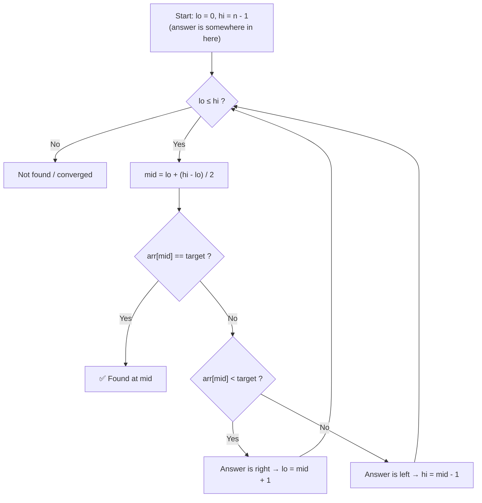
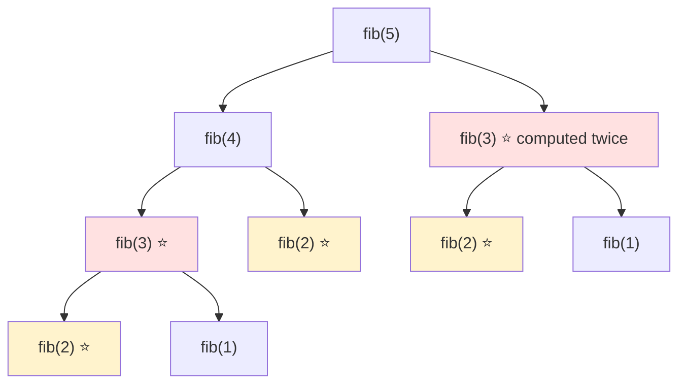

# 🧩 DSA — Complete Interview Notes

This file covers everything a fresher needs for coding rounds and DSA interviews: what Big-O actually means, the 8–10 patterns that solve most problems, and how to think out loud when you're stuck.

> [!NOTE]
> **The honest truth:** interviewers are not testing whether you memorized 500 solutions. They test **approach + complexity** — can you break the problem down, pick the right pattern, and say *why* your solution is fast enough? A correct O(n) approach you can explain beats a copied O(n log n) solution you can't.

---

## 1. Big-O Notation — The Language of "How Fast?"

Big-O tells you **how your runtime (or memory) grows as input size `n` grows** — not the exact seconds, just the shape of the growth. Think of it as: *"If I double the input, what happens to my time?"*

| Complexity | Name | If `n` doubles… | Everyday example |
|---|---|---|---|
| `O(1)` | Constant | Nothing changes | Looking up a word's page number in an index / getting an array element by index |
| `O(log n)` | Logarithmic | +1 extra step | Finding a name in a phone book by halving it each time (binary search) |
| `O(n)` | Linear | Time doubles | Reading every page of a book once / scanning a list for one item |
| `O(n log n)` | Linearithmic | A bit more than doubles | Sorting a deck of cards the "smart" way (merge sort / quick sort) |
| `O(n²)` | Quadratic | Time becomes 4× | Every student shaking hands with every other student / nested loops over pairs |
| `O(2ⁿ)` | Exponential | Explodes | Trying every possible combination of a lock, one digit longer each time |

> [!TIP]
> 🧠 **Quick mental shortcut:** count the loops. One loop over `n` → `O(n)`. A loop inside a loop → `O(n²)`. A loop that **halves** the problem each time → `O(log n)`. Sorting first and then one pass → `O(n log n)` (sorting dominates).

### 📌 Complexity Cheat Table — Common Data Structure Operations

| Operation | Array | Linked List | Stack | Queue | Hash Map (avg) |
|---|---|---|---|---|---|
| Access by index/position | **O(1)** ✅ | O(n) | — | — | — |
| Search for a value | O(n) | O(n) | O(n) | O(n) | **O(1)** ✅ |
| Insert at beginning | O(n) | **O(1)** ✅ | O(1) push | O(1) enqueue | O(1) |
| Insert at end | O(1) amortized | O(n) (O(1) with tail pointer) | — | O(1) enqueue | O(1) |
| Insert in middle | O(n) | O(n) to reach, O(1) to link | — | — | — |
| Delete at beginning | O(n) | **O(1)** ✅ | O(1) pop | O(1) dequeue | O(1) |
| Delete a known value | O(n) | O(n) to find | — | — | **O(1)** ✅ |

> [!IMPORTANT]
> Hash maps are O(1) **on average**. Worst case (many collisions) can degrade to O(n), but in interviews you always quote the average unless asked. This one table answers a huge percentage of "why did you choose this data structure?" follow-ups.

---

## 2. Arrays & Strings — The Basics Everyone Skips

Arrays are contiguous memory: index access is O(1), but inserting/deleting in the middle means shifting everything → O(n). Strings in most languages are **immutable** — every "edit" creates a new string, so building strings in a loop can quietly become O(n²). Use a character array / StringBuilder instead.

**Core skills to be fluent in:**
- Traversal (forward, backward, two at a time)
- In-place modification (swap, reverse, rotate) — interviewers love "do it without extra space"
- Prefix sums (below)

> [!NOTE]
> 📌 **Prefix idea in one line:** Precompute `prefix[i] = sum of first i elements` once, and then *any* range sum `sum(l..r) = prefix[r+1] - prefix[l]` becomes O(1) instead of O(n) every time.

**Practice:** Reverse String (in-place swap), Maximum Subarray (Kadane's — track best-ending-here vs best-so-far).

---

## 3. Hashing — The "Have I Seen This Before?" Tool

A hash map/set stores values for O(1) lookup. The single most powerful interview sentence is:

> 🧠 *"Instead of searching for X again and again, I can store what I've seen in a hash set and check in O(1)."*

This one idea converts countless O(n²) brute forces into O(n).

**🔍 Two Sum (the classic):** For each number `x`, you need `target - x`. Check if that complement is already in the map. If yes → found the pair. If no → store `x` and move on. One pass, O(n) time, O(n) space.

| Use a Hash Map when… | Use a Hash Set when… |
|---|---|
| You need value → something (index, count) | You only need "exists or not" |
| Counting frequency | Removing duplicates |
| Two Sum, Group Anagrams | Contains Duplicate, cycle detection in arrays |

> [!WARNING]
> ⚠️ Hashing kills *time* but costs *space*. Always mention the trade-off: "I'm using O(n) extra space to bring this from O(n²) down to O(n)." Saying this unprompted scores points.

**Practice:** Two Sum (approach above), Contains Duplicate (set lookup), Group Anagrams (sorted string as key), First Unique Character (frequency map).

---

## 4. Two Pointers — Two Fingers, One Pass

**When to use it:** The array is **sorted** (or you can sort it), and the problem involves **pairs, palindromes, or removing things in place**.

**How it works:** Put one pointer at the start (`left`) and one at the end (`right`). Compare, then move the pointer that makes progress toward the answer. Because they only move toward each other, the whole thing is O(n) after sorting.

**Tiny example — Two Sum II (sorted array):** Sum too small → move `left` up (bigger numbers). Sum too big → move `right` down. No map needed, O(1) space.

> [!TIP]
> Two pointers has a second flavor: **fast & slow pointers** (both start at the left, moving at different speeds) — used for cycle detection and finding middles in linked lists (Section 8).

**Practice:** Valid Palindrome (left/right meet in middle, skip non-letters), Container With Most Water (move the shorter side inward — moving the taller one can never help).

---

## 5. Sliding Window — A Window That Breathes

**When to use it:** The problem asks about a **contiguous subarray/substring** — longest, shortest, or best — especially *"longest substring without repeating characters"* style questions.

| Type | How it works | Example problem |
|---|---|---|
| **Fixed window** | Window size `k` never changes; slide it one step at a time, add the new element, remove the old | Maximum sum subarray of size k |
| **Variable window** | Expand `right` to include more; when the window becomes *invalid*, shrink from `left` until valid again | Longest substring without repeating characters |

**🔍 Longest substring idea:** Keep a window `[left, right]` and a set of characters inside it. Expand `right`; if the new char is already in the set, keep removing from `left` until it's gone. Track the max window size. Every character enters and leaves once → O(n), not O(n²).

> [!IMPORTANT]
> Sliding window works because the answer is **contiguous** and shrinking the window is *safe* (monotonic). The moment a problem allows non-contiguous picks, or "shrinking" can destroy a good answer, it's not sliding window — that's your cue to think DP or greedy instead.

**Practice:** Maximum Average Subarray I (fixed window), Longest Substring Without Repeating Characters (variable window), Minimum Window Substring (variable, harder — the boss level).

---

## 6. Sorting — Know the Menu, Not the Kitchen

You rarely implement sorting in interviews, but you **must** know the complexity table and *when merge sort is preferred* (a favorite follow-up question).

| Algorithm | Best | Average | Worst | Extra Space | Stable? | Idea in 5 words |
|---|---|---|---|---|---|---|
| Bubble Sort | O(n) | O(n²) | O(n²) | O(1) | Yes | Swap neighbours repeatedly |
| Selection Sort | O(n²) | O(n²) | O(n²) | O(1) | No | Pick smallest, place it |
| Insertion Sort | O(n) | O(n²) | O(n²) | O(1) | Yes | Insert into sorted left part |
| **Merge Sort** | O(n log n) | O(n log n) | **O(n log n)** | O(n) | Yes | Divide, sort, merge |
| **Quick Sort** | O(n log n) | O(n log n) | O(n²) | O(log n) | No | Partition around a pivot |

> [!NOTE]
> 📌 **When is merge sort preferred?** Three cases: (1) you need a **guaranteed** O(n log n) worst case, (2) you need a **stable** sort (equal items keep their order), and (3) sorting **linked lists** (merging needs no random access) or huge data that doesn't fit in memory (external sorting). Quick sort is usually faster in practice due to cache-friendliness — that's why most built-in sorts are quicksort hybrids. Insertion sort wins on tiny or nearly-sorted arrays.

**Practice:** Sort Colors (Dutch national flag — counting/pointers), Merge Intervals (sort by start, then merge — sorting as a *setup step* is the real lesson).

---

## 7. Binary Search — Halve It Till You Find It

**Two conditions, both required:**
1. The data is **sorted**, and
2. The decision is **monotonic** — if a value works, everything on one side of it also works/fails predictably ("if mid is too small, answer must be to the right").

> [!TIP]
> That second condition is the secret level. Binary search isn't just for sorted arrays — it works on any "find the first position where a yes/no condition flips" problem: first bad version, smallest ship capacity, square root. Interviewers call this **binary search on the answer**.

**Template idea:** Keep `lo` and `hi` as the range where the answer *could* be. While `lo < hi`: compute `mid = lo + (hi - lo) / 2` (this form avoids integer overflow), test the condition at `mid`, and throw away the half that can't contain the answer.

**Practice:** Binary Search (the template itself), Search Insert Position / First Bad Version (monotonic yes→no flip), Find Minimum in Rotated Sorted Array (compare mid with right end).

---

## 8. Linked Lists — Pointers, Not Indexes

A singly linked list is nodes chained by `next` pointers. No random access (finding the k-th element is O(n)), but inserting/deleting at a known node is O(1) — just rewire two arrows.

**The three moves that solve 80% of linked list problems:**

| Move | How | Solves |
|---|---|---|
| **Dummy node** | Put a fake node before the head; now edge cases (deleting the head) disappear | Remove Nth Node, Merge Two Lists |
| **Fast & slow pointers** | `slow` moves 1 step, `fast` moves 2. When `fast` hits the end, `slow` is at the **middle** | Middle of Linked List, cycle detection |
| **Reversal** | Walk with `prev`, `curr`, `next`: save `next`, flip `curr.next = prev`, advance all three | Reverse Linked List |

**🔍 Cycle detection (Floyd's):** Run fast (2 steps) and slow (1 step). If there's a cycle, fast eventually laps slow and they **meet**. If fast hits `null`, there's no cycle. Why it works: once both are inside the loop, fast gains exactly 1 step per move, so it can never jump over slow forever.

> [!WARNING]
> ⚠️ The #1 linked list bug: losing the rest of the list. **Always save `next` before you rewire a pointer.** Say this out loud in the interview — it shows you've actually debugged this before.

**Practice:** Reverse Linked List (iterative), Linked List Cycle (fast/slow), Merge Two Sorted Lists (dummy node), Remove Nth Node From End (fast starts n steps ahead).

---

## 9. Stacks & Queues — Order Is the Whole Point

| Structure | Rule | Analogy | Remove from | Classic use |
|---|---|---|---|---|
| **Stack** | LIFO — Last In, First Out | Stack of plates | Same end you added (top) | Undo, recursion, matching brackets |
| **Queue** | FIFO — First In, First Out | Line at a ticket counter | Opposite end (front) | BFS, scheduling, buffers |

**🔍 Valid Parentheses (the stack classic):** Push every opening bracket. On a closing bracket, the top of the stack *must* be its match — if not, invalid. At the end, the stack must be empty. The insight: the **most recent** unmatched opener is the one that must close first — that's exactly LIFO.

> [!NOTE]
> 🧠 Why BFS uses a queue: BFS explores level by level — nodes discovered first must be *visited* first (the ones closest to the start finish their turn before deeper ones). That first-in-first-out order is literally the definition of a queue. DFS, by contrast, uses a stack (which is also what recursion secretly is — the call stack).

**Practice:** Valid Parentheses (stack matching), Implement Queue using Stacks (two stacks, pour when empty), Min Stack (store pairs: value + min-so-far).

---

## 10. Trees — Recursion's Home Ground

A binary tree: each node has a value, a left child, and a right child (either can be null).

### The Four Traversals (memorize what each one *gives* you)

| Traversal | Order | What it's good for |
|---|---|---|
| **Inorder** | Left → Root → Right | On a BST, prints values **in sorted order** ✅ |
| **Preorder** | Root → Left → Right | Copying/serializing a tree; prefix expressions |
| **Postorder** | Left → Right → Root | Deleting a tree (children before parent); evaluating expression trees |
| **Level order (BFS)** | Row by row, top to bottom | Level-by-level answers; uses a **queue** |

> [!TIP]
> Depth-first traversals (in/pre/post) are just recursion: process children and root in different orders. If you can write one, you can write all three — only the position of the "visit root" line changes.

### BST Property

> [!IMPORTANT]
> **Binary Search Tree:** for every node, *all* values in its left subtree are **smaller**, and *all* values in its right subtree are **greater**. This makes search/insert/delete average O(log n) — it's binary search, but as a shape. (Worst case, a degenerate "stick" tree is O(n) — that's why balanced trees exist, but that's beyond fresher scope.)

**Practice:** Maximum Depth of Binary Tree (1 + max of children), Invert Binary Tree (swap children recursively), Binary Tree Level Order Traversal (queue, process level-by-level), Validate BST (inorder must be increasing, or pass min/max range down).

---

## 11. Graphs in Brief — Just BFS and DFS

A graph is nodes (vertices) connected by edges. For coding interviews, store it as an **adjacency list**: a map/array where each node lists its neighbours. It's compact and iterating neighbours is cheap.

| | BFS (Breadth-First) | DFS (Depth-First) |
|---|---|---|
| Uses | **Queue** | **Stack** (or recursion) |
| Explores | Level by level, nearest first | One path as deep as possible, then backtracks |
| Best for | **Shortest path** in unweighted graphs ✅ | Connectivity, cycles, paths, exploring everything |
| Everyday analogy | Ripple spreading in a pond | Walking a maze with one hand on the wall |

> [!WARNING]
> ⚠️ Graphs have cycles, so **both** BFS and DFS need a `visited` set. Forgetting it = infinite loop. In 4 out of 5 graph interview bugs, this is the bug. Trees don't need it (no cycles); graphs always do.

**Practice:** Number of Islands (grid DFS/BFS flood fill — the most-asked fresher graph problem), Clone Graph or Course Schedule basics if you're feeling strong.

---

## 12. Recursion & Backtracking — Trust the Leap

Every recursive solution needs two parts:
1. **Base case** — when to stop (smallest version of the problem).
2. **Choice / recursive case** — solve a *smaller* version, and trust it returns the right answer.

**🔍 Subsets idea (backtracking in 2 lines):** For each element, branch twice — *take it* or *skip it* — and recurse; when you run out of elements, record the current selection. Backtracking = recursion + "undo the choice" after exploring it, so the next branch starts clean.

> [!NOTE]
> 🧠 Debugging recursion: draw the **call tree** on paper for a tiny input (n = 3). If you can't trace it small, you don't understand it yet. Interviewers love candidates who sketch the tree before coding.

**Practice:** Subsets (take/skip branching), Permutations (pick one, recurse on the rest), Fibonacci recursively (then notice the repeated work — perfect bridge to DP below).

---

## 13. Dynamic Programming — Recursion With a Notebook

A problem is DP when it has **both**:
1. **Overlapping subproblems** — the same small problem gets solved again and again (e.g., `fib(3)` is recomputed all over the `fib(5)` recursion tree).
2. **Optimal substructure** — the best answer is built from best answers to smaller pieces.

> [!TIP]
> 📌 **Memoization idea (top-down DP):** keep a notebook (array/map). Before computing `fib(n)`, check the notebook — if it's there, return it instantly. If not, compute, *write it down*, then return. Every subproblem is now solved exactly once: O(2ⁿ) becomes O(n). The bottom-up version ("tabulation") just fills the same notebook from smallest to largest with a loop.

**3 classic beginner DP problems (in learning order):**
1. **Climbing Stairs** — ways to reach step n = ways(n−1) + ways(n−2). It's Fibonacci wearing a hat.
2. **House Robber** — at each house: rob it (+ answer from 2 houses back) or skip it (answer from 1 back). *Take vs skip*, the most common DP decision.
3. **Coin Change** — fewest coins for an amount; try every coin as the last one. Teaches "for each state, try all choices."

> [!IMPORTANT]
> In interviews, don't jump to DP. Say the brute-force recursion first, **name the repeated subproblem out loud**, then optimize. That journey — brute → memoize → tabulate — is exactly what the interviewer wants to hear.

**Pattern-recognition summary before you dive into the final table:** hashing fixes *lookup*, two pointers/slider fix *pairs & windows*, binary search fixes *sorted & monotonic*, and DP fixes *repeated subproblems with choices*. Most fresher problems are one of these four wearing a costume.

---

## 14. 🔍 Pattern-Recognition Table — Read the Clue, Pick the Weapon

This is the highest-value table in this file. In the interview, spend the first 60 seconds matching the problem to a row here.

| Clue in the problem | First pattern to try | Why |
|---|---|---|
| "Find two numbers that add up to target" | **Hashing** (or Two Pointers if sorted) | Complement lookup is O(1) |
| "Sorted array — find / first / last / count" | **Binary Search** | Sorted + monotonic = halving |
| "Longest/shortest **contiguous** subarray or substring" | **Sliding Window** | Contiguous + monotonic validity |
| "Pairs in a sorted array" / "palindrome check" | **Two Pointers** | Move inward from both ends |
| "Have I seen this before?" / duplicates / frequency | **Hash Map / Set** | O(1) membership and counting |
| "Shortest path, no weights" / "level by level" | **BFS** (queue) | Nearest nodes finish first |
| "Explore all paths / connected components / islands" | **DFS** | Go deep, backtrack |
| "Matching brackets / most recent thing matters" | **Stack** | LIFO = last opened closes first |
| "All combinations / permutations / subsets" | **Recursion + Backtracking** | Branch on take/skip, undo, repeat |
| "Maximum/minimum ways / count ways to reach…" | **Dynamic Programming** | Overlapping subproblems + choices |
| "Repeated same subproblem (like fib)" | **Memoization → DP** | Cache results, solve each once |
| "Next greater/smaller element" | **Monotonic Stack** | Stack keeps candidates in order |
| "Range sum queries, again and again" | **Prefix Sums** | Precompute once, answer in O(1) |
| "Middle / cycle in a linked list" | **Fast & Slow Pointers** | Speed difference reveals structure |
| "Top K / K largest / K smallest" | **Heap (priority queue)** | Keep only K best, O(n log k) |
| "Merge overlapping ranges" | **Sort first, then sweep** | Sorting by start makes overlaps neighbours |

> [!TIP]
> 🧠 **The 30-second drill:** ask yourself three questions — (1) Is it sorted or can I sort? (2) Is the answer contiguous? (3) Am I recomputing the same thing? The answers point straight at binary search, sliding window, and DP respectively.

---

## 🎤 Mock Interview Questions — DSA

**1. Array vs Linked List — when do you use each?**
Use an array when you need fast index access (O(1)) and the size is fairly fixed. Use a linked list when insertions/deletions at known positions are frequent and random access is rare. Arrays also win in practice more often than students expect, because contiguous memory is cache-friendly.

**2. How do you find a cycle in a linked list?**
Floyd's fast & slow pointers: slow moves 1 step, fast moves 2. If they ever meet, there's a cycle; if fast reaches null, there isn't. It uses O(1) extra space — mention that you'd otherwise need a hash set of visited nodes (O(n) space).

**3. Why is hash map lookup O(1)? Is it always?**
A hash function converts the key directly into a bucket index, so you jump there without scanning — average O(1). It's not guaranteed: if many keys collide into the same bucket, lookup can degrade to O(n). Good hash functions + resizing keep collisions rare, so we quote the average.

**4. Two Sum: array is sorted. Map or two pointers?**
Two pointers. Left at start, right at end; sum too small → move left up, too big → move right down. Sorting already gives us the ordering, so we get O(n) time with O(1) space — the hash map's O(n) extra space buys us nothing here.

**5. Explain binary search. When does it NOT work?**
Keep halving the search range using the middle element; each step discards half. It needs sorted data (or a monotonic yes/no condition). On unsorted data there's no way to know which half to discard, so it fails — you'd sort first (O(n log n)) or just do a linear scan.

**6. Stack or Queue for BFS? Why?**
Queue. BFS visits nodes level by level: nodes found first (closest to start) must be processed first, which is exactly FIFO order. A stack would give DFS — deep-first instead of level-first.

**7. What's the difference between BFS and DFS? When is each better?**
BFS explores level-by-level using a queue and finds the *shortest path* in unweighted graphs. DFS dives down one path using a stack/recursion and is better for exploring everything — connectivity, cycles, islands. Both are O(V + E) and both need a visited set.

**8. How do you find the middle of a linked list in one pass?**
Fast & slow pointers. Slow moves one step, fast moves two; when fast reaches the end, slow is exactly at the middle. No counting pass or extra storage needed.

**9. What two properties make a problem a DP problem?**
Overlapping subproblems — the same subproblem recurs (like fib(3) inside fib(5)) — and optimal substructure, where the optimal answer is composed of optimal sub-answers. If subproblems never repeat, plain recursion/divide-and-conquer is enough.

**10. `fib(5)` with plain recursion is slow. Why, and how do you fix it?**
The recursion tree recomputes values: fib(3) twice, fib(2) three times — exponential O(2ⁿ) total calls. Fix with memoization: cache each result after computing it, so each value is computed once → O(n) time, O(n) space. Or tabulate bottom-up with two variables for O(1) space.

**11. Longest substring without repeating characters — approach?**
Variable sliding window with a set. Expand the right end; when you hit a character already in the window, shrink from the left until it's removed. Track the max window length. Each character enters/leaves once, so O(n) total.

**12. How do you reverse a linked list?**
Iteratively with three pointers: `prev` (null), `curr` (head), and a saved `next`. At each step: save next, point curr back to prev, then advance prev and curr. Say out loud that you save `next` *before* rewiring — that's where everyone loses the list.

**13. Merge sort vs quick sort — which and why?**
Both average O(n log n). Merge sort guarantees O(n log n) worst-case and is stable, but needs O(n) extra space — preferred for linked lists and when stability matters. Quick sort's worst case is O(n²) (bad pivots) but it's faster in practice due to cache behavior and sorts in place. Most library sorts are hybrids of the two plus insertion sort.

**14. How do you check for valid parentheses?**
Stack. Push opening brackets; on a closing bracket, the stack top must be the matching opener — pop it. If the stack is empty when a closer arrives, or non-empty at the end, it's invalid. The most recent opener must close first — that's LIFO doing the work.

**15. A problem says "longest subarray with sum ≤ k, all numbers positive." First thought?**
Sliding window. Positivity makes it valid: expanding only increases the sum and shrinking only decreases it, so the window is monotonic and safe to slide — expand right, shrink left whenever the sum exceeds k, track max length. (Bonus awareness: with negative numbers this breaks, and you'd switch to prefix sums + hashing.)

---

## ✅ 60-Second Revision Checklist

- [ ] I can define Big-O and give O(1), O(log n), O(n), O(n log n), O(n²) examples without pausing
- [ ] I know the array / linked list / stack / queue / hash map complexity table cold
- [ ] I can spot hashing problems ("seen before", frequency, duplicates) instantly
- [ ] I can explain Two Sum both ways: hash map (unsorted) and two pointers (sorted)
- [ ] I can tell fixed vs variable sliding window and name the longest-substring approach
- [ ] I can write the binary search template and state its two conditions (sorted + monotonic)
- [ ] I can explain fast/slow pointers for middle-finding AND cycle detection
- [ ] I know stack = LIFO (parentheses, undo), queue = FIFO (BFS) — and *why*
- [ ] I can name all 4 tree traversals and what inorder gives on a BST
- [ ] I can say when BFS beats DFS (shortest path) and why both need `visited`
- [ ] I can state the 2 DP ingredients and walk fib from recursion → memoization → O(n)
- [ ] I can look at a fresh problem, find its row in the pattern table, and start talking

> [!NOTE]
> 📌 **Final word:** DSA interviews reward *narrating your thinking*. Brute force first, name the bottleneck, pick the pattern, state the complexity. Practice that loop out loud on 2 problems a day and you'll sound like someone who solves problems — because you will be. Good luck! 🚀
