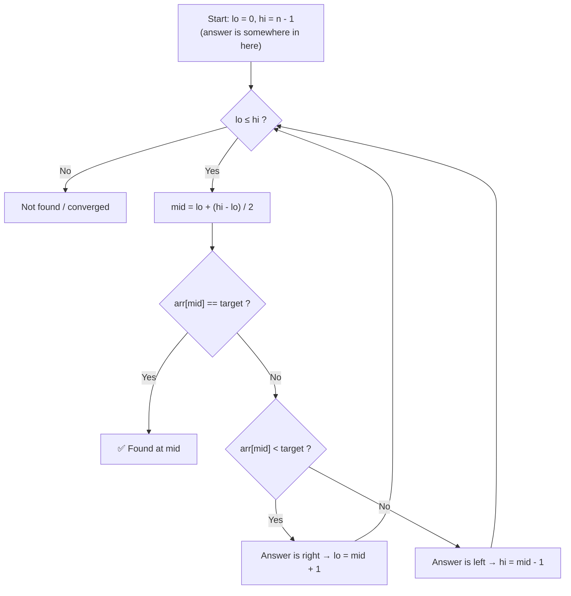
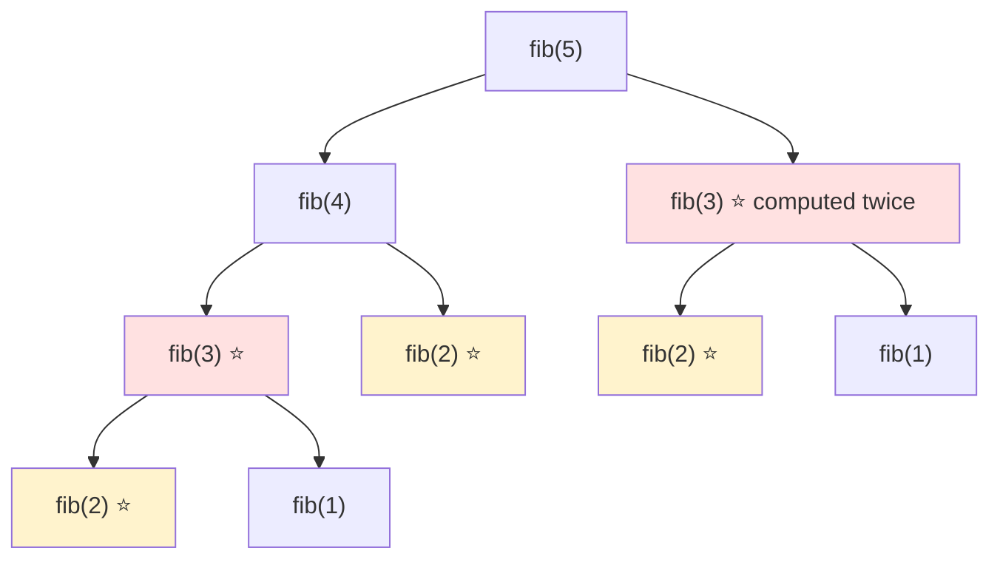

# 🧩 DSA — Complete Interview Notes

This file covers everything a fresher needs for coding rounds and DSA interviews: what Big-O actually means, the 8–10 patterns that solve most problems, and how to think out loud when you're stuck.

> [!NOTE]
> **The honest truth:** interviewers are not testing whether you memorized 500 solutions. They test **approach + complexity** — can you break the problem down, pick the right pattern, and say *why* your solution is fast enough? A correct O(n) approach you can explain beats a copied O(n log n) solution you can't.

---

## 1. Big-O Notation — The Language of "How Fast?"

Big-O tells you **how your runtime (or memory) grows as input size `n` grows** — not the exact seconds, just the shape of the growth. Think of it as: *"If I double the input, what happens to my time?"*

| Complexity | Name | If `n` doubles… | Everyday example |
|---|---|---|---|
| `O(1)` | Constant | Nothing changes | Looking up a word's page number in an index / getting an array element by index |
| `O(log n)` | Logarithmic | +1 extra step | Finding a name in a phone book by halving it each time (binary search) |
| `O(n)` | Linear | Time doubles | Reading every page of a book once / scanning a list for one item |
| `O(n log n)` | Linearithmic | A bit more than doubles | Sorting a deck of cards the "smart" way (merge sort / quick sort) |
| `O(n²)` | Quadratic | Time becomes 4× | Every student shaking hands with every other student / nested loops over pairs |
| `O(2ⁿ)` | Exponential | Explodes | Trying every possible combination of a lock, one digit longer each time |

> [!TIP]
> 🧠 **Quick mental shortcut:** count the loops. One loop over `n` → `O(n)`. A loop inside a loop → `O(n²)`. A loop that **halves** the problem each time → `O(log n)`. Sorting first and then one pass → `O(n log n)` (sorting dominates).

### Growth with real numbers (this is what "fast" really means)

Formulas feel abstract until you put numbers in. Roughly how many steps does each shape take?

| Complexity | n = 10 | n = 100 | n = 1,000 | What it feels like |
|---|---|---|---|---|
| O(1) | 1 | 1 | 1 | Instant, always |
| O(log n) | ~3 | ~7 | ~10 | Barely grows — doubling n adds about 1 step |
| O(n) | 10 | 100 | 1,000 | Grows in a straight line |
| O(n log n) | ~33 | ~664 | ~9,970 | A little above linear — still fine |
| O(n²) | 100 | 10,000 | 1,000,000 | Fine small, painful at 1,000, dead at 100,000 |
| O(2ⁿ) | 1,024 | ~10³⁰ | hopeless | Already broken before n = 50 |

Read the O(2ⁿ) row slowly: at n = 100 it needs more steps than atoms you could ever count. That is why spotting exponential brute force (plain recursive Fibonacci is the classic) is an instant signal to look for DP.

> [!WARNING]
> **Common mistake:** quoting the complexity of the *code you wrote* instead of the *work it does*. A single loop that calls a library sort inside it is not O(n) — it is O(n log n) per call, so O(n² log n) overall. Always ask what each line inside the loop secretly costs.


### 📌 Complexity Cheat Table — Common Data Structure Operations

| Operation | Array | Linked List | Stack | Queue | Hash Map (avg) |
|---|---|---|---|---|---|
| Access by index/position | **O(1)** ✅ | O(n) | — | — | — |
| Search for a value | O(n) | O(n) | O(n) | O(n) | **O(1)** ✅ |
| Insert at beginning | O(n) | **O(1)** ✅ | O(1) push | O(1) enqueue | O(1) |
| Insert at end | O(1) amortized | O(n) (O(1) with tail pointer) | — | O(1) enqueue | O(1) |
| Insert in middle | O(n) | O(n) to reach, O(1) to link | — | — | — |
| Delete at beginning | O(n) | **O(1)** ✅ | O(1) pop | O(1) dequeue | O(1) |
| Delete a known value | O(n) | O(n) to find | — | — | **O(1)** ✅ |

> [!IMPORTANT]
> Hash maps are O(1) **on average**. Worst case (many collisions) can degrade to O(n), but in interviews you always quote the average unless asked. This one table answers a huge percentage of "why did you choose this data structure?" follow-ups.

---

## 2. Arrays & Strings — The Basics Everyone Skips

Arrays are contiguous memory: index access is O(1), but inserting/deleting in the middle means shifting everything → O(n). Strings in most languages are **immutable** — every "edit" creates a new string, so building strings in a loop can quietly become O(n²). Use a character array / StringBuilder instead.

**Core skills to be fluent in:**
- Traversal (forward, backward, two at a time)
- In-place modification (swap, reverse, rotate) — interviewers love "do it without extra space"
- Prefix sums (below)

> [!NOTE]
> 📌 **Prefix idea in one line:** Precompute `prefix[i] = sum of first i elements` once, and then *any* range sum `sum(l..r) = prefix[r+1] - prefix[l]` becomes O(1) instead of O(n) every time.

### What interviewers are actually probing here

Arrays and strings look too easy, so most students skip them — and then lose marks on the follow-ups. When an interviewer gives you an array problem, they are rarely testing whether you can write a loop. They are checking three quieter things:

1. **Can you work without extra space?** The first solution often builds a second array or a new string. The interviewer then asks, *"Can you do it in place?"* That is where the real test starts.
2. **Do you think about cost while you code?** Joining strings inside a loop, calling a sort inside a loop, or scanning the array again for every query — each one quietly changes your complexity. Saying the cost out loud while you code is the skill.
3. **Do you handle the boring edges?** Empty array, single element, all duplicates, already-sorted input. Interviewers keep one of these in their pocket.

A speakable line that covers all three: *"I can do this with a second array in O(n) time and O(n) space — if you want, I will now do the same thing in place with two pointers and O(1) extra space."* You have just answered the follow-up before it was asked.

### In-place thinking, in plain words

"In place" means you rearrange the same array instead of building a new one. You keep two pointers — usually one at each end, or a *read* pointer and a *write* pointer — and you swap or overwrite as you go. No second array grows with the input, so extra space stays O(1).

Think of it like rearranging chairs in a room instead of renting a second room: you temporarily hold one chair (a `temp` variable) while you move another, but you never need double the furniture.

### Worked micro-example — reverse `[1, 2, 3, 4]` in place

Goal: turn `[1, 2, 3, 4]` into `[4, 3, 2, 1]` without a second array. Left starts at index 0, right at index 3. Swap, then step both inward.

| Step | left (value) | right (value) | Action | Array after |
|---|---|---|---|---|
| Start | 0 → 1 | 3 → 4 | Swap 1 and 4 | `[4, 2, 3, 1]` |
| Next | 1 → 2 | 2 → 3 | Swap 2 and 3 | `[4, 3, 2, 1]` |
| Stop | left passes right | — | Pointers have met — done | `[4, 3, 2, 1]` |

Two swaps, one `temp` variable, done. That is the whole pattern: **swap the ends, move inward, stop when the pointers cross.** The same skeleton reverses a string (after converting it to a character array), checks a palindrome, and partitions an array — only the swap condition changes.

> [!WARNING]
> **Three pitfalls that cost marks here:**
> 1. **Building a string in a loop** — `result = result + ch` copies the whole string every time, so n characters quietly cost O(n²). Collect pieces in an array and join once at the end.
> 2. **Modifying the array you are still reading** — if you delete or overwrite while scanning forward, you skip the next element. Either scan backwards for deletions, or use a separate write pointer that only moves forward.
> 3. **Forgetting the single-element and empty cases** — a reverse that starts with `right = length - 1` crashes on an empty array in some languages. Name the edge case out loud before you code; interviewers notice.

**Practice:** Reverse String (in-place swap), Maximum Subarray (Kadane's — track best-ending-here vs best-so-far).

---

## 3. Hashing — The "Have I Seen This Before?" Tool

A hash map/set stores values for O(1) lookup. The single most powerful interview sentence is:

> 🧠 *"Instead of searching for X again and again, I can store what I've seen in a hash set and check in O(1)."*

This one idea converts countless O(n²) brute forces into O(n).

**🔍 Two Sum (the classic):** For each number `x`, you need `target - x`. Check if that complement is already in the map. If yes → found the pair. If no → store `x` and move on. One pass, O(n) time, O(n) space.

| Use a Hash Map when… | Use a Hash Set when… |
|---|---|
| You need value → something (index, count) | You only need "exists or not" |
| Counting frequency | Removing duplicates |
| Two Sum, Group Anagrams | Contains Duplicate, cycle detection in arrays |

> [!WARNING]
> ⚠️ Hashing kills *time* but costs *space*. Always mention the trade-off: "I'm using O(n) extra space to bring this from O(n²) down to O(n)." Saying this unprompted scores points.


### What is a collision, in plain words?

A hash function turns your key into a bucket number, like a coat-check ticket machine. *"Ayushi" → bucket 3. "Rahul" → bucket 7.* Lookup means: compute the bucket, jump straight there. No scanning.

A **collision** is simply two keys getting the same ticket number. *"Ikra" also lands in bucket 3.* Now bucket 3 holds a small list, and lookup means scanning that little list to find the right key. A few collisions? Still fast. *Every* key in one bucket? That one bucket is now just a list, and lookup degrades to O(n) — the worst case from the table above. Good hash functions spread keys evenly so buckets stay tiny.

### Traced example — Two Sum, one pass

Array `[2, 7, 11, 15]`, target `9`. Rule: for each `x`, ask "have I already seen `target - x`?" Check **first**, store **second**.

| Step | x | Need (9 − x) | Map before checking | What happens |
|---|---|---|---|---|
| i = 0 | 2 | 7 | empty | Not there → store 2 at index 0 |
| i = 1 | 7 | 2 | {2 → 0} | Found! Return indices [0, 1] |
| i = 2 | — | — | — | Never reached — we stopped early |

> [!WARNING]
> **Common mistake:** storing `x` in the map *before* checking for the complement. If `x` is exactly half the target (x = 5, target = 10), you would "find" the element paired with itself. Check first, store second — the order is the whole trick.

**Practice:** Two Sum (approach above), Contains Duplicate (set lookup), Group Anagrams (sorted string as key), First Unique Character (frequency map).


```playground Playground: two sum with a hash map
// Two Sum: return the indices of the two numbers that add up to target.
const nums = [2, 7, 11, 15];
const target = 9;

function twoSum(nums, target) {
  const seen = new Map(); // value -> index
  for (let i = 0; i < nums.length; i++) {
    const need = target - nums[i];
    // TODO: if `need` is already in seen, return [seen.get(need), i]
    // TODO: otherwise store nums[i] with its index, then keep going
  }
  return [];
}

console.log(twoSum(nums, target)); // expect [0, 1]
console.log(twoSum([3, 2, 4], 6)); // expect [1, 2]
```


---

## 4. Two Pointers — Two Fingers, One Pass

**When to use it:** The array is **sorted** (or you can sort it), and the problem involves **pairs, palindromes, or removing things in place**.

**How it works:** Put one pointer at the start (`left`) and one at the end (`right`). Compare, then move the pointer that makes progress toward the answer. Because they only move toward each other, the whole thing is O(n) after sorting.

```visual two-pointers
```


**Tiny example — Two Sum II (sorted array):** Sum too small → move `left` up (bigger numbers). Sum too big → move `right` down. No map needed, O(1) space.

> [!TIP]
> Two pointers has a second flavor: **fast & slow pointers** (both start at the left, moving at different speeds) — used for cycle detection and finding middles in linked lists (Section 8).


### Traced example — find the pair that sums to 17

Sorted array `[2, 5, 8, 12]`, target `17`. Watch the pointers walk toward each other:

| Step | left (value) | right (value) | Sum | Decision |
|---|---|---|---|---|
| Start | index 0 → 2 | index 3 → 12 | 14 | Too small → only a bigger left value can help, move `left` up |
| Next | index 1 → 5 | index 3 → 12 | 17 | Equal — found the pair at indices 1 and 3 |

> [!WARNING]
> **Common mistake:** reaching for two pointers on an **unsorted** array. The move rules ("sum too small, move left up") only work because bigger values reliably live on the right. Unsorted, moving a pointer can throw away the answer. Sort first (O(n log n)) or use the hash map from Section 3.

**Practice:** Valid Palindrome (left/right meet in middle, skip non-letters), Container With Most Water (move the shorter side inward — moving the taller one can never help).

---

## 5. Sliding Window — A Window That Breathes

**When to use it:** The problem asks about a **contiguous subarray/substring** — longest, shortest, or best — especially *"longest substring without repeating characters"* style questions.

| Type | How it works | Example problem |
|---|---|---|
| **Fixed window** | Window size `k` never changes; slide it one step at a time, add the new element, remove the old | Maximum sum subarray of size k |
| **Variable window** | Expand `right` to include more; when the window becomes *invalid*, shrink from `left` until valid again | Longest substring without repeating characters |

```visual sliding-window
```


**🔍 Longest substring idea:** Keep a window `[left, right]` and a set of characters inside it. Expand `right`; if the new char is already in the set, keep removing from `left` until it's gone. Track the max window size. Every character enters and leaves once → O(n), not O(n²).


### Traced example — variable window on `"abca"`

Goal: longest substring with no repeating character. The window is whatever sits between `left` and `right`.

| right lands on | Window now | Valid? | Action before moving on | Best so far |
|---|---|---|---|---|
| a (index 0) | `a` | Yes | — | 1 |
| b (index 1) | `ab` | Yes | — | 2 |
| c (index 2) | `abc` | Yes | — | 3 |
| a (index 3) | `abca` | No — `a` repeats | Shrink from left: drop the old `a`, window becomes `bca` | 3 |

### Traced example — fixed window sums

Array `[2, 1, 5, 1, 3, 2]`, window size k = 3, find the maximum window sum. Never re-add the whole window — subtract what leaves, add what enters.

| Window | Sum | How we got it |
|---|---|---|
| [2, 1, 5] | 8 | First window: add all three |
| [1, 5, 1] | 7 | 8 − 2 (left) + 1 (entered) |
| [5, 1, 3] | 9 | 7 − 1 + 3 |
| [1, 3, 2] | 8 | 9 − 5 + 2 |

> [!WARNING]
> **Common mistake:** in a variable window, updating your best answer *before* shrinking back to valid. The invalid window (like `abca` above) must never be recorded. Shrink first, measure second.

> [!IMPORTANT]
> Sliding window works because the answer is **contiguous** and shrinking the window is *safe* (monotonic). The moment a problem allows non-contiguous picks, or "shrinking" can destroy a good answer, it's not sliding window — that's your cue to think DP or greedy instead.

**Practice:** Maximum Average Subarray I (fixed window), Longest Substring Without Repeating Characters (variable window), Minimum Window Substring (variable, harder — the boss level).


```playground Playground: max sum window of size k
// Maximum sum of any contiguous window of size k. Slide, don't re-add.
const nums = [2, 1, 5, 1, 3, 2];
const k = 3;

function maxWindowSum(nums, k) {
  let windowSum = 0;
  // TODO: add up the first k numbers into windowSum
  let best = windowSum;
  for (let i = k; i < nums.length; i++) {
    // TODO: slide — subtract nums[i - k] (leaving), add nums[i] (entering)
    console.log("window ending at", i, "sum =", windowSum); // trace each slide
    // TODO: update best if windowSum is bigger
  }
  return best;
}

console.log("answer:", maxWindowSum(nums, k)); // expect 9
```


---

## 6. Sorting — Know the Menu, Not the Kitchen

You rarely implement sorting in interviews, but you **must** know the complexity table and *when merge sort is preferred* (a favorite follow-up question).

| Algorithm | Best | Average | Worst | Extra Space | Stable? | Idea in 5 words |
|---|---|---|---|---|---|---|
| Bubble Sort | O(n) | O(n²) | O(n²) | O(1) | Yes | Swap neighbours repeatedly |
| Selection Sort | O(n²) | O(n²) | O(n²) | O(1) | No | Pick smallest, place it |
| Insertion Sort | O(n) | O(n²) | O(n²) | O(1) | Yes | Insert into sorted left part |
| **Merge Sort** | O(n log n) | O(n log n) | **O(n log n)** | O(n) | Yes | Divide, sort, merge |
| **Quick Sort** | O(n log n) | O(n log n) | O(n²) | O(log n) | No | Partition around a pivot |

> [!NOTE]
> 📌 **When is merge sort preferred?** Three cases: (1) you need a **guaranteed** O(n log n) worst case, (2) you need a **stable** sort (equal items keep their order), and (3) sorting **linked lists** (merging needs no random access) or huge data that doesn't fit in memory (external sorting). Quick sort is usually faster in practice due to cache-friendliness — that's why most built-in sorts are quicksort hybrids. Insertion sort wins on tiny or nearly-sorted arrays.


```visual sorting
```

### Worked example — sorting as the setup step

Merge Intervals on `[[1, 3], [2, 6], [8, 10]]`. The intervals look messy until you sort by start time; then overlaps are forced to sit next to each other.

| Step | Current interval | Merged list so far | What happens |
|---|---|---|---|
| Sorted input | [1, 3] | — | Sorting by start gives [1,3], [2,6], [8,10] |
| Take [1, 3] | [1, 3] | [1, 3] | First one goes in as-is |
| Take [2, 6] | [2, 6] | [1, 6] | 2 starts before 3 ends → overlap → stretch the end to 6 |
| Take [8, 10] | [8, 10] | [1, 6], [8, 10] | 8 starts after 6 → no overlap → new entry |

> [!WARNING]
> **Common mistake:** assuming the built-in sort is free or magic. Sorting numbers with a default string sort (JavaScript's classic trap) turns `[10, 9, 80]` into `[10, 80, 9]`. Always pass a numeric comparator — `sort((a, b) => a - b)` — and always count the O(n log n) in your complexity answer.

**Practice:** Sort Colors (Dutch national flag — counting/pointers), Merge Intervals (sort by start, then merge — sorting as a *setup step* is the real lesson).

---

## 7. Binary Search — Halve It Till You Find It

**Two conditions, both required:**
1. The data is **sorted**, and
2. The decision is **monotonic** — if a value works, everything on one side of it also works/fails predictably ("if mid is too small, answer must be to the right").

> [!TIP]
> That second condition is the secret level. Binary search isn't just for sorted arrays — it works on any "find the first position where a yes/no condition flips" problem: first bad version, smallest ship capacity, square root. Interviewers call this **binary search on the answer**.

**Template idea:** Keep `lo` and `hi` as the range where the answer *could* be. While `lo < hi`: compute `mid = lo + (hi - lo) / 2` (this form avoids integer overflow), test the condition at `mid`, and throw away the half that can't contain the answer.

```visual binary-search
```





### Traced example — hunting for 23

Array `[3, 7, 11, 15, 23, 29, 35]` (indices 0–6), target `23`. One column per question: where can the answer still be, what is in the middle, and which half dies?

| Step | lo | hi | mid | arr[mid] | Comparison | New range |
|---|---|---|---|---|---|---|
| Start | 0 | 6 | 3 | 15 | 15 < 23 → answer is right | lo = 4 |
| Next | 4 | 6 | 5 | 29 | 29 > 23 → answer is left | hi = 4 |
| Next | 4 | 4 | 4 | 23 | Equal — found at index 4 | Done |

> [!NOTE]
> **Under the hood:** `mid = lo + (hi - lo) / 2` instead of `(lo + hi) / 2` — in languages like Java or C++, `lo + hi` can overflow the integer limit when both are huge, giving a negative mid and a crash. One line to remember: **mid = lo + (hi − lo) / 2, never (lo + hi) / 2**.

> [!WARNING]
> **Common mistake:** writing `lo = mid` instead of `lo = mid + 1` when the answer must be to the right. Since `mid` itself was already checked and rejected, keeping it in range can loop forever on a two-element range. The pointer must always move *past* mid.

**Practice:** Binary Search (the template itself), Search Insert Position / First Bad Version (monotonic yes→no flip), Find Minimum in Rotated Sorted Array (compare mid with right end).


```playground Playground: binary search by hand
// Find target in a sorted array. The console.log IS the lesson — watch lo/hi shrink.
const arr = [3, 7, 11, 15, 23, 29, 35];
const target = 23;

function binarySearch(arr, target) {
  let lo = 0;
  let hi = arr.length - 1;
  // TODO: while lo <= hi:
  //   mid = lo + Math.floor((hi - lo) / 2)
  //   console.log("lo", lo, "hi", hi, "mid", mid, "value", arr[mid]);
  //   if arr[mid] === target, return mid
  //   if arr[mid] < target, search right (lo = mid + 1), else search left (hi = mid - 1)
  return -1;
}

console.log("found at index:", binarySearch(arr, target)); // expect 4
console.log("missing gives:", binarySearch(arr, 8)); // expect -1
```


---

## 8. Linked Lists — Pointers, Not Indexes

A singly linked list is nodes chained by `next` pointers. No random access (finding the k-th element is O(n)), but inserting/deleting at a known node is O(1) — just rewire two arrows.

### Singly vs doubly, in one breath

A **singly** linked list gives each node one arrow: `next`. You can only walk forward, and deleting a node means you must already be standing on the node *before* it — you cannot step back. A **doubly** linked list gives each node two arrows: `next` and `prev`. Now you can walk both ways and delete a node you are standing on, because you can reach its neighbours from the node itself. The price is one extra pointer per node and one extra arrow to keep correct on every insert and delete — more memory, more chances to rewire one side and forget the other. Interviewers usually mean *singly* unless they say otherwise; name the difference in one line and move on: *"Singly walks one way; doubly walks both ways at the cost of an extra pointer per node."*

**The three moves that solve 80% of linked list problems:**

| Move | How | Solves |
|---|---|---|
| **Dummy node** | Put a fake node before the head; now edge cases (deleting the head) disappear | Remove Nth Node, Merge Two Lists |
| **Fast & slow pointers** | `slow` moves 1 step, `fast` moves 2. When `fast` hits the end, `slow` is at the **middle** | Middle of Linked List, cycle detection |
| **Reversal** | Walk with `prev`, `curr`, `next`: save `next`, flip `curr.next = prev`, advance all three | Reverse Linked List |

**🔍 Cycle detection (Floyd's):** Run fast (2 steps) and slow (1 step). If there's a cycle, fast eventually laps slow and they **meet**. If fast hits `null`, there's no cycle. Why it works: once both are inside the loop, fast gains exactly 1 step per move, so it can never jump over slow forever.

### The fast/slow idea, said slowly

Keep two walkers on the same list, both starting at the head. On every beat, `slow` takes one step and `fast` takes two. Because they move at different speeds, the *gap* between them tells you things a single walker cannot:

- **Finding the middle:** when `fast` runs off the end, `slow` has covered exactly half the distance — it is standing on the middle node. You found the centre in one pass, without counting the length first.
- **Spotting a cycle:** on a straight list, `fast` pulls away forever and exits. On a list that loops back, both walkers eventually enter the loop, and since `fast` closes the gap by one node per beat, it must land exactly on `slow` — it cannot hop over it forever.

The speakable summary: *"Same start, different speeds — the speed difference itself becomes the measuring tool."* If an interviewer asks why fast moves two steps and not three, the honest answer is that two is enough: it keeps the gap-closing argument simple (exactly 1 per beat) and reaches the end in the fewest extra moves.

> [!WARNING]
> ⚠️ The #1 linked list bug: losing the rest of the list. **Always save `next` before you rewire a pointer.** Say this out loud in the interview — it shows you've actually debugged this before.

**Practice:** Reverse Linked List (iterative), Linked List Cycle (fast/slow), Merge Two Sorted Lists (dummy node), Remove Nth Node From End (fast starts n steps ahead).

---

## 9. Stacks & Queues — Order Is the Whole Point

These two structures store the same kind of thing — a sequence of items. The *only* difference is the order in which items come back out, and that single difference decides which one a problem needs.

**A stack is LIFO — Last In, First Out.** Picture a stack of plates in a canteen. You place a fresh plate on the *top*, and when someone needs a plate, they also take it from the *top*. The last plate you put down is the first plate that leaves. There is no reaching into the middle; both adding (`push`) and removing (`pop`) happen at the same end — the top.

**A queue is FIFO — First In, First Out.** Picture the line at a ticket counter. New people join at the *back*, and the person served next is always the one at the *front* — the one who has waited longest. Adding (`enqueue`) happens at the back, removing (`dequeue`) at the front, the opposite end.

If you remember nothing else, remember this pair of sentences: *a stack reverses order; a queue preserves it.*

| Structure | Rule | Analogy | Remove from | Classic use |
|---|---|---|---|---|
| **Stack** | LIFO — Last In, First Out | Stack of plates | Same end you added (top) | Undo, recursion, matching brackets |
| **Queue** | FIFO — First In, First Out | Line at a ticket counter | Opposite end (front) | BFS, scheduling, buffers |

### Two classic uses each — the ones interviewers actually name

**Where a stack earns its keep:**
1. **Undo and the browser Back button.** Every action you take is pushed; Undo pops the most recent action first. Your browsing history behaves the same way — Back shows you the *last* page you visited, not the first.
2. **The call stack behind recursion.** When a function calls another function, the caller is pushed and paused; the inner call must finish and pop before the caller resumes. This is also why matching brackets need a stack: the *most recent* opening bracket is always the one that must close first.

**Where a queue earns its keep:**
1. **Breadth-first search (BFS).** Nodes are explored in the order they were discovered — the nearest neighbours finish their turn before anything deeper (see the traced BFS in Section 11). First discovered, first visited: that is FIFO doing the work.
2. **Scheduling and buffering.** Print jobs, message queues, and video buffering all share one promise: things are handled in arrival order, so nothing that arrived early starves while late arrivals jump ahead.

**🔍 Valid Parentheses (the stack classic):** Push every opening bracket. On a closing bracket, the top of the stack *must* be its match — if not, invalid. At the end, the stack must be empty. The insight: the **most recent** unmatched opener is the one that must close first — that's exactly LIFO.

### Traced example — checking `"([ ])"` with a stack

Read the string left to right. Openers get pushed; a closer must match whatever is currently on top. After each character, the stack shows the openers still waiting to be closed, leftmost at the bottom:

| Character | Action | Stack after (bottom → top) | Why |
|---|---|---|---|
| `(` | Push opener | `(` | Nothing to match yet |
| `[` | Push opener | `( [` | The newer opener sits on top |
| `]` | Closer — top must be `[` | `(` | It matches, so pop the `[` |
| `)` | Closer — top must be `(` | *(empty)* | It matches, so pop the `(` |
| End of string | Check the stack | *(empty)* | Nothing left unmatched — valid ✅ |

Two failure shapes to name out loud: a closer arrives while the stack is **empty** (something closed that never opened), or the string ends with a **non-empty** stack (something opened that never closed). Both mean invalid. Notice *why* a queue would fail here: the first opener, `(`, must close *last* — a queue would hand it back first, which is exactly the wrong order.

> [!NOTE]
> 🧠 Why BFS uses a queue: BFS explores level by level — nodes discovered first must be *visited* first (the ones closest to the start finish their turn before deeper ones). That first-in-first-out order is literally the definition of a queue. DFS, by contrast, uses a stack (which is also what recursion secretly is — the call stack).

**Practice:** Valid Parentheses (stack matching), Implement Queue using Stacks (two stacks, pour when empty), Min Stack (store pairs: value + min-so-far).

---

## 10. Trees — Recursion's Home Ground

A binary tree: each node has a value, a left child, and a right child (either can be null).

### The Four Traversals (memorize what each one *gives* you)

| Traversal | Order | What it's good for |
|---|---|---|
| **Inorder** | Left → Root → Right | On a BST, prints values **in sorted order** ✅ |
| **Preorder** | Root → Left → Right | Copying/serializing a tree; prefix expressions |
| **Postorder** | Left → Right → Root | Deleting a tree (children before parent); evaluating expression trees |
| **Level order (BFS)** | Row by row, top to bottom | Level-by-level answers; uses a **queue** |

> [!TIP]
> Depth-first traversals (in/pre/post) are just recursion: process children and root in different orders. If you can write one, you can write all three — only the position of the "visit root" line changes.

**All four traversals in one breath:** the three depth-first orders are one recursive walk wearing three outfits — *inorder* visits the root between its two subtrees, *preorder* visits the root before them, *postorder* visits it after them, and *level order* abandons recursion entirely, laying the tree out row by row with a queue. If you can say that sentence and point at where the "visit" line sits, you understand traversals; everything else is typing.

Try it on one tiny tree — root `2`, left child `1`, right child `3`:

- **Inorder** (left, root, right): `1, 2, 3` — sorted, exactly as the table promises for a BST.
- **Preorder** (root, left, right): `2, 1, 3` — the root speaks first.
- **Postorder** (left, right, root): `1, 3, 2` — the root speaks last, after both children.
- **Level order**: `2, 1, 3` — same numbers here by luck of the shape; on a bigger tree it reads strictly row by row.

Same three nodes, four different visiting orders. The tree never changes — only *when you visit the root* changes.

### Height and depth — two words interviewers swap on purpose

These two get mixed up constantly, and interviewers know it, so define them precisely:

- **Depth of a node** = how far it is *down from the root*. The root itself has depth 0 (some books say 1 — mention your convention out loud and stay consistent).
- **Height of a node** = how far it is *up from the deepest leaf below it*. A leaf has height 0, and the **height of the whole tree is simply the height of its root**.

In plain words: *depth counts edges looking down from the top; height counts edges looking up from the bottom.* They meet at the root, whose depth is 0 and whose height describes the entire tree.

```
        2        depth 0, height 2
       / \
      1   3      depth 1 (both children)
```

For this tree the height is 2 if you count edges (root → child → leaf on the longest path), or 3 if you count nodes — which is exactly why "Maximum Depth of Binary Tree" problems expect 3 for this shape. The safe interview move: state your counting convention in one line — *"I'll count nodes, so a single node has depth 1"* — then compute `1 + max(height of left, height of right)`. The recursion is three words long; the marks are in the convention.

### BST Property

> [!IMPORTANT]
> **Binary Search Tree:** for every node, *all* values in its left subtree are **smaller**, and *all* values in its right subtree are **greater**. This makes search/insert/delete average O(log n) — it's binary search, but as a shape. (Worst case, a degenerate "stick" tree is O(n) — that's why balanced trees exist, but that's beyond fresher scope.)

**Practice:** Maximum Depth of Binary Tree (1 + max of children), Invert Binary Tree (swap children recursively), Binary Tree Level Order Traversal (queue, process level-by-level), Validate BST (inorder must be increasing, or pass min/max range down).

---

## 11. Graphs in Brief — Just BFS and DFS

A graph is nodes (vertices) connected by edges. For coding interviews, store it as an **adjacency list**: a map/array where each node lists its neighbours. It's compact and iterating neighbours is cheap.

| | BFS (Breadth-First) | DFS (Depth-First) |
|---|---|---|
| Uses | **Queue** | **Stack** (or recursion) |
| Explores | Level by level, nearest first | One path as deep as possible, then backtracks |
| Best for | **Shortest path** in unweighted graphs ✅ | Connectivity, cycles, paths, exploring everything |
| Everyday analogy | Ripple spreading in a pond | Walking a maze with one hand on the wall |

> [!WARNING]
> ⚠️ Graphs have cycles, so **both** BFS and DFS need a `visited` set. Forgetting it = infinite loop. In 4 out of 5 graph interview bugs, this is the bug. Trees don't need it (no cycles); graphs always do.


### Traced example — BFS queue on a tiny 6-node graph

Edges: A–B, A–C, B–D, C–E, D–F, E–F. Start BFS at A. The queue is the star of this table — nodes wait their turn in the order they were discovered.

| Step | Take from front | New neighbours added | Queue after | Visited order so far |
|---|---|---|---|---|
| Start | — | A goes in | [A] | — |
| Visit A | A | B, C | [B, C] | A |
| Visit B | B | D | [C, D] | A, B |
| Visit C | C | E | [D, E] | A, B, C |
| Visit D | D | F | [E, F] | A, B, C, D |
| Visit E | E | F — already discovered, skip | [F] | A, B, C, D, E |
| Visit F | F | none new | empty | A, B, C, D, E, F |

Two things to say out loud from this trace: F was discovered from D (distance 3: A→B→D→F) before E ever got its turn, and *visited when added to the queue*, not when removed — otherwise F would be added twice. Because the queue is first-in-first-out, nodes are always visited in increasing distance from A. That is the whole shortest-path argument.

**Practice:** Number of Islands (grid DFS/BFS flood fill — the most-asked fresher graph problem), Clone Graph or Course Schedule basics if you're feeling strong.

---

## 12. Recursion & Backtracking — Trust the Leap

Every recursive solution needs two parts:
1. **Base case** — when to stop (smallest version of the problem).
2. **Choice / recursive case** — solve a *smaller* version, and trust it returns the right answer.

**🔍 Subsets idea (backtracking in 2 lines):** For each element, branch twice — *take it* or *skip it* — and recurse; when you run out of elements, record the current selection. Backtracking = recursion + "undo the choice" after exploring it, so the next branch starts clean.

```visual recursion-tree
```


> [!NOTE]
> 🧠 Debugging recursion: draw the **call tree** on paper for a tiny input (n = 3). If you can't trace it small, you don't understand it yet. Interviewers love candidates who sketch the tree before coding.


### Call-stack walkthrough — `fact(3)`

Recursion is the computer keeping a stack of paused calls. Trace `fact(3)` (3 × `fact(2)`, base case `fact(1)` returns 1) as frames being pushed and popped:

| Moment | Call stack (bottom → top) | What is happening |
|---|---|---|
| Call fact(3) | fact(3) | Needs fact(2) before it can multiply — pauses |
| Call fact(2) | fact(3), fact(2) | Needs fact(1) — pauses too |
| Call fact(1) | fact(3), fact(2), fact(1) | Base case — returns 1 immediately |
| fact(1) pops | fact(3), fact(2) | fact(2) resumes: 2 × 1 = 2, returns |
| fact(2) pops | fact(3) | fact(3) resumes: 3 × 2 = 6, returns |
| Stack empty | — | Final answer: 6 |

> [!WARNING]
> **Common mistake:** a missing or unreachable base case. Every call then pushes a new frame forever until the runtime kills the program with a stack overflow. Before writing the recursive case, write the base case and say out loud, "every call must move closer to this."

**Practice:** Subsets (take/skip branching), Permutations (pick one, recurse on the rest), Fibonacci recursively (then notice the repeated work — perfect bridge to DP below).

---

## 13. Dynamic Programming — Recursion With a Notebook

A problem is DP when it has **both**:
1. **Overlapping subproblems** — the same small problem gets solved again and again (e.g., `fib(3)` is recomputed all over the `fib(5)` recursion tree).
2. **Optimal substructure** — the best answer is built from best answers to smaller pieces.



> [!TIP]
> 📌 **Memoization idea (top-down DP):** keep a notebook (array/map). Before computing `fib(n)`, check the notebook — if it's there, return it instantly. If not, compute, *write it down*, then return. Every subproblem is now solved exactly once: O(2ⁿ) becomes O(n). The bottom-up version ("tabulation") just fills the same notebook from smallest to largest with a loop.


### Building the Fibonacci table, bottom-up

Tabulation means filling the notebook from the smallest answer upward, so every value you need is already written when you reach for it.

| i | dp[i] | How it was computed |
|---|---|---|
| 0 | 0 | Base case — given |
| 1 | 1 | Base case — given |
| 2 | 1 | dp[1] + dp[0] = 1 + 0 |
| 3 | 2 | dp[2] + dp[1] = 1 + 1 |
| 4 | 3 | dp[3] + dp[2] = 2 + 1 |
| 5 | 5 | dp[4] + dp[3] = 3 + 2 |
| 6 | 8 | dp[5] + dp[4] = 5 + 3 |

> [!WARNING]
> **Common mistake:** jumping to DP before you can write the plain recursion and point at the repeated subproblem. If the subproblems do not overlap, memoization buys nothing — and if you cannot name the state ("dp[i] means the answer for the first i items"), the table will come out wrong no matter how neat it looks.

**3 classic beginner DP problems (in learning order):**
1. **Climbing Stairs** — ways to reach step n = ways(n−1) + ways(n−2). It's Fibonacci wearing a hat.
2. **House Robber** — at each house: rob it (+ answer from 2 houses back) or skip it (answer from 1 back). *Take vs skip*, the most common DP decision.
3. **Coin Change** — fewest coins for an amount; try every coin as the last one. Teaches "for each state, try all choices."

> [!IMPORTANT]
> In interviews, don't jump to DP. Say the brute-force recursion first, **name the repeated subproblem out loud**, then optimize. That journey — brute → memoize → tabulate — is exactly what the interviewer wants to hear.

**Pattern-recognition summary before you dive into the final table:** hashing fixes *lookup*, two pointers/slider fix *pairs & windows*, binary search fixes *sorted & monotonic*, and DP fixes *repeated subproblems with choices*. Most fresher problems are one of these four wearing a costume.

---

## 14. 🔍 Pattern-Recognition Table — Read the Clue, Pick the Weapon

This is the highest-value table in this file. In the interview, spend the first 60 seconds matching the problem to a row here.

| Clue in the problem | First pattern to try | Why |
|---|---|---|
| "Find two numbers that add up to target" | **Hashing** (or Two Pointers if sorted) | Complement lookup is O(1) |
| "Sorted array — find / first / last / count" | **Binary Search** | Sorted + monotonic = halving |
| "Longest/shortest **contiguous** subarray or substring" | **Sliding Window** | Contiguous + monotonic validity |
| "Pairs in a sorted array" / "palindrome check" | **Two Pointers** | Move inward from both ends |
| "Have I seen this before?" / duplicates / frequency | **Hash Map / Set** | O(1) membership and counting |
| "Shortest path, no weights" / "level by level" | **BFS** (queue) | Nearest nodes finish first |
| "Explore all paths / connected components / islands" | **DFS** | Go deep, backtrack |
| "Matching brackets / most recent thing matters" | **Stack** | LIFO = last opened closes first |
| "All combinations / permutations / subsets" | **Recursion + Backtracking** | Branch on take/skip, undo, repeat |
| "Maximum/minimum ways / count ways to reach…" | **Dynamic Programming** | Overlapping subproblems + choices |
| "Repeated same subproblem (like fib)" | **Memoization → DP** | Cache results, solve each once |
| "Next greater/smaller element" | **Monotonic Stack** | Stack keeps candidates in order |
| "Range sum queries, again and again" | **Prefix Sums** | Precompute once, answer in O(1) |
| "Middle / cycle in a linked list" | **Fast & Slow Pointers** | Speed difference reveals structure |
| "Top K / K largest / K smallest" | **Heap (priority queue)** | Keep only K best, O(n log k) |
| "Merge overlapping ranges" | **Sort first, then sweep** | Sorting by start makes overlaps neighbours |

> [!TIP]
> 🧠 **The 30-second drill:** ask yourself three questions — (1) Is it sorted or can I sort? (2) Is the answer contiguous? (3) Am I recomputing the same thing? The answers point straight at binary search, sliding window, and DP respectively.

---

## 🎤 Mock Interview Questions — DSA

**1. Array vs Linked List — when do you use each?**
Use an array when you need fast index access (O(1)) and the size is fairly fixed. Use a linked list when insertions/deletions at known positions are frequent and random access is rare. Arrays also win in practice more often than students expect, because contiguous memory is cache-friendly.

**2. How do you find a cycle in a linked list?**
Floyd's fast & slow pointers: slow moves 1 step, fast moves 2. If they ever meet, there's a cycle; if fast reaches null, there isn't. It uses O(1) extra space — mention that you'd otherwise need a hash set of visited nodes (O(n) space).

**3. Why is hash map lookup O(1)? Is it always?**
A hash function converts the key directly into a bucket index, so you jump there without scanning — average O(1). It's not guaranteed: if many keys collide into the same bucket, lookup can degrade to O(n). Good hash functions + resizing keep collisions rare, so we quote the average.

**4. Two Sum: array is sorted. Map or two pointers?**
Two pointers. Left at start, right at end; sum too small → move left up, too big → move right down. Sorting already gives us the ordering, so we get O(n) time with O(1) space — the hash map's O(n) extra space buys us nothing here.

**5. Explain binary search. When does it NOT work?**
Keep halving the search range using the middle element; each step discards half. It needs sorted data (or a monotonic yes/no condition). On unsorted data there's no way to know which half to discard, so it fails — you'd sort first (O(n log n)) or just do a linear scan.

**6. Stack or Queue for BFS? Why?**
Queue. BFS visits nodes level by level: nodes found first (closest to start) must be processed first, which is exactly FIFO order. A stack would give DFS — deep-first instead of level-first.

**7. What's the difference between BFS and DFS? When is each better?**
BFS explores level-by-level using a queue and finds the *shortest path* in unweighted graphs. DFS dives down one path using a stack/recursion and is better for exploring everything — connectivity, cycles, islands. Both are O(V + E) and both need a visited set.

**8. How do you find the middle of a linked list in one pass?**
Fast & slow pointers. Slow moves one step, fast moves two; when fast reaches the end, slow is exactly at the middle. No counting pass or extra storage needed.

**9. What two properties make a problem a DP problem?**
Overlapping subproblems — the same subproblem recurs (like fib(3) inside fib(5)) — and optimal substructure, where the optimal answer is composed of optimal sub-answers. If subproblems never repeat, plain recursion/divide-and-conquer is enough.

**10. `fib(5)` with plain recursion is slow. Why, and how do you fix it?**
The recursion tree recomputes values: fib(3) twice, fib(2) three times — exponential O(2ⁿ) total calls. Fix with memoization: cache each result after computing it, so each value is computed once → O(n) time, O(n) space. Or tabulate bottom-up with two variables for O(1) space.

**11. Longest substring without repeating characters — approach?**
Variable sliding window with a set. Expand the right end; when you hit a character already in the window, shrink from the left until it's removed. Track the max window length. Each character enters/leaves once, so O(n) total.

**12. How do you reverse a linked list?**
Iteratively with three pointers: `prev` (null), `curr` (head), and a saved `next`. At each step: save next, point curr back to prev, then advance prev and curr. Say out loud that you save `next` *before* rewiring — that's where everyone loses the list.

**13. Merge sort vs quick sort — which and why?**
Both average O(n log n). Merge sort guarantees O(n log n) worst-case and is stable, but needs O(n) extra space — preferred for linked lists and when stability matters. Quick sort's worst case is O(n²) (bad pivots) but it's faster in practice due to cache behavior and sorts in place. Most library sorts are hybrids of the two plus insertion sort.

**14. How do you check for valid parentheses?**
Stack. Push opening brackets; on a closing bracket, the stack top must be the matching opener — pop it. If the stack is empty when a closer arrives, or non-empty at the end, it's invalid. The most recent opener must close first — that's LIFO doing the work.

**15. A problem says "longest subarray with sum ≤ k, all numbers positive." First thought?**
Sliding window. Positivity makes it valid: expanding only increases the sum and shrinking only decreases it, so the window is monotonic and safe to slide — expand right, shrink left whenever the sum exceeds k, track max length. (Bonus awareness: with negative numbers this breaks, and you'd switch to prefix sums + hashing.)

---

## ✅ 60-Second Revision Checklist

- [ ] I can define Big-O and give O(1), O(log n), O(n), O(n log n), O(n²) examples without pausing
- [ ] I know the array / linked list / stack / queue / hash map complexity table cold
- [ ] I can spot hashing problems ("seen before", frequency, duplicates) instantly
- [ ] I can explain Two Sum both ways: hash map (unsorted) and two pointers (sorted)
- [ ] I can tell fixed vs variable sliding window and name the longest-substring approach
- [ ] I can write the binary search template and state its two conditions (sorted + monotonic)
- [ ] I can explain fast/slow pointers for middle-finding AND cycle detection
- [ ] I know stack = LIFO (parentheses, undo), queue = FIFO (BFS) — and *why*
- [ ] I can name all 4 tree traversals and what inorder gives on a BST
- [ ] I can say when BFS beats DFS (shortest path) and why both need `visited`
- [ ] I can state the 2 DP ingredients and walk fib from recursion → memoization → O(n)
- [ ] I can look at a fresh problem, find its row in the pattern table, and start talking

> [!NOTE]
> 📌 **Final word:** DSA interviews reward *narrating your thinking*. Brute force first, name the bottleneck, pick the pattern, state the complexity. Practice that loop out loud on 2 problems a day and you'll sound like someone who solves problems — because you will be. Good luck! 🚀

---

## 15. Sliding Window Deep Dive — Templates You Can Copy-Paste

Section 5 gave you the idea. This chapter gives you the **exact skeletons** so you never have to reinvent the window mid-interview. The trick is that almost every sliding window problem is the same loop wearing a different condition.

> [!NOTE]
> 📌 **The one sentence to remember:** Move `right` one step at a time, keep your window *valid*, and every index enters and leaves the window at most once — that is why the whole thing is O(n), not O(n²).

### The fixed-window template

Use this when the window size `k` is given and never changes ("max sum of any subarray of size k", "average of every window of size k").

```js
function maxSumFixed(nums, k) {
  let windowSum = 0;
  // build the first window
  for (let i = 0; i < k; i++) windowSum += nums[i];
  let best = windowSum;
  // slide: add what enters, subtract what leaves
  for (let right = k; right < nums.length; right++) {
    windowSum += nums[right];       // new element enters
    windowSum -= nums[right - k];   // old element leaves
    best = Math.max(best, windowSum);
  }
  return best;
}
```

**Why it is fast:** the first window costs O(k), and each slide after that is O(1). Total time is O(n). Extra space is O(1) — just two numbers.

> [!TIP]
> 🧠 Say this out loud: *"I compute the first window once, then each new window is the old window minus the element that fell out plus the element that just came in."* Interviewers love hearing "subtract what leaves, add what enters" word for word.

### The variable-window template (shrink-while-invalid)

Use this when you want the **longest** or **shortest** valid window and the size is not fixed. `right` only expands; `left` chases it to restore validity.

```js
function longestValid(nums, isValid) {
  let left = 0;
  let best = 0;
  // window state lives here (sum, frequency map, count, ...)
  for (let right = 0; right < nums.length; right++) {
    // 1. add nums[right] to the window state
    // 2. while the window is INVALID, shrink from the left
    while (!isValid()) {
      // remove nums[left] from the window state
      left++;
    }
    // 3. window is valid again — now it is safe to measure
    best = Math.max(best, right - left + 1);
  }
  return best;
}
```

The `while` is not a typo. One bad element can sit deep in the window, so you may need to shrink several times. A single `if` would leave invalid windows behind.

> [!WARNING]
> **Common mistake:** measuring the window *before* the shrink loop finishes. The moment `right` lands, your window can be invalid — shrink first, measure second. Recording an invalid window gives you answers that are too long (for "longest") or too short (for "shortest").

### Adding a frequency map to the window

When validity depends on *counts* — "at most k distinct characters", "no character appears more than twice", "all characters of `t` are covered" — keep a `Map` of what is inside.

```js
function longestAtMostKDistinct(s, k) {
  const freq = new Map(); // char -> count inside window
  let left = 0, best = 0;
  for (let right = 0; right < s.length; right++) {
    const c = s[right];
    freq.set(c, (freq.get(c) || 0) + 1);
    while (freq.size > k) {           // too many distinct chars
      const out = s[left];
      freq.set(out, freq.get(out) - 1);
      if (freq.get(out) === 0) freq.delete(out);
      left++;
    }
    best = Math.max(best, right - left + 1);
  }
  return best;
}
```

Three rules keep this code correct:

1. When a count drops to **0**, delete the key — otherwise `freq.size` lies about how many distinct characters you really have.
2. Update the map for the *leaving* character **before** you move `left`.
3. The condition is almost always on the map (`freq.size`, a matched counter), not on raw window length.

**Complexity to say out loud:** O(n) time — each character enters the map and leaves it once. O(k) space, where k is the alphabet or the distinct limit.

### Worked trace — Minimum Window Substring

Problem: given `s = "ADOBECODEBANC"` and `t = "ABC"`, find the **smallest** substring of `s` that contains all of `ABC`. Answer: `"BANC"`.

Track two things: a `need` map for `t` (`A:1, B:1, C:1`) and a `formed` counter = how many distinct required characters are fully satisfied in the window.

| right char | Window (left..right) | formed / required | What happens |
|---|---|---|---|
| A | `A` | 1 / 3 | A satisfied |
| D | `AD` | 1 / 3 | D not needed |
| O | `ADO` | 1 / 3 | Not needed |
| B | `ADOB` | 2 / 3 | B satisfied |
| E | `ADOBE` | 2 / 3 | Not needed |
| C | `ADOBEC` | 3 / 3 | All satisfied! Record length 6 |
| O | shrink → `DOBEC`… `BEC` | drops below 3 | Keep shrinking while valid, record each step, stop when invalid |

Once the window is valid, you flip into shrink mode: move `left` forward, record the window each time it stays valid, and stop the moment a required character drops out. Then expand `right` again. The smallest window you recorded is `"BANC"`.

> [!TIP]
> Minimum-window problems invert the instinct from longest-window problems: there you shrink because the window is *invalid*; here you shrink *while it stays valid* to make it as small as possible. Saying "shrink-while-valid for minimum, shrink-while-invalid for longest" out loud is a clean way to show you know the difference.

**Practice:** Longest Substring With At Most K Distinct Characters, Fruit Into Baskets (this is the map template), Minimum Window Substring, Permutation in String (fixed window + frequency map).

### When sliding window FAILS — and what to do instead

Sliding window quietly assumes something big: **expanding the window only pushes your measure in one direction.** With all-positive numbers, growing the window only increases the sum and shrinking only decreases it — monotonic, safe, slide away.

Negative numbers break that promise. In `[2, -1, 2]` with target sum 3, expanding might increase the sum, decrease it, then increase it again. There is no rule left for which pointer to move, so the technique collapses.

The replacement is **prefix sums + a hash map**:

```js
// count subarrays that sum to k — works with negatives
function subarraySum(nums, k) {
  const seen = new Map([[0, 1]]); // prefixSum -> how many times seen
  let sum = 0, count = 0;
  for (const x of nums) {
    sum += x;
    // a subarray ending here sums to k if (sum - k) appeared before
    count += seen.get(sum - k) || 0;
    seen.set(sum, (seen.get(sum) || 0) + 1);
  }
  return count;
}
```

The idea in one line: `sum(l..r) = prefix[r] - prefix[l-1]`, so a subarray sums to `k` exactly when you have seen the prefix value `sum - k` before. Still O(n) time, O(n) space — just no window.

> [!WARNING]
> **Common mistake:** reaching for sliding window any time you see the word "subarray". Check the numbers first: all positive (or all same sign) → window is safe; negatives allowed → think prefix sums. Naming this check in the first 30 seconds is exactly the kind of signal interviewers score.

> [!TIP]
> 🗣️ **30-second interview answer:** "Sliding window keeps a contiguous range that I expand on the right and shrink on the left while it breaks the rule. Each element enters and leaves once, so it is O(n). If the problem needs frequency counts, I keep a Map of the window. And if the array has negatives, sliding window loses its monotonicity, so I switch to prefix sums with a hash map."

---

## 16. Binary Search on the Answer Space — Search the Answer, Not the Array

Section 7 ended with a hint: binary search works on any monotonic yes/no condition. This chapter is the full pattern, because "binary search on the answer" is one of the highest-yield interview topics there is — the array is nowhere in sight, yet halving still works.

> [!NOTE]
> 📌 **The shape of these problems:** "Find the *minimum* X such that it is *possible* to…" or "Find the *smallest* capacity / speed / largest minimum distance such that…" The word **minimum possible** next to a **feasibility condition** is the tell.

### The monotonic feasibility idea

Suppose you are choosing a number `x` (a ship capacity, a banana-eating speed, a day limit). Now imagine a yes/no question: *"If I pick x, can I finish the job?"* In these problems, the answers always look like this:

```text
x:    1   2   3   4   5   6   7   8   9  10
works? ✗   ✗   ✗   ✗   ✓   ✓   ✓   ✓   ✓   ✓
                    ^ first ✓ — this is your answer
```

Once `x` is big enough to work, **every larger x also works** (a bigger ship never makes shipping harder; eating bananas faster never makes you later). And below the threshold, nothing works. That single flip from ✗ to ✓ is monotonic — exactly the second condition from Section 7.

So the job splits into two pieces:

1. `can(x)` — a plain linear check: *"given x, does it work?"* (the **feasibility check**)
2. Binary search for the **first** `x` where `can(x)` turns true.

```js
function binarySearchOnAnswer(lo, hi, can) {
  // find the smallest x in [lo, hi] with can(x) === true
  while (lo < hi) {
    const mid = lo + Math.floor((hi - lo) / 2);
    if (can(mid)) {
      hi = mid;       // mid works — answer is mid or smaller
    } else {
      lo = mid + 1;   // mid fails — answer is strictly bigger
    }
  }
  return lo; // lo === hi === first working value
}
```

> [!TIP]
> 🧠 The sentence that unlocks it in the interview: *"I am not searching the array — I am searching the answer. If I can test a guess in linear time, I can binary-search the guesses."*

### Worked example — Capacity To Ship Packages Within D Days

Packages have weights `[1, 2, 3, 4, 5, 6, 7, 8, 9, 10]` (total 55). They must ship **in order**, in at most `D = 5` days. Each day the ship takes a contiguous run of packages whose total is at most the capacity. Find the **minimum** capacity. Expected answer: `15`.

**Step 1 — the search range.** The capacity is at least the heaviest single package (`lo = 10`) and at most the sum of everything (`hi = 55`). Your answer lives in `[10, 55]`.

**Step 2 — the feasibility check.** Given a capacity, greedily fill each day: keep adding packages until the next one would overflow, then start a new day. Count the days.

```js
function daysNeeded(weights, capacity) {
  let days = 1;
  let load = 0;
  for (const w of weights) {
    if (load + w > capacity) {
      days++;      // start a new day
      load = w;
    } else {
      load += w;
    }
  }
  return days;
}

function shipWithinDays(weights, D) {
  let lo = Math.max(...weights);
  let hi = weights.reduce((a, b) => a + b, 0);
  const can = (cap) => daysNeeded(weights, cap) <= D;
  while (lo < hi) {
    const mid = lo + Math.floor((hi - lo) / 2);
    if (can(mid)) hi = mid;
    else lo = mid + 1;
  }
  return lo;
}
```

**Step 3 — trace the halving.** Watch `can(mid)` flip and the range shrink:

| lo | hi | mid | daysNeeded(mid) | can(mid)? (≤ 5 days) | Move |
|---|---|---|---|---|---|
| 10 | 55 | 32 | 2 | ✓ | Too generous — try smaller, `hi = 32` |
| 10 | 32 | 21 | 3 | ✓ | Still works, `hi = 21` |
| 10 | 21 | 15 | 5 | ✓ | Exactly 5 days, `hi = 15` |
| 10 | 15 | 12 | 6 | ✗ | Too small — answer is bigger, `lo = 13` |
| 13 | 15 | 14 | 6 | ✗ | Still too small, `lo = 15` |
| 15 | 15 | — | — | — | `lo === hi` → answer is **15** |

Notice what never happened: we never sorted anything, and we only ran the O(n) day-counter about log(55−10) ≈ 6 times.

**Complexity to say out loud:** O(n log S) time, where S is the sum of weights (the size of the search range), and O(1) extra space. The linear check runs once per halving.

> [!WARNING]
> **Common mistake:** picking the wrong bounds. `lo` must be a value that *might* be the answer and `hi` must be a value that *definitely works* (or the largest candidate). If `hi` does not actually work, the loop quietly returns a wrong answer instead of complaining. Thirty seconds spent justifying both bounds beats five minutes of debugging.

### lower_bound and upper_bound — the same template on arrays

Back in Section 7 you searched for a value. Two close cousins show up constantly:

- **lower_bound(target):** first index where `arr[i] >= target` ("where would this value be inserted, keeping order?")
- **upper_bound(target):** first index where `arr[i] > target` ("one past the last equal element")

Together they answer "how many times does x occur?" → `upper_bound(x) − lower_bound(x)`, and "first/last occurrence" problems (a very common interview ask).

```js
function lowerBound(arr, target) {
  let lo = 0, hi = arr.length; // note: hi can be arr.length
  while (lo < hi) {
    const mid = lo + Math.floor((hi - lo) / 2);
    if (arr[mid] < target) lo = mid + 1;
    else hi = mid;
  }
  return lo;
}

function upperBound(arr, target) {
  let lo = 0, hi = arr.length;
  while (lo < hi) {
    const mid = lo + Math.floor((hi - lo) / 2);
    if (arr[mid] <= target) lo = mid + 1;
    else hi = mid;
  }
  return lo;
}
```

The only difference between them is `<` versus `<=` in one line — and that one character deciding "first ≥" versus "first >" is a classic interviewer follow-up. Both run in O(log n).

**Practice:** Capacity To Ship Packages Within D Days, Koko Eating Bananas (same skeleton, `can(speed)` = total hours ≤ h), Split Array Largest Sum, Find First and Last Position of Element in Sorted Array (lower/upper bound).

> [!TIP]
> 🗣️ **30-second interview answer:** "If I can phrase the problem as 'smallest x that works', and once x works every larger x works too, I binary-search on x. I write a linear can(x) check, set lo to the smallest possible answer and hi to one that definitely works, then halve until lo and hi meet. That gives O(n log range) instead of trying every candidate."

---

## 17. Graph Deep Dive — From Adjacency List to Dijkstra

Section 11 gave you BFS and DFS as ideas. This chapter gives you the code skeletons, plus the three graph algorithms interviewers actually escalate to: topological sort, cycle detection in directed graphs, and shortest paths with weights.

> [!NOTE]
> 📌 **Storage first, always:** build an **adjacency list** — `graph[u]` = the neighbours of `u`. Iterating neighbours stays cheap, memory is O(V + E), and every algorithm below reads from this one shape.

```js
// build an adjacency list from an edge list (directed)
function buildGraph(n, edges) {
  const graph = Array.from({ length: n }, () => []);
  for (const [u, v] of edges) graph[u].push(v); // add graph[v].push(u) too if undirected
  return graph;
}
```

### BFS and DFS templates

BFS explores level by level with a queue — say *"nearest first"* out loud. DFS dives down one path with recursion (the call stack *is* the stack from Section 9).

```js
function bfs(graph, start) {
  const visited = new Set([start]);
  const queue = [start]; // use an index pointer instead of shift() for O(1) pops
  let head = 0;
  const order = [];
  while (head < queue.length) {
    const u = queue[head++];
    order.push(u);
    for (const v of graph[u]) {
      if (!visited.has(v)) {
        visited.add(v); // mark when ADDED, not when removed
        queue.push(v);
      }
    }
  }
  return order;
}

function dfs(graph, start) {
  const visited = new Set();
  const order = [];
  function walk(u) {
    visited.add(u);
    order.push(u);
    for (const v of graph[u]) {
      if (!visited.has(v)) walk(v);
    }
  }
  walk(start);
  return order;
}
```

> [!WARNING]
> **Common mistake:** using `queue.shift()` in JavaScript "because it looks clean." `shift()` re-indexes the whole array — O(n) per pop, quietly turning your BFS quadratic. Use an array with a `head` index pointer and mention why: *"shift is O(n), so I move a read pointer instead."* That one line signals real debugging experience.

**Complexity to say out loud:** both BFS and DFS visit every vertex and edge once → O(V + E) time, O(V) space for the visited set (plus the queue or call stack).

### Topological sort — Kahn's algorithm

Problem shape: tasks with prerequisites ("course B needs course A first") — *course schedule* is the classic. A topological order is any ordering where every edge points forward. **Kahn's algorithm** works like peeling an onion:

1. Compute each node's **indegree** = how many edges point *into* it.
2. Queue every node with indegree 0 (nothing blocks it — safe to take now).
3. Take a node out, append it to the answer, and "remove" its outgoing edges (decrement neighbours' indegrees). Any neighbour that hits 0 joins the queue.

```js
function topoSort(n, edges) {
  const graph = buildGraph(n, edges);
  const indegree = Array(n).fill(0);
  for (const [u, v] of edges) indegree[v]++;
  const queue = [];
  for (let i = 0; i < n; i++) if (indegree[i] === 0) queue.push(i);
  const order = [];
  let head = 0;
  while (head < queue.length) {
    const u = queue[head++];
    order.push(u);
    for (const v of graph[u]) {
      if (--indegree[v] === 0) queue.push(v);
    }
  }
  return order.length === n ? order : []; // shorter than n => there is a cycle
}
```

**Indegree trace** on tasks `0→2, 1→2, 2→3` (read `a→b` as "a before b"):

| Step | Indegrees [0, 1, 2, 3] | Queue | Take | Effect |
|---|---|---|---|---|
| Start | [0, 0, 2, 1] | [0, 1] | — | 0 and 1 are unblocked |
| 1 | [0, 0, 1, 1] | [1] | 0 | 2 loses one blocker |
| 2 | [0, 0, 0, 1] | [2] | 1 | 2 is now free, joins queue |
| 3 | [0, 0, 0, 0] | [3] | 2 | 3 is now free |
| 4 | [0, 0, 0, 0] | [] | 3 | Done — order `[0, 1, 2, 3]` |

The bonus is free: if the final order is shorter than `n`, the leftover nodes are stuck behind a **cycle** — no valid order exists. Interviewers ask "how do you detect an impossible schedule?" and this is the answer.

### Cycle detection in directed graphs — the three colors

Undirected cycles are easy (did I come from this neighbour?). Directed graphs need more care, because reaching an already-visited node is fine if that branch is *finished*. So each node gets a color:

- **White** — never visited
- **Gray** — on the *current* recursion path (visited, not finished)
- **Black** — completely finished

**The rule:** if DFS ever reaches a **gray** node, you just walked back into your own path → cycle found.

```js
function hasCycle(n, edges) {
  const graph = buildGraph(n, edges);
  const color = Array(n).fill(0); // 0 = white, 1 = gray, 2 = black
  function walk(u) {
    color[u] = 1; // gray: on the current path
    for (const v of graph[u]) {
      if (color[v] === 1) return true;            // back edge => cycle
      if (color[v] === 0 && walk(v)) return true; // search deeper
    }
    color[u] = 2; // black: this path is fully explored
    return false;
  }
  for (let i = 0; i < n; i++) {
    if (color[i] === 0 && walk(i)) return true;
  }
  return false;
}
```

> [!TIP]
> 🧠 The one-line intuition: *"gray means 'still on my current path' — pointing at gray means I looped back into myself; pointing at black is just a finished detour."* Saying "gray, not just visited" is what separates this from the undirected answer.

### Dijkstra — shortest path with weights

Now edges have costs (distances, prices, time), so BFS breaks: the *nearest by hops* is no longer the *cheapest overall*. Dijkstra's algorithm keeps, for every node, the **best known distance** from the start, and always finalizes the unvisited node with the smallest tentative distance next.

**Why the greediness is safe (the part interviewers probe):** when you pick the unvisited node with the smallest distance, could a *longer-looking* detour through other unvisited nodes secretly beat it? No — every other unvisited node is already ≥ this distance, and edge weights are non-negative, so any detour only adds more. The smallest tentative distance is final. That "non-negative weights" condition is not a footnote; it is the entire proof, and Dijkstra genuinely fails with negative edges (that is Bellman-Ford territory — just name it).

**Distance-table walk** on `A→B (4), A→C (2), C→B (1), B→D (3), C→D (5)`:

| Finalized | dist A | dist B | dist C | dist D | Why |
|---|---|---|---|---|---|
| start | 0 | ∞ | ∞ | ∞ | Only A is known |
| A | **0** | 4 | 2 | ∞ | From A: B costs 4, C costs 2 |
| C | 0 | **3** | **2** | 7 | Via C: B improves to 2+1=3, D = 2+5=7 |
| B | 0 | 3 | 2 | **6** | Via B: D improves to 3+3=6 |
| D | 0 | 3 | 2 | 6 | Nothing left to improve — done |

Watch B get *corrected* from 4 to 3 before it is finalized — that correction (called **relaxation**) is the heartbeat of the algorithm: `if dist[u] + w < dist[v], update dist[v]`.

```js
// Dijkstra skeleton — dist array + a min-priority queue of [dist, node]
// (JavaScript has no built-in heap; see Section 19 for the heap itself.)
function dijkstra(n, edges, start) {
  const graph = Array.from({ length: n }, () => []);
  for (const [u, v, w] of edges) graph[u].push([v, w]);
  const dist = Array(n).fill(Infinity);
  dist[start] = 0;
  const pq = [[0, start]]; // pretend this is a real min-heap
  while (pq.length) {
    const [d, u] = popMin(pq);       // smallest distance first
    if (d > dist[u]) continue;       // stale entry — a better one already won
    for (const [v, w] of graph[u]) {
      if (d + w < dist[v]) {
        dist[v] = d + w;             // relax the edge
        pq.push([dist[v], v]);
      }
    }
  }
  return dist;
}
```

**Complexity to say out loud:** O((V + E) log V) with a proper heap (the log comes from heap pops). And the line that ends most follow-ups: *"If all weights are 1, plain BFS already gives shortest paths in O(V + E) — Dijkstra is BFS with a priority queue instead of a regular queue."*

**Practice:** Course Schedule (Kahn's or colors), Number of Islands (BFS/DFS grid), Network Delay Time (Dijkstra), Find if Path Exists in Graph (either traversal + visited).

> [!TIP]
> 🗣️ **30-second interview answer:** "I store graphs as adjacency lists. BFS with a queue gives shortest paths in unweighted graphs; DFS goes deep with recursion. For prerequisite ordering I use Kahn's — repeatedly take nodes with indegree zero; a short answer means a cycle. For weighted shortest paths I use Dijkstra: always finalize the smallest tentative distance, which is safe because weights are non-negative."

---

## 18. DP Patterns — Name the State, Then Fill the Table

Section 13 taught you to spot DP. The graveyard mistake in interviews is diving into a table before you can say what a cell *means*. So this chapter starts every pattern the same way: **define the state in one English sentence first**, then let the table fill itself.

> [!NOTE]
> 📌 **The state-first ritual:** before any code, say *"dp[i] means …"* out loud and write it as a comment. If you cannot finish that sentence, you are not ready to write the loop. Every pattern below starts there.

### 0/1 Knapsack — each item once: take it or leave it

You have a bag with capacity `W` and items with weights and values. Each item can be taken **at most once** (that is the "0/1" — 0 copies or 1). Maximize the value.

**State:** `dp[w]` = the **maximum value achievable using some of the items considered so far, with total weight at most w**.

```js
function knapsack(weights, values, W) {
  const dp = Array(W + 1).fill(0);
  for (let i = 0; i < weights.length; i++) {
    // walk capacity BACKWARD — see the warning below
    for (let w = W; w >= weights[i]; w--) {
      dp[w] = Math.max(
        dp[w],                              // skip item i
        dp[w - weights[i]] + values[i]      // take item i
      );
    }
  }
  return dp[W];
}
```

**1D table walk** — items: A (w=2, v=3), B (w=3, v=4), C (w=4, v=5), capacity 5. Each row shows `dp` after that item, capacities 0→5:

| After item | dp[0] | dp[1] | dp[2] | dp[3] | dp[4] | dp[5] | Reading it |
|---|---|---|---|---|---|---|---|
| none | 0 | 0 | 0 | 0 | 0 | 0 | Empty bag |
| A (2,3) | 0 | 0 | 3 | 3 | 3 | 3 | Only A fits |
| B (3,4) | 0 | 0 | 3 | 4 | 4 | 7 | dp[5]=7 is A+B |
| C (4,5) | 0 | 0 | 3 | 4 | 5 | 7 | C alone (5) does not beat A+B (7) |

Answer: `dp[5] = 7` (items A + B).

> [!WARNING]
> **Common mistake:** looping capacity **forward** in the 1D version. Forward, `dp[w - weight]` may already include the current item from this same round — you would take one item twice, silently solving the *unbounded* knapsack instead. Backward guarantees every `dp[w - weight]` still means "without this item." Interviewers probe exactly this line.

**Complexity:** O(n × W) time, O(W) space in the 1D form.

### Longest Increasing Subsequence — from O(n²) to O(n log n)

**State (the honest O(n²) version):** `dp[i]` = length of the longest increasing subsequence **ending exactly at i**. For each i, look back at every j < i with `nums[j] < nums[i]` and extend. Fine to derive first — then optimize.

**The O(n log n) "tails" idea:** keep an array `tails`, where `tails[len]` = the **smallest possible last value** of an increasing subsequence of length `len + 1`. Small tails are good news — they leave the most room to extend. For each new number `x`, binary-search for the first tail ≥ x and replace it (or append if x beats them all).

Walk on `[10, 9, 2, 5, 3, 7]`:

| x | tails after | What happened |
|---|---|---|
| 10 | [10] | First subsequence of length 1 |
| 9 | [9] | 9 < 10 — a smaller tail for length 1 |
| 2 | [2] | Smaller still |
| 5 | [2, 5] | 5 extends length 1 → new length 2 |
| 3 | [2, 3] | 3 replaces 5 — better tail for length 2 |
| 7 | [2, 3, 7] | 7 extends → length 3 |

The answer is `tails.length` = **3** (e.g., 2, 3, 7 or 2, 5, 7).

```js
function lengthOfLIS(nums) {
  const tails = [];
  for (const x of nums) {
    let lo = 0, hi = tails.length; // lower_bound from Section 16
    while (lo < hi) {
      const mid = lo + Math.floor((hi - lo) / 2);
      if (tails[mid] < x) lo = mid + 1; else hi = mid;
    }
    tails[lo] = x; // replace, or append when lo === tails.length
  }
  return tails.length;
}
```

> [!WARNING]
> **Common mistake:** claiming `tails` *is* the subsequence. It is not — `[2, 3, 7]` here happens to be valid, but `tails` is only a bookkeeping device of best-possible endings; its length is always right, its contents are not guaranteed to be an actual subsequence. Say "the length is correct, the array itself is not the answer sequence" and you dodge the follow-up trap.

### Grid DP — answers from the neighbours

Grids are DP wearing coordinates. **State:** `dp[r][c]` = the answer **for the sub-grid problem ending at cell (r, c)**.

**Unique Paths** (only moves: right or down) — count routes to each cell. A cell is reachable from the top and the left only, so `dp[r][c] = dp[r-1][c] + dp[r][c-1]`:

| | c0 | c1 | c2 |
|---|---|---|---|
| r0 | 1 | 1 | 1 |
| r1 | 1 | 2 | 3 |
| r2 | 1 | 3 | 6 |

The bottom-right cell says **6** paths. First row/column are all 1s (only one straight-line way in) — that is your base case.

**Minimum Path Sum** — same walk, different combination rule: `dp[r][c] = grid[r][c] + min(dp[r-1][c], dp[r][c-1])`. On grid `[[1,3,1],[1,5,1],[4,2,1]]`:

| | c0 | c1 | c2 |
|---|---|---|---|
| r0 | 1 | 4 (=1+3) | 5 (=4+1) |
| r1 | 2 (=1+1) | 7 (=2+min(4,5)→ 1+5) | 6 (=5+1) |
| r2 | 6 (=2+4) | 8 (=6+2) | 7 (=6+1) |

Answer: **7** (the path 1→3→1→1→1 running along the top and right edges).

> [!TIP]
> 🧠 Both grid problems are one template: *fill in reading order, combine the cells you could have come from*. Change the combination rule (sum, min, max) and you change the problem — the skeleton never changes. Bonus space trick worth naming: each row only needs the previous row, so a 1D array of width = columns works, O(cols) space.

### The take/skip template — House Robber, generalized

House Robber from Section 13 — *rob this house (+ answer from two back) or skip it (answer from one back)* — is actually the master template for a whole family:

```js
// decide(i) = best answer considering items from position i onward
// decide(i) = max( skip: decide(i + 1),  take: value[i] + decide(i + step) )
```

Recognize the family by its silhouette: **items in a row, a decision per item, and a constraint between neighbours** (no two adjacent, at most one transaction, cooldown after a sale). Coin Change is the same spirit with more choices ("try every coin as the last one"). When you see "at each step, take it or skip it," write the two branches first — the DP table is just those branches with a notebook.

**Practice:** 0/1 Knapsack (any platform), Climbing Stairs / House Robber (take-skip), Longest Increasing Subsequence, Unique Paths and Minimum Path Sum (grids), Coin Change (choice loop inside the state).

> [!TIP]
> 🗣️ **30-second interview answer:** "I start by defining the state in words — dp[i] means the best answer for the first i items. Then I write the choice: skip item i, or take it and add the answer from before it. Knapsack walks capacity backward so no item is reused, LIS can be done in O(n log n) with a tails array and binary search, and grid DP just combines the cells above and left. Everything is that state plus a transition."

---

## 19. Heap Patterns — Keep Only the K Best, Throw the Rest Away

The pattern table in Section 14 says: *"Top K / K largest / K smallest → Heap."* This chapter shows why, and how. One honest JavaScript wrinkle first: **JS has no built-in heap or PriorityQueue** (as of these notes). Other languages get one free; in JS you either hand-roll a small binary heap or describe the approach and note the missing library. Below is a compact heap you can write from memory.

> [!NOTE]
> 📌 **The core idea in one line:** a heap is a binary tree stored in an array where every parent beats its children — so the *best* (smallest or largest) element is always sitting at index 0, readable in O(1).

### A small binary heap you can actually write

Stored flat: for the node at index `i`, its children are `2i + 1` and `2i + 2`, and its parent is `Math.floor((i - 1) / 2)`. Two repairs keep the promise after every change: **bubble up** after pushing, **sink down** after popping the root.

```js
class MinHeap {
  constructor() { this.a = []; }
  size() { return this.a.length; }
  peek() { return this.a[0]; }
  push(x) {
    const a = this.a;
    a.push(x);
    let i = a.length - 1;
    while (i > 0) { // bubble up while smaller than parent
      const p = Math.floor((i - 1) / 2);
      if (a[p] <= a[i]) break;
      [a[p], a[i]] = [a[i], a[p]];
      i = p;
    }
  }
  pop() {
    const a = this.a;
    const top = a[0];
    const last = a.pop();
    if (a.length) {
      a[0] = last;
      let i = 0;
      while (true) { // sink down toward the smaller child
        const l = 2 * i + 1, r = l + 1;
        let s = i;
        if (l < a.length && a[l] < a[s]) s = l;
        if (r < a.length && a[r] < a[s]) s = r;
        if (s === i) break;
        [a[s], a[i]] = [a[i], a[s]];
        i = s;
      }
    }
    return top;
  }
}
```

Push and pop are O(log n) (the element travels the tree's height); peek is O(1). For a **max-heap**, flip every comparison — or push negated values into a min-heap and negate on the way out (the trick JS folks use constantly).

> [!TIP]
> 🧠 Interview line that covers the JS gap gracefully: *"JavaScript doesn't ship a priority queue, so I'd implement this small binary heap — in Java I'd use PriorityQueue and in Python heapq. The pattern and complexity are identical."* Interviewers accept this every time; fumbling silently does not.

### The Top-K template

Problem shape: *"Kth largest element"* or *"K most frequent"* in a stream too big to sort.

The move: keep a **min-heap of size at most k** holding the current K winners. Its root is the *worst of the winners* — the easiest one to evict. If a new element beats the root, pop the root and push the newcomer.

```js
function kthLargest(nums, k) {
  const heap = new MinHeap();
  for (const x of nums) {
    heap.push(x);
    if (heap.size() > k) heap.pop(); // evict the smallest of the candidates
  }
  return heap.peek(); // root = Kth largest overall
}
```

**Trace** on `[3, 2, 1, 5, 6, 4]` with k = 2 (find the 2nd largest):

| x | Heap after (array view) | Root | What happened |
|---|---|---|---|
| 3 | [3] | 3 | First candidate |
| 2 | [2, 3] | 2 | Pool of 2 complete |
| 1 | [2, 3] | 2 | Push 1 → size 3 → pop the 1 back out |
| 5 | [3, 5] | 3 | 5 enters, old root 2 evicted |
| 6 | [5, 6] | 5 | 6 enters, 3 evicted |
| 4 | [5, 6] | 5 | 4 pushed then immediately evicted |

Answer: root **5** — the 2nd largest (6 is 1st). The heap never held more than 2 elements, even though the input could have had a billion.

**Complexity to say out loud:** O(n log k) time — every push/pop touches a heap of size ≤ k — and O(k) space. Contrast it with sorting: O(n log n). When k is small, this is a clear win; that contrast is usually the whole interview question.

> [!WARNING]
> **Common mistake:** using a **max**-heap for top-K and ending up with the whole array inside. The heap must hold the *candidates you might discard*, so its root should be the weakest candidate — a min-heap for "K largest" (and a max-heap for "K smallest"). If your heap grows to n, you have just invented a slower sort.

### Two heaps — the median of a stream

Numbers keep arriving and you must report the median at any moment. Keep two heaps:

- **Low half** in a **max-heap** (its root = largest of the small numbers)
- **High half** in a **min-heap** (its root = smallest of the big numbers)

Keep the sizes balanced (differ by at most 1, every low ≤ every high). The median is then a root — or the average of both roots. Each insert is O(log n), each median query is O(1). The sentence to memorize: *"the median always lives at the border between the two heaps."*

### Merge K sorted lists — the heap as a frontier

You have k already-sorted lists and need one merged list. At any moment, the next output element is the **smallest current head** among the lists. Put one head per list into a min-heap; repeatedly pop the minimum, output it, and push that same list's next element.

**Complexity:** each of the n total elements does one push and one pop on a heap of size ≤ k → **O(n log k)**. Without the heap you'd scan all k heads for every output — O(n × k). The heap is the whole optimization, and "the heap holds the frontier — one candidate per list" is the intuition to say out loud.

**Practice:** Kth Largest Element in an Array, Top K Frequent Elements (frequency map + heap of size k), Find Median from Data Stream (two heaps), Merge K Sorted Lists.

> [!TIP]
> 🗣️ **30-second interview answer:** "A heap keeps the best element at the root with O(log n) push and pop. For K largest, I keep a min-heap of the top K candidates — the root is the weakest winner, so anything smaller gets evicted immediately. That's O(n log k) time and O(k) space instead of sorting everything. Two balanced heaps give a running median, and a heap of list-heads merges K sorted lists in O(n log k)."

---

## 20. Complexity Deep Dive — Amortized Analysis and Defending Your Answer

Every chapter so far ends in a claim like "this is O(n)". Interviewers follow up with *"but why?"* — and this chapter gives you the two arguments that answer most of those follow-ups, plus how to defend any complexity claim without hand-waving.

> [!NOTE]
> 📌 **Worst case vs amortized, in plain words:** worst case is the price of the single most expensive operation. **Amortized** is the *average price over a long run of operations* — expensive once in a while is fine, as long as the cheap operations pay for it.

### Example 1 — why array push is O(1) amortized

A dynamic array (JS `Array`, Java `ArrayList`, Python `list`) stores elements in a fixed block. When the block fills up, it allocates a **double-size** block and copies everything over. That copy is O(n) — so how can push claim O(1)?

Watch the copying cost with capacity doubling, counting only copies (each push also writes 1 element, always O(1)):

| Pushes so far (capacity) | Copy cost at this resize | Total copies so far | Copies per push |
|---|---|---|---|
| 1 → 2 | 1 | 1 | 1.00 |
| 2 → 4 | 2 | 3 | 0.75 |
| 4 → 8 | 4 | 7 | 0.88 |
| 8 → 16 | 8 | 15 | 0.94 |
| 16 → 32 | 16 | 31 | 0.97 |
| 32 → 64 | 32 | 63 | 0.98 |

The pattern: each resize is expensive, but resizes get *rarer* — you must push capacity-many times before the next one. Total copies after n pushes are under 2n, so the average cost per push stays below a constant. That is the whole argument:

> 🔍 *"The expensive operation is real, but it is paid for by all the cheap pushes since the last one. Averaged over the whole sequence, push is O(1) amortized."*

This is why "Insert at end: O(1) amortized" appears in the Section 1 table — and why honest answers say **amortized**, not just O(1). (Same idea powers the two-stack queue from Section 9: pouring is occasionally O(n), but each element is poured at most once.)

### Example 2 — "each element enters once" (the sliding window argument)

Students often look at the variable-window code, see a `while` inside a `for`, and call it O(n²). It is O(n) — here is the airtight reason, the **monotone pointer argument**:

- `right` moves from 0 to n − 1: exactly n steps, never backwards.
- `left` also only moves forward: at most n steps across the *entire run*, not per iteration.
- The inner `while` cannot push either pointer past n, so the total pointer moves are ≤ 2n.

Same skeleton, same conclusion everywhere:

| Pattern | Why it is linear, not quadratic |
|---|---|
| Variable sliding window | Each index enters and leaves the window once; both pointers only advance |
| Two pointers on sorted array | left and right together cross the array once — at most n moves in total |
| BFS / DFS | Each vertex is queued/visited once, each edge relaxed from each endpoint once → O(V + E) |
| Two-stack queue | Each element is pushed twice and popped twice in its whole lifetime |

> [!TIP]
> 🧠 The speakable version: *"Nested loops don't automatically mean quadratic — ask whether the inner pointer ever resets. If both pointers only move forward, the total work is linear."* Counting pointer movement instead of loop nesting is the skill; say it exactly like that.

### Space complexity of recursion — the call stack is not free

Time gets all the attention, but interviewers ask *"and the space?"* — and recursion's hidden cost is the **call stack**. Every active call holds a frame (parameters, local variables, return address). If the deepest chain of calls is `d` frames, the stack costs O(d) space, even if your code allocates nothing else.

| Recursion shape | Depth d | Stack space |
|---|---|---|
| fib / subsets branching over n items | O(n) deep (the longest single path) | O(n) |
| Balanced binary-tree recursion | O(log n) if the tree is balanced | O(log n) |
| Degenerate ("stick") tree recursion | O(n) — balance is gone | O(n) |
| DFS on a path-like graph | O(V) in the worst case | O(V) |

```js
// depth counter: the deepest level of recursion IS the stack space
function depth(node) {
  if (!node) return 0;
  return 1 + Math.max(depth(node.left), depth(node.right));
}
// this allocates no arrays — but on a skewed tree of n nodes,
// n frames are alive at once at the bottom: O(n) space
```

> [!WARNING]
> **Common mistake:** answering "O(1) space" for a recursive solution because you never wrote `new Array`. The stack disagrees. Always announce it: *"plus O(depth) for the call stack — O(log n) balanced, O(n) worst case."* And when you convert recursion to an explicit stack or loop, the space doesn't vanish — it moves. Naming where it went is the mature answer.

### How to defend a complexity claim in the interview

When challenged — *"are you sure that's O(n log n)?"* — do not repeat the claim louder. **Break the work into pieces and price each piece**, out loud:

1. **Identify the dominant term.** "The sort is O(n log n), the scan after it is O(n) — the sort dominates, so total O(n log n)."
2. **Count what the loops actually touch.** Name the quantity: elements, edges, or bits — not just "n". For graphs this is V and E, always both.
3. **Separate one-time costs from per-step costs.** Building the frequency map is O(n) once; lookups inside the loop are O(1) each.
4. **State your average/worst case and why.** "Hash map lookup is O(1) average; the worst case with collisions is O(n), but we quote the average for interviews."
5. **Check the hidden costs of library calls**, like Section 1 warned: a sort or `shift()` hiding inside a loop multiplies, not adds.

A calm template that works for nearly any solution:

> *"Overall O(n log k): every one of the n elements does one push and at most one pop on a heap capped at size k, and heap operations cost O(log k). Space is O(k) for the heap itself, plus O(depth) if I count the recursion stack. The worst case doesn't change because the heap size is bounded by k, not n."*

Numbers, a decomposition, a space line, and a worst-case note — that is a complete defense.

**Practice:** revisit any three problems you have solved and re-derive their complexity with the five steps above, out loud, without looking at your notes. Then do it once more for space only.

> [!TIP]
> 🗣️ **30-second interview answer:** "I justify complexity by counting actual work: how many times each element or pointer moves, not how many loops are nested. Push on a dynamic array is O(1) amortized because doubling copies are paid for by the cheap pushes between resizes, and sliding window is O(n) because both pointers only move forward. For space, I always add the recursion stack — O(depth)."
