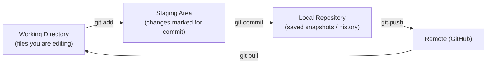

# 🧰 Git & CS Fundamentals — Quick Notes

> [!NOTE]
> These are **rapid-revision notes**. Every concept here is written as a 30-second interview answer — short, correct, and easy to say out loud. Revise this file the morning of your interview.

---

## Part 1 — 🌿 Git & GitHub

Git tracks code changes on your machine; GitHub hosts that code online so teams can collaborate. Interviewers rarely test deep Git — they check whether you can work on a team project without breaking it.

### The 10 commands that matter

| Command | What it does | When you use it |
|---|---|---|
| `git init` | Starts a new Git repo in the current folder | Once, at the start of a new project |
| `git clone <url>` | Downloads a full copy of a remote repo | When joining an existing project |
| `git status` | Shows modified, staged, and untracked files | Before every commit — your safety check |
| `git add <file>` (or `git add .`) | Moves changes to the staging area | When you're ready to include changes in a commit |
| `git commit -m "msg"` | Saves a snapshot of staged changes with a message | After a logical unit of work is done |
| `git push` | Uploads your local commits to GitHub | When you want teammates (or a backup) to have your code |
| `git pull` | Downloads + merges the latest remote changes | Before starting work each day |
| `git branch <name>` | Creates a new branch | Before starting a feature or fix |
| `git switch <name>` | Moves you onto that branch | Right after creating a branch (`git switch -c` does both) |
| `git merge <branch>` | Combines another branch into your current one | When a feature is finished and reviewed |

> [!TIP]
> Daily workflow in one line: `git pull` → make a branch → code → `git add` → `git commit` → `git push` → open a Pull Request. Saying this flow in an interview scores instant points.

### How Git thinks: three areas

- **Working directory** — the actual files on your disk that you're editing.
- **Staging area** — a waiting room; `git add` lets you choose *which* changes go into the next snapshot.
- **Commit** — a permanent snapshot in history, identified by a hash (e.g., `a3f9c1d`).

### Merge vs Rebase

- **Merge:** joins two branches and creates a "merge commit". History shows exactly what happened, including the branch. Safe, used by default.
- **Rebase:** replays your commits on top of the latest base branch, giving a clean, straight-line history. Never rebase commits that others have already pulled.

> [!WARNING]
> Golden rule: **never rebase or force-push a shared branch** (like `main`). You rewrite history that your teammates already have, and their repos break.

### Two one-liners

- **`.gitignore`** — a file listing things Git should never track, like `node_modules/`, `.env` (secrets!), and build folders.
- **Pull Request (PR)** — a request on GitHub to merge your branch into another, so teammates can review, comment, and approve before the code lands.

### 🎤 Quick Q&A — Git

**Q1. `git fetch` vs `git pull`?**
Fetch downloads remote changes but doesn't touch your code; pull = fetch + merge into your current branch. Fetch first when you want to inspect before merging.

**Q2. How do you undo a commit?**
`git reset --soft HEAD~1` keeps your changes staged; `--hard` deletes them completely. For a commit that's already pushed, use `git revert <hash>` — it creates a new commit that undoes the old one safely.

**Q3. What is a merge conflict and how do you fix it?**
Two branches changed the same lines. Git marks the conflict in the file; you edit it to the correct final version, then `git add` and `git commit` to complete the merge.

**Q4. How do you see commit history?**
`git log` (add `--oneline` for a compact one-line-per-commit view).

**Q5. Difference between `git stash` and commit?**
Stash shelves unfinished changes temporarily without a commit, so you can switch branches; `git stash pop` restores them. A commit is permanent history.

**Q6. What is HEAD?**
A pointer to the commit you're currently on — usually the latest commit of your current branch.

---

## Part 2 — 🧠 CS Fundamentals

### Operating Systems (OS)

| Concept | 30-second answer |
|---|---|
| Process vs Thread | A **process** is a running program with its own memory; a **thread** is a unit of execution *inside* a process, and threads share that process's memory. One Chrome process, many tabs/threads. |
| Deadlock | Two or more processes wait forever for resources held by each other. Needs 4 conditions together: mutual exclusion, hold-and-wait, no preemption, circular wait. Break any one to prevent it. |
| Scheduling | The OS decides which process/thread gets the CPU next — e.g., FCFS (first come, first served), Round Robin (fixed time slices), SJF (shortest job first). |
| Virtual Memory | The OS uses disk space (page file) as extra RAM, so programs get more memory than physically exists; data is swapped in pages as needed. |

### DBMS

- **Normalization** — organising tables to remove duplicate data:
  - **1NF:** every cell holds a single value; no repeating groups.
  - **2NF:** 1NF + no column depends on only *part* of a composite key.
  - **3NF:** 2NF + no column depends on another non-key column (only on the key).
- **ACID** — guarantees a database transaction is reliable:
  - **Atomicity** — all steps happen, or none do.
  - **Consistency** — the DB moves from one valid state to another.
  - **Isolation** — concurrent transactions don't corrupt each other.
  - **Durability** — once committed, data survives a crash.
- **Primary key** uniquely identifies a row in its own table (never NULL). A **foreign key** is a column that references another table's primary key, linking the two tables.
- **Index** — like a book's index: a sorted lookup structure (usually a B-tree) that makes reads/WHERE queries much faster, at the cost of slower writes and extra storage.

> [!IMPORTANT]
> **SQL vs NoSQL in one line:** SQL = structured tables with relations and strict schema (MySQL, PostgreSQL); NoSQL = flexible documents/key-values that scale horizontally (MongoDB, Redis). In the MERN stack you use MongoDB, but you should be able to write basic SQL too.

### Networks

| | TCP | UDP |
|---|---|---|
| Reliable? | Yes — delivery guaranteed, in order | No — packets may drop or arrive out of order |
| Speed | Slower (handshake + acknowledgements) | Faster, lightweight |
| Used for | Web pages, APIs, email, file transfer | Live video, voice calls, gaming, DNS |

- **HTTP vs HTTPS:** HTTPS is HTTP encrypted with TLS — data between browser and server can't be read or tampered with in transit. Always use HTTPS in production.
- **DNS in one line:** DNS translates a domain name (`google.com`) into the server's IP address, like a phone book for the internet.

**What happens when you type a URL in the browser?**

1. Browser checks its cache, then asks **DNS** for the server's IP address.
2. Browser opens a **TCP connection** to that IP (plus a TLS handshake for HTTPS).
3. Browser sends an **HTTP request** (e.g., `GET /home`).
4. Server processes it (runs backend code, queries the database) and sends an **HTTP response** with HTML.
5. Browser parses the HTML, downloads linked CSS/JS/images with more requests.
6. Browser renders the page — and JS can then call APIs to update it without reloads.

> [!NOTE]
> **GET vs POST recap:** GET reads data (parameters visible in the URL, idempotent); POST sends data to create something (data in the body). You'll see full API details in the Backend notes.

**Status code families:**

- **2xx** — Success (200 OK, 201 Created)
- **3xx** — Redirection (301 Moved Permanently, 304 Not Modified)
- **4xx** — Client's fault (400 Bad Request, 401 Unauthorized, 404 Not Found)
- **5xx** — Server's fault (500 Internal Server Error)

### OOP — the 4 pillars

A **class** is a blueprint (e.g., `Car`); an **object** is a real instance built from it (your red Swift). The four pillars:

| Pillar | One-line meaning | Example |
|---|---|---|
| **Encapsulation** | Bundle data + methods, hide internals | A class keeps `balance` private; you can only use `deposit()` / `withdraw()` |
| **Abstraction** | Show only what's needed, hide complexity | You press the accelerator; you don't manage the engine's internals |
| **Inheritance** | A child class reuses a parent's properties/methods | `ElectricCar` extends `Car` and inherits `drive()` |
| **Polymorphism** | Same method name, different behaviour | `makeSound()` barks for `Dog`, meows for `Cat` |

---

---

## ✅ 60-Second Revision Checklist

Before you walk in, be able to say each of these without pausing:

- [ ] Git flow: pull → branch → add → commit → push → Pull Request
- [ ] Merge joins history; rebase rewrites it — never rebase shared branches
- [ ] `fetch` downloads, `pull` downloads *and* merges
- [ ] Process has its own memory; threads share it
- [ ] Deadlock = 4 conditions; break one to prevent it
- [ ] Normalization 1NF→3NF: single values → no partial dependency → no transitive dependency
- [ ] ACID: Atomicity, Consistency, Isolation, Durability
- [ ] TCP = reliable and ordered; UDP = fast and lossy
- [ ] URL flow: DNS → TCP/TLS → HTTP request → response → render
- [ ] 4xx = client's fault, 5xx = server's fault
- [ ] OOP pillars: Encapsulation, Abstraction, Inheritance, Polymorphism

> [!TIP]
> Interviewers don't expect textbook depth in extras — they expect *confidence*. Answer in one or two lines, then stop. If they want more, they'll ask.
