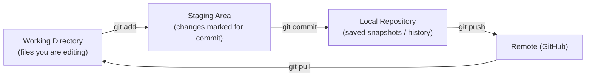

# 🧰 Git & CS Fundamentals — Quick Notes

> [!NOTE]
> These are **rapid-revision notes**. Every concept here is written as a 30-second interview answer — short, correct, and easy to say out loud. Revise this file the morning of your interview.

---

## Part 1 — 🌿 Git & GitHub

Git tracks code changes on your machine; GitHub hosts that code online so teams can collaborate. Interviewers rarely test deep Git — they check whether you can work on a team project without breaking it.

## The 10 commands that matter

| Command | What it does | When you use it |
|---|---|---|
| `git init` | Starts a new Git repo in the current folder | Once, at the start of a new project |
| `git clone <url>` | Downloads a full copy of a remote repo | When joining an existing project |
| `git status` | Shows modified, staged, and untracked files | Before every commit — your safety check |
| `git add <file>` (or `git add .`) | Moves changes to the staging area | When you're ready to include changes in a commit |
| `git commit -m "msg"` | Saves a snapshot of staged changes with a message | After a logical unit of work is done |
| `git push` | Uploads your local commits to GitHub | When you want teammates (or a backup) to have your code |
| `git pull` | Downloads + merges the latest remote changes | Before starting work each day |
| `git branch <name>` | Creates a new branch | Before starting a feature or fix |
| `git switch <name>` | Moves you onto that branch | Right after creating a branch (`git switch -c` does both) |
| `git merge <branch>` | Combines another branch into your current one | When a feature is finished and reviewed |

> [!TIP]
> Daily workflow in one line: `git pull` → make a branch → code → `git add` → `git commit` → `git push` → open a Pull Request. Saying this flow in an interview scores instant points.

## How Git thinks: three areas



- **Working directory** — the actual files on your disk that you're editing.
- **Staging area** — a waiting room; `git add` lets you choose *which* changes go into the next snapshot.
- **Commit** — a permanent snapshot in history, identified by a hash (e.g., `a3f9c1d`).

## Merge vs Rebase

- **Merge:** joins two branches and creates a "merge commit". History shows exactly what happened, including the branch. Safe, used by default.
- **Rebase:** replays your commits on top of the latest base branch, giving a clean, straight-line history. Never rebase commits that others have already pulled.

Picture it: you branched off `main` on Monday and made 3 commits. By Wednesday, `main` has moved ahead with your teammates' work.

- `git merge main` → your branch gains one extra "merge commit" that ties the two lines together. Safe — nothing already pushed changes.
- `git rebase main` → Git lifts your 3 commits and replays them, one by one, on top of Wednesday's `main`. The history now reads as if you started today. Cleaner — but your commits get brand-new hashes, so the old ones must be force-pushed away.

| | Merge | Rebase |
|---|---|---|
| History | Shows the true branch-and-join story | One straight line, easier to read |
| Commit hashes | Unchanged | Rewritten (new hashes) |
| Safe on shared branches? | Yes | No — only your own, unpushed work |
| Typical use | Finishing a feature into `main` | Tidying your local branch before a PR |

**Say it like this:** "Merge preserves history exactly as it happened; rebase rewrites my commits onto the latest base for a cleaner history. I rebase only my own local branches, never a shared one."

> [!WARNING]
> Golden rule: **never rebase or force-push a shared branch** (like `main`). You rewrite history that your teammates already have, and their repos break.

## Two one-liners

- **`.gitignore`** — a file listing things Git should never track, like `node_modules/`, `.env` (secrets!), and build folders.
- **Pull Request (PR)** — a request on GitHub to merge your branch into another, so teammates can review, comment, and approve before the code lands.

**Why these two tiny things carry real weight:**

Neither of these is a command you run once and forget — they are daily habits, and each one prevents a classic fresher disaster.

- **`.gitignore` — why:** Git tracks *everything* you don't tell it to ignore. Without a `.gitignore`, your very first `git add .` sweeps `node_modules/` (hundreds of megabytes your teammate can reinstall themselves) and, much worse, your `.env` file — which holds API keys and database passwords — straight onto GitHub, where it stays in history even if you delete it later.
- **Pull Request — why:** a PR is the checkpoint between "code that works on my laptop" and "code the whole team now depends on." It gives teammates a chance to catch a bug, a leaked secret, or a confusing name *before* it lands on `main` — and it leaves a written record of why the change exists.

**Tiny scenario — one afternoon, both lessons:**

You're finishing the save-mood feature. You run `git add .` and `git status` shows `.env` listed as a new file, about to be committed. Because your `.gitignore` already has a line saying `.env`, you pause — wait, why is it showing? You check: the file was created *before* you added the ignore rule, so you unstage it, confirm `.gitignore` now covers it, and only then commit. Crisis avoided in ten seconds. You push the branch and open the PR; your teammate spots in review that the button saves a mood but never shows a confirmation. One small fix later, you both merge with confidence. The `.gitignore` protected your secrets, the PR protected your quality — say exactly that if an interviewer asks why either one matters.

## 🌅 A day in the life — one feature, start to finish

Say this out loud once and you will never fumble the "how do you work in a team?" question. You are adding a small "save mood" button to your project:

1. **Morning sync:** you run `git pull` on `main`. Git prints `Already up to date.` (nothing new) or `Updating... Fast-forward` with the files that changed. You now have the team's latest code — never start work on stale code.
2. **Make your own branch:** `git switch -c feature/save-mood` creates the branch and moves you onto it in one step. Git replies `Switched to a new branch 'feature/save-mood'`. Your work now cannot disturb `main`.
3. **Code for a while,** then check yourself with `git status`. Git lists your changed files under `Changes not staged for commit:` — this is your safety check before every commit.
4. **Stage only this feature:** `git add src/SaveMoodButton.jsx`. It prints nothing on success — silence means done. (`git add .` stages everything; fine for a solo project, risky in a team.)
5. **Commit the snapshot:** `git commit -m "Add save mood button"`. Git replies `[feature/save-mood a3f9c1d] Add save mood button` plus `1 file changed...`. You now have a permanent, named checkpoint.
6. **Push your branch:** `git push -u origin feature/save-mood` uploads the branch and prints a line like `Create a pull request for 'feature/save-mood'...` with a link. The `-u` links local and remote branch, so next time plain `git push` is enough.
7. **Open the Pull Request** on GitHub: you describe what changed, a teammate reads the diff, comments, and approves. This review step is the whole point of branching — `main` only receives reviewed code.
8. **Merge and clean up:** after merging on GitHub, you run `git switch main`, then `git pull` to bring the merge down, then `git branch -d feature/save-mood` to delete the finished branch. Git confirms `Deleted branch feature/save-mood`.

> [!TIP]
> If an interviewer asks "walk me through your Git workflow", narrate exactly these 8 steps. Branch → commit small → push → PR → review → merge. That *is* the professional workflow.

**What you write in the PR (3 lines is enough):**

- **What:** one line — "Adds a save-mood button on the result card."
- **Why:** one line — "Users asked to revisit suggestions without re-entering their mood."
- **How tested:** one honest line — "Tested locally: selected mood, saved, refreshed, entry persisted."

A reviewer should understand your branch in 30 seconds without opening the code first. If they ask why a change exists, the PR answers — not your memory a week later.

> [!NOTE]
> Branch names carry meaning too: `feature/`, `fix/`, `chore/` prefixes (like `fix/login-redirect`) let a team scan a branch list and know the intent instantly. Small habit, very professional signal.

## ⏪ Undo scenarios — which tool, and is it safe to share?

Undoing is where freshers panic and type something dangerous. The rule is simple: **if the commit is already pushed and others may have it, only `revert` is safe.** Everything with `reset` rewrites history.

| Your situation | Command | What actually happens | Safe on a shared branch? |
|---|---|---|---|
| You staged a file by mistake | `git restore --staged <file>` | File leaves the staging area; your edits stay untouched in the working directory | ✅ Yes — purely local, history untouched |
| Undo last commit, keep the work | `git reset --soft HEAD~1` | Commit disappears, changes stay staged, ready to re-commit | ⚠️ Only if **not pushed yet** |
| Undo last commit, throw work away | `git reset --hard HEAD~1` | Commit *and* your changes are deleted completely | ❌ Never after pushing; dangerous even locally |
| Undo a commit already on GitHub | `git revert <hash>` | Creates a **new** commit that reverses the old one; history stays honest | ✅ Yes — this is the shared-branch-safe way |

> [!WARNING]
> `git reset --hard` is the one command that can delete real work with no recycle bin. In an interview, say: "I avoid `--hard` on anything pushed; for pushed commits I use `revert` because it doesn't rewrite history my teammates already have." That sentence alone signals senior-level caution.

## ⚔️ Merge conflict walkthrough — what the scary markers mean

A conflict just means: *two branches edited the same lines, and Git refuses to guess which version you want.* Git stops the merge, writes both versions into the file, and waits for you. Inside the file you will see:

- A line starting with `<<<<<<< HEAD` — everything below it, down to the separator, is **your current branch's** version.
- A line of `=======` — the divider between the two versions.
- Everything below it down to `>>>>>>> feature/save-mood` — the **incoming branch's** version, with the branch name after the arrows.

**Resolve it in 3 steps (always the same 3):**

1. **Decide the final code:** open the file, keep the correct lines (sometimes yours, sometimes theirs, sometimes a mix), and delete all three marker lines. The file must read like normal code again — no markers left behind.
2. **Mark it resolved:** run `git add <file>`. Staging the file is how you tell Git "this conflict is handled."
3. **Finish the merge:** run `git commit` (Git pre-fills the merge message). Done — the merge completes with your chosen version.

> [!NOTE]
> Two escape hatches worth knowing: `git status` during a conflict lists files as `both modified` so you never guess which files are stuck, and `git merge --abort` cancels the whole merge and puts you back exactly where you were. Mentioning `--abort` tells the interviewer you stay calm under pressure.

## 🎤 Quick Q&A — Git

**Q1. `git fetch` vs `git pull`?**
Fetch downloads remote changes but doesn't touch your code; pull = fetch + merge into your current branch. Fetch first when you want to inspect before merging.

**Q2. How do you undo a commit?**
`git reset --soft HEAD~1` keeps your changes staged; `--hard` deletes them completely. For a commit that's already pushed, use `git revert <hash>` — it creates a new commit that undoes the old one safely.

**Q3. What is a merge conflict and how do you fix it?**
Two branches changed the same lines. Git marks the conflict in the file; you edit it to the correct final version, then `git add` and `git commit` to complete the merge.

**Q4. How do you see commit history?**
`git log` (add `--oneline` for a compact one-line-per-commit view).

**Q5. Difference between `git stash` and commit?**
Stash shelves unfinished changes temporarily without a commit, so you can switch branches; `git stash pop` restores them. A commit is permanent history.

**Q6. What is HEAD?**
A pointer to the commit you're currently on — usually the latest commit of your current branch.

---

## Part 2 — 🧠 CS Fundamentals

Operating systems, databases, networks, and OOP are the four subjects every service-based and product company checks, usually as rapid one-line questions between the coding rounds. Nobody expects textbook depth — they expect the definition, one example, and one place you have actually seen it in your own projects. That is exactly how the next four chapters are written: say the example, not just the definition.

## Operating Systems (OS)

| Concept | 30-second answer |
|---|---|
| Process vs Thread | A **process** is a running program with its own memory; a **thread** is a unit of execution *inside* a process, and threads share that process's memory. One Chrome process, many tabs/threads. |
| Deadlock | Two or more processes wait forever for resources held by each other. Needs 4 conditions together: mutual exclusion, hold-and-wait, no preemption, circular wait. Break any one to prevent it. |
| Scheduling | The OS decides which process/thread gets the CPU next — e.g., FCFS (first come, first served), Round Robin (fixed time slices), SJF (shortest job first). |
| Virtual Memory | The OS uses disk space (page file) as extra RAM, so programs get more memory than physically exists; data is swapped in pages as needed. |

**Go deeper — Operating Systems:**

Key concepts to hold together: a **process** is one running program with its own private memory; **threads** are the workers *inside* it who share that memory (fast to cooperate, but they can trip over each other); **scheduling** is the OS handing out CPU time fairly; **virtual memory** lets the OS pretend RAM is bigger than it is by parking idle pages on disk.

*Worked micro-example — why your laptop survives 30 tabs:* you have 8 GB of RAM and you open Chrome (30 tabs), VS Code, and Spotify — together they "want" about 12 GB. Nothing crashes, because the OS keeps only the pages each app is actively touching in RAM and parks the rest (that tab you haven't clicked in an hour) on disk. Click the old tab and there's a half-second pause while its page swaps back in — that's the trade working exactly as designed.

*Common trap:* saying threads have their own separate memory. They don't — sharing memory is precisely what makes threads light *and* risky: two threads editing the same data at once is how race conditions (and, with locks, deadlocks) are born. If the interviewer asks why multithreading is hard, that's your answer.

## DBMS

- **Normalization** — organising tables to remove duplicate data:
  - **1NF:** every cell holds a single value; no repeating groups.
  - **2NF:** 1NF + no column depends on only *part* of a composite key.
  - **3NF:** 2NF + no column depends on another non-key column (only on the key).
- **ACID** — guarantees a database transaction is reliable:
  - **Atomicity** — all steps happen, or none do.
  - **Consistency** — the DB moves from one valid state to another.
  - **Isolation** — concurrent transactions don't corrupt each other.
  - **Durability** — once committed, data survives a crash.
- **Primary key** uniquely identifies a row in its own table (never NULL). A **foreign key** is a column that references another table's primary key, linking the two tables.
- **Index** — like a book's index: a sorted lookup structure (usually a B-tree) that makes reads/WHERE queries much faster, at the cost of slower writes and extra storage.

> [!IMPORTANT]
> **SQL vs NoSQL in one line:** SQL = structured tables with relations and strict schema (MySQL, PostgreSQL); NoSQL = flexible documents/key-values that scale horizontally (MongoDB, Redis). In the MERN stack you use MongoDB, but you should be able to write basic SQL too.

**Go deeper — DBMS:**

Key concepts to hold together: **tables** store rows; a **primary key** names each row uniquely; a **foreign key** points from one table's row to another's; **normalization** removes copies of the same fact so it can never disagree with itself; **ACID** is the promise that a multi-step transaction behaves like one indivisible step; an **index** is a pre-sorted shortcut for finding rows fast.

*Worked micro-example — one order, placed correctly:* a customer in Ghaziabad places an order. Un-normalized, you'd store the customer name, city, and phone *inside* every order row — order #51 repeats what orders #1–#50 already said. Normalized, you store it once: `customers(customer_id, name, city, phone)` and `orders(order_id, customer_id, item, amount)`. The order carries only the `customer_id` — a foreign key. When the customer changes her phone number, you update **one** row and every order ever placed is instantly correct. That is normalization paying rent.

*Common trap:* reaching for an index on every column "to make it fast." Every index speeds up reads but taxes *every* write (the B-tree must be maintained on each insert) and eats storage. Index the columns you actually filter and join on — no more. If an interviewer asks "can indexes hurt?", that's the answer they're fishing for.

## Networks

| | TCP | UDP |
|---|---|---|
| Reliable? | Yes — delivery guaranteed, in order | No — packets may drop or arrive out of order |
| Speed | Slower (handshake + acknowledgements) | Faster, lightweight |
| Used for | Web pages, APIs, email, file transfer | Live video, voice calls, gaming, DNS |

- **HTTP vs HTTPS:** HTTPS is HTTP encrypted with TLS — data between browser and server can't be read or tampered with in transit. Always use HTTPS in production.
- **DNS in one line:** DNS translates a domain name (`google.com`) into the server's IP address, like a phone book for the internet.

**What happens when you type a URL in the browser?**

1. Browser checks its cache, then asks **DNS** for the server's IP address.
2. Browser opens a **TCP connection** to that IP (plus a TLS handshake for HTTPS).
3. Browser sends an **HTTP request** (e.g., `GET /home`).
4. Server processes it (runs backend code, queries the database) and sends an **HTTP response** with HTML.
5. Browser parses the HTML, downloads linked CSS/JS/images with more requests.
6. Browser renders the page — and JS can then call APIs to update it without reloads.

> [!NOTE]
> **GET vs POST recap:** GET reads data (parameters visible in the URL, idempotent); POST sends data to create something (data in the body). You'll see full API details in the Backend notes.

**Status code families:**

- **2xx** — Success (200 OK, 201 Created)
- **3xx** — Redirection (301 Moved Permanently, 304 Not Modified)
- **4xx** — Client's fault (400 Bad Request, 401 Unauthorized, 404 Not Found)
- **5xx** — Server's fault (500 Internal Server Error)

**Go deeper — Networks:**

Key concepts to hold together: **DNS** finds the address; **TCP** opens a reliable, ordered pipe (or **UDP** trades reliability for speed); **TLS** encrypts that pipe to make HTTP into HTTPS; the **request/response** pair is one round trip; and the **status code** is the server's one-number summary of how it went.

*Worked micro-example — trace one click:* you click "Pay" on a checkout page. DNS has already resolved the shop's domain to an IP (likely cached). The browser opens TCP, does the TLS handshake, and sends `POST /pay`. The server charges the card, saves the order, and replies `201 Created`. Your screen shows "Order placed." Now the negative trace, same click: your login had expired, so the server replies `401 Unauthorized` and the app routes you to sign-in; or you typed a product URL that doesn't exist and get `404 Not Found`. Reading the status code first tells you *whose* problem it is before you read a single line of the body — 4xx, look at the request; 5xx, look at the server.

*Common trap:* mixing up 401 and 403. **401** means "I don't know who you are — log in" (missing or expired authentication); **403** means "I know exactly who you are, and you're not allowed" (authenticated but not authorized). Interviewers swap them deliberately — keep them straight.

## OOP — the 4 pillars

A **class** is a blueprint (e.g., `Car`); an **object** is a real instance built from it (your red Swift). The four pillars:

| Pillar | One-line meaning | Example |
|---|---|---|
| **Encapsulation** | Bundle data + methods, hide internals | A class keeps `balance` private; you can only use `deposit()` / `withdraw()` |
| **Abstraction** | Show only what's needed, hide complexity | You press the accelerator; you don't manage the engine's internals |
| **Inheritance** | A child class reuses a parent's properties/methods | `ElectricCar` extends `Car` and inherits `drive()` |
| **Polymorphism** | Same method name, different behaviour | `makeSound()` barks for `Dog`, meows for `Cat` |

**Go deeper — OOP:**

Key concepts to hold together: a **class** is the blueprint, an **object** is one built instance with its own data; **encapsulation** guards that data behind methods; **abstraction** exposes a simple surface over messy internals; **inheritance** reuses a parent's behaviour in a child; **polymorphism** lets one method call behave differently per object.

*Worked micro-example — one bank account, all four pillars in five lines:*

```java
class Account {                       // blueprint (class)
  private double balance;             // encapsulation: data is locked away
  void deposit(double amt) { ... }    // abstraction: caller just says "deposit"
}
class SavingsAccount extends Account { // inheritance: reuses deposit()
  void addInterest() { ... }           // ...and adds its own behaviour
}
// polymorphism: acc.withdraw() behaves differently
// for a SavingsAccount vs a CurrentAccount — same call, right behaviour.
```

Walk it out loud: "The class is the blueprint; each customer's account is an object. Balance is private — encapsulation — so you can only touch it through `deposit` and `withdraw`, which is abstraction from the caller's side. A savings account inherits from the general account instead of rewriting it, and calling `withdraw` does the right thing for each account type — that's polymorphism."

*Common trap:* confusing abstraction with encapsulation — interviewers treat them as a pair and probe the seam. Keep the scalpel sharp: **encapsulation hides the data** (private fields, controlled access); **abstraction hides the complexity** (a simple method over messy steps). One protects state, the other simplifies use. If you can say which is which without blinking, this follow-up is over.

## 🏃 CS rapid answers — say the example, not just the definition

Definitions get you a nod; a one-line story gets you the mark. Keep one concrete picture ready for each:

- **Process vs Thread:** "Chrome and Spotify are two processes with separate memory; the many tabs inside Chrome are threads sharing Chrome's memory — one tab crashing doesn't kill the other app."
- **Deadlock (the two-locks story):** "Thread A holds the database lock and waits for the cache lock. Thread B holds the cache lock and waits for the database lock. Neither can move — that's deadlock. You prevent it by making everyone take locks in the same order."
- **Scheduling:** "Round Robin is a ticket counter giving each person exactly 2 minutes — nobody waits forever, everybody gets a turn."
- **Virtual Memory:** "Your laptop has 8 GB RAM but you open apps needing 12 GB — the OS quietly parks the idle pages on disk and brings them back when needed. Disk pretends to be extra RAM."
- **Normalization (the repeated-city fix):** "If 50 orders of one customer repeat the city 'Ghaziabad' on every row, fixing a spelling means editing 50 rows. In 3NF the city lives once in the customer row — one fix, done everywhere."
- **ACID (one bank transfer says it all):** "Sending ₹500: Atomicity — debit and credit both happen or neither does. Consistency — balances stay valid. Isolation — my transfer doesn't mix with yours running at the same time. Durability — after success, a power cut can't erase it."
- **Index:** "Finding 'Sharma' using a phone book's index takes seconds; without it you'd read every page. Indexes speed up reads, cost you a little on every write."
- **TCP vs UDP (call vs download):** "A file download uses TCP — one missing chunk corrupts the file, so every packet must arrive in order. A live video call uses UDP — a late frame is useless, so it skips it and keeps the conversation live."
- **DNS:** "You type `github.com`, DNS returns the server's IP — exactly like tapping a contact name instead of dialling the number from memory."

> [!TIP]
> Interview trick: answer the definition in one line, then say "for example..." and give the story above. Two lines total, then stop. That rhythm — definition, example, stop — is what "strong basics" sounds like.

---

---

## ✅ 60-Second Revision Checklist

Before you walk in, be able to say each of these without pausing:

- [ ] Git flow: pull → branch → add → commit → push → Pull Request
- [ ] Merge joins history; rebase rewrites it — never rebase shared branches
- [ ] `fetch` downloads, `pull` downloads *and* merges
- [ ] Process has its own memory; threads share it
- [ ] Deadlock = 4 conditions; break one to prevent it
- [ ] Normalization 1NF→3NF: single values → no partial dependency → no transitive dependency
- [ ] ACID: Atomicity, Consistency, Isolation, Durability
- [ ] TCP = reliable and ordered; UDP = fast and lossy
- [ ] URL flow: DNS → TCP/TLS → HTTP request → response → render
- [ ] 4xx = client's fault, 5xx = server's fault
- [ ] OOP pillars: Encapsulation, Abstraction, Inheritance, Polymorphism

> [!TIP]
> Interviewers don't expect textbook depth in extras — they expect *confidence*. Answer in one or two lines, then stop. If they want more, they'll ask.
