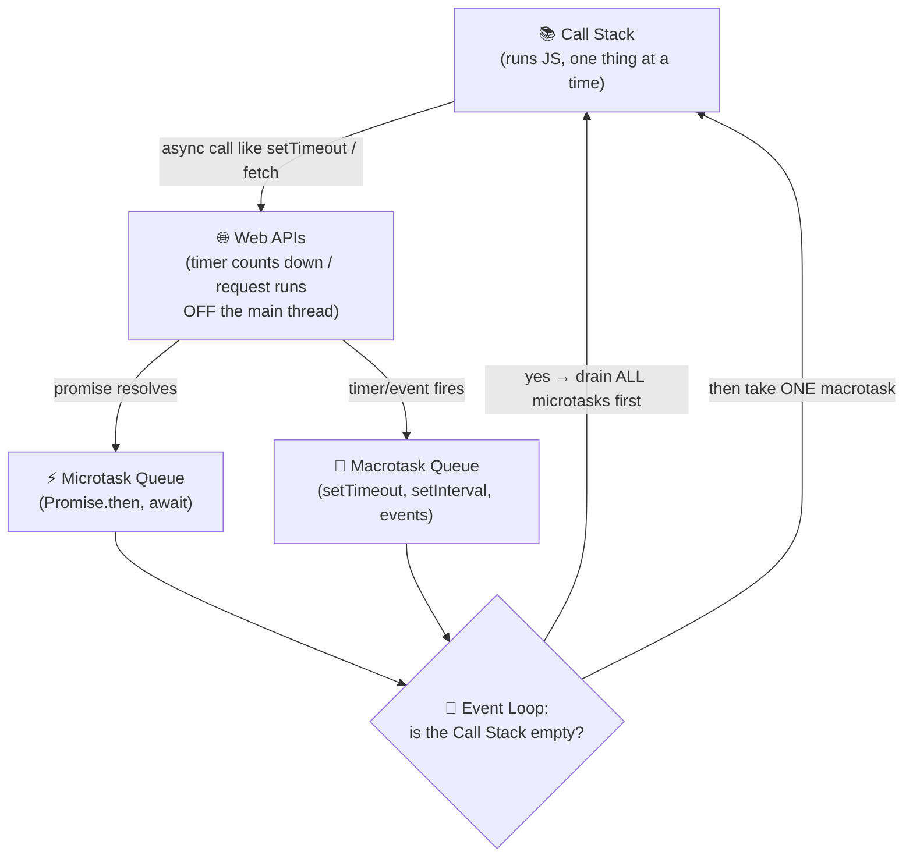

# ⚡ JavaScript — Complete Interview Notes

> 📚 Part of **Full-Stack Interview Notes by Ayushi Singh** — written for final-year CSE students and freshers preparing for MERN / full-stack interviews. Every concept here is explained the way you should explain it *out loud* in an interview: simple, correct, with one example ready.

JavaScript is the one language that runs on **both** sides of a full-stack app — the browser (React) and the server (Node.js). That is exactly why interviewers dig deepest here. This file covers everything from the ground up: data types, scoping, `this`, coercion, arrays, promises, the event loop, ES6+, and the classic traps that decide whether an interview goes well or not.

**How to use these notes:** read a section → run the example in your head → read the "What the interviewer actually asks" line. That last line is the point. 🎯

---

## 📌 1. Data Types — Primitive vs Reference

JavaScript has **8 data types**, split into two families. The split matters because the two families behave completely differently when you copy them.

### 🔹 Primitive types (7) — copied *by value*

`string`, `number`, `boolean`, `null`, `undefined`, `symbol`, `bigint`

```js
let a = 10;
let b = a;   // b gets a COPY of the value
b = 20;
console.log(a); // 10 — a is unaffected
```

### 🔹 Reference types (1 family) — copied *by reference*

`object` (this includes arrays, functions, dates — everything non-primitive)

```js
let obj1 = { name: "Ayushi" };
let obj2 = obj1;        // obj2 points to the SAME object in memory
obj2.name = "Singh";
console.log(obj1.name); // "Singh" — obj1 changed too!
```

> [!IMPORTANT]
> **The one-line rule:** Primitives store the actual value. Objects store a *reference* (an address) to the value. Copying a variable copies the value for primitives, but copies the *address* for objects — so both variables end up pointing at the same object.

> [!NOTE]
> **Memory picture:** primitives live directly in the variable (think: the value is *in* the box). Objects live in the heap, and the variable only holds the *address* of that object (the box holds a slip of paper with a house address on it). Copying the box copies the address slip, not the house.

### 🔍 `typeof` and its famous traps

`typeof` tells you the type of a value — but it has three traps every interviewer knows:

```js
typeof "hello"      // "string"
typeof 42           // "number"
typeof true         // "boolean"
typeof undefined    // "undefined"
typeof Symbol()     // "symbol"
typeof 10n          // "bigint"
typeof function(){} // "function"  ← functions get their own answer

typeof null         // "object"  ⚠️ TRAP 1
typeof []           // "object"  ⚠️ TRAP 2
typeof {}           // "object"
typeof NaN          // "number"  ⚠️ TRAP 3 — NaN is still a number!
```

> [!WARNING]
> **`typeof null === "object"` is a bug from 1995** that can never be fixed (too much old code depends on it). `null` is a primitive, not an object. If an interviewer asks "is null an object?" — the answer is: *no, `typeof` just lies about it for historical reasons.*

> [!TIP]
> To check for an array properly, never use `typeof` (it says `"object"`). Use **`Array.isArray([])`** → `true`. And to check for null: `value === null`.

> [!NOTE]
> `undefined` means "declared but not assigned a value yet" (JavaScript's default). `null` means "intentionally empty — *I* set this to nothing." You assign `null`; the engine assigns `undefined`.

**🎤 What the interviewer actually asks:** *"What are the data types in JavaScript?"* (list them), *"Difference between null and undefined?"*, and the favourite trap — *"What does `typeof null` print, and why?"*

---

## 📌 2. `var` vs `let` vs `const`

The three ways to declare a variable. `var` is the old (pre-2016) way; `let` and `const` came with ES6 and fixed its problems.

| Feature | `var` | `let` | `const` |
|---|---|---|---|
| **Scope** | Function-scoped | Block-scoped `{ }` | Block-scoped `{ }` |
| **Hoisting** | Hoisted **and** initialised to `undefined` | Hoisted but in **TDZ** | Hoisted but in **TDZ** |
| **Re-declare** (same scope) | ✅ Allowed | ❌ SyntaxError | ❌ SyntaxError |
| **Re-assign** | ✅ Yes | ✅ Yes | ❌ No |
| **Must initialise at declaration?** | No | No | ✅ Yes |
| **Default value if unassigned** | `undefined` | `undefined` | — (not allowed) |

```js
// SCOPE difference — the most asked point
if (true) {
  var a = 1;
  let b = 2;
  const c = 3;
}
console.log(a); // 1  — var leaks OUT of the block!
console.log(b); // ❌ ReferenceError — let stays inside the block
console.log(c); // ❌ ReferenceError — const stays inside too
```

> [!IMPORTANT]
> **const does NOT make objects unchangeable.** `const` locks the *binding* (you can't point the variable at a different value), but an object's contents can still change:
> ```js
> const user = { name: "Ayushi" };
> user.name = "Singh";  // ✅ allowed — mutating the object
> user = {};            // ❌ TypeError — reassigning the variable
> ```

> [!TIP]
> **What to use in real code:** `const` by default, `let` when the value must change, `var` almost never. Interviewers love hearing this exact order.

**🎤 What the interviewer actually asks:** *"Difference between var, let and const?"* — answer with scope first, then hoisting/TDZ, then reassignment. And *"Can I change a const object?"* — yes, mutate yes, reassign no.

---

## 📌 3. Hoisting

> [!NOTE]
> **Definition:** Hoisting is JavaScript's behaviour of moving declarations to the top of their scope *before* the code runs. Variables and functions behave differently, and that difference is the whole game.

### Variable hoisting

```js
console.log(x); // undefined  (NOT an error!)
var x = 5;
console.log(x); // 5
```

Why `undefined` and not an error? Because `var x` is hoisted *with* an initial value of `undefined`. The declaration moves up; the assignment (`= 5`) stays where it is.

But `let` and `const` behave differently:

```js
console.log(y); // ❌ ReferenceError: Cannot access 'y' before initialization
let y = 5;
```

**Watch hoisting run, using the two phases:**

```js
console.log(score);   // line 1
var score = 90;       // line 2
console.log(score);   // line 3
```

1. **Creation phase:** before anything executes, JavaScript scans the scope and registers `score` in memory, initialising the slot to `undefined`. (This registration *is* the hoisting.)
2. **Execution, line 1:** `console.log(score)` looks up the slot — it exists and holds `undefined` → prints `undefined`, no error.
3. **Execution, line 2:** the assignment `score = 90` finally runs, filling the slot with `90`.
4. **Execution, line 3:** prints `90`.

So the code behaves *as if* `var score;` were written at the very top while `score = 90` stayed on line 2 — because effectively, that's what the engine did. Swap `var` for `let` and line 1 crashes instead: the slot exists from the creation phase, but `let` slots stay *uninitialised* until their declaration line executes — the TDZ, explained next.

### ⏳ The Temporal Dead Zone (TDZ)

> [!IMPORTANT]
> The **TDZ** is the time between entering a scope and the actual `let`/`const` declaration line. The variable *exists* (it is hoisted) but is **not initialised**, so touching it throws a `ReferenceError`. `var` has no TDZ — it starts life as `undefined`.

### Function hoisting

```js
greet(); // "Hello!" — works even BEFORE the definition

function greet() {
  console.log("Hello!");
}
```

Function **declarations** are hoisted completely — both the name *and* the body. But function **expressions** are not:

```js
sayHi(); // ❌ TypeError: sayHi is not a function

var sayHi = function () {
  console.log("Hi");
};
```

Here only `var sayHi` is hoisted (as `undefined`). Calling `undefined()` gives `TypeError: sayHi is not a function` — notice it's a *Type*Error, not a *Reference*Error, because the variable exists but holds no function yet.

> [!NOTE]
> **Under the hood:** Before a single line of your code runs, JavaScript does a quiet "creation phase" walk through the scope and sets up memory slots for every declaration it finds. `var` slots are filled with `undefined` immediately; `let`/`const` slots are created but left *uninitialised* (that waiting period is the TDZ); function declarations get their entire body stored. Then the "execution phase" runs your code top to bottom, replacing slot values as it reaches each assignment. Hoisting is just you peeking at a slot before its assignment line has run.

> [!WARNING]
> **Error-type trap:** `ReferenceError` = the variable doesn't exist / is in TDZ. `TypeError: x is not a function` = the variable exists but isn't a function (usually a hoisted `var` that's still `undefined`).

**🎤 What the interviewer actually asks:** *"What is hoisting?"*, *"Why does this print undefined instead of throwing?"*, and *"What is the TDZ?"* — all three are usually asked back-to-back.

---

## 📌 4. Scope & Closures

### Scope — where a variable is visible

- **Global scope** — declared outside everything; visible everywhere. (Avoid polluting it.)
- **Function scope** — declared inside a function with `var`; visible only in that function.
- **Block scope** — declared inside `{ }` with `let`/`const`; visible only in that block.

```js
let globalVar = "I'm everywhere";

function demo() {
  let functionVar = "I'm inside demo";
  if (true) {
    let blockVar = "I'm inside the if block";
    console.log(globalVar);    // ✅
    console.log(functionVar);  // ✅
    console.log(blockVar);     // ✅
  }
  console.log(blockVar);       // ❌ ReferenceError — block ended
}
console.log(functionVar);      // ❌ ReferenceError — function ended
```

Inner scopes can look *outward* for variables, but outer scopes can never look *inward*. That one-way visibility chain is called the **scope chain**.

### 🧠 Closures

> [!NOTE]
> **Definition:** A closure is a function that *remembers* the variables from the scope where it was created — even after that outer scope has finished running. The inner function "closes over" the outer variables.

```js
function counter() {
  let count = 0;               // private — nobody outside can touch it
  return function () {
    count++;
    return count;
  };
}

const myCounter = counter();
console.log(myCounter()); // 1
console.log(myCounter()); // 2
console.log(myCounter()); // 3
```

`counter()` has finished running — but `count` is still alive because the returned function remembers it. Each call to `counter()` creates a **fresh, independent** `count`:

```js
const another = counter();
console.log(another()); // 1 — separate count, starts over
```

**Watch it run, line by line:**

```js
function counter() {
  let count = 0;
  return function () {
    count++;
    return count;
  };
}

const c = counter();
console.log(c()); // ?
console.log(c()); // ?
```

1. `counter()` runs. A fresh `count = 0` is created inside it.
2. `counter()` returns the inner function and finishes. Normally `count` would be thrown away now — but the returned function still *mentions* `count`, so JavaScript keeps that variable alive in a hidden memory area attached to the function. That saved environment **is** the closure.
3. `c()` runs the inner function: it looks up `count`, finds `0` in its saved environment, bumps it to `1`, returns `1`.
4. `c()` again: same saved environment, `count` is now `1`, becomes `2`, returns `2`.

Output: `1`, then `2`. And every separate `counter()` call builds a *separate* saved environment — which is why `another()` above started back at `1`.

> [!NOTE]
> **Under the hood:** A closure does **not** copy the *value* of the outer variable — it keeps a reference to the variable itself (its slot in the "environment record"). So if outer code changes the variable later, the closure sees the new value. It remembers the *variable*, not a photograph of it. This one fact explains almost every closure bug ever written.

**One more worked example — a function factory:**

```js
function makeMultiplier(factor) {
  return function (n) {
    return n * factor;
  };
}

const double = makeMultiplier(2);
const triple = makeMultiplier(3);

console.log(double(5)); // 10
console.log(triple(5)); // 15
```

`double` and `triple` run the *same* inner-function code, but each closes over a different `factor` (2 vs 3). One function template, many specialised functions — that's a factory.

**The loop + closure classic — `var` vs `let` side by side:**

```js
for (var i = 0; i < 3; i++) {
  setTimeout(() => console.log("var:", i), 0);
}

for (let i = 0; i < 3; i++) {
  setTimeout(() => console.log("let:", i), 0);
}
```

Output:

```
var: 3
var: 3
var: 3
let: 0
let: 1
let: 2
```

With `var` there is only **one** `i` for the whole loop, and all three callbacks close over that same variable — by the time they run, the loop has finished and `i` is `3`. With `let`, each iteration creates a **fresh** `i`, so each callback closes over its own variable: 0, 1, 2. (Section 13 revisits this as a trap — it combines closures, scope, and the event loop in a single question.)

> [!WARNING]
> **Common mistake:** assuming a closure froze the value at the moment it was created. It didn't — it kept the *variable*. Loop with `var`, or mutate a captured variable after creating the closure, and the closure will happily use the latest value. When you need a frozen snapshot per iteration, use `let`, or pass the value into another function so each callback gets its own variable to close over.

> [!IMPORTANT]
> **Why closures matter (say this in interviews):**
> - **Data privacy / encapsulation** — `count` above cannot be read or changed from outside; only the returned function can touch it. This is how you fake "private variables" in JS.
> - **Function factories** — `makeMultiplier(2)` returning a doubler function.
> - **React hooks** — `useState` and event handlers rely on closures; a stale-closure bug is a famous React interview topic.

Try it yourself — finish the counter:

```playground Closures: build a counter
function makeCounter() {
  let count = 0;
  return function () {
    // TODO: increase count by 1 first, then return it
    return count;
  };
}

const c1 = makeCounter();
console.log(c1()); // goal: 1
console.log(c1()); // goal: 2

const c2 = makeCounter();
console.log(c2()); // goal: 1 — a fresh, separate count
```

**🎤 What the interviewer actually asks:** *"What is a closure?"* (definition + one example), *"Give a real use case"* (private counter), and often the trap in Section 13 — `var` + loop + `setTimeout`.

---

## 📌 5. The `this` Keyword

`this` is the most confusing word in JavaScript, so let's fix it with one idea:

> [!IMPORTANT]
> **`this` refers to the object that is *calling* the function right now.** It is decided at **call time**, not when the function is written. Ask: *"Who called me, and how?"*

### The basic rules (in priority order)

1. **Normal function called plainly** (`fn()`) → `this` is `undefined` in strict mode, the global object (`window`) in sloppy mode.
2. **Method call** (`obj.fn()`) → `this` is `obj` — whatever is on the **left of the dot**.
3. **`new` keyword** (`new Fn()`) → `this` is the brand-new object being created.
4. **Explicit binding** (`call` / `apply` / `bind`) → `this` is whatever you pass in.
5. **Arrow functions** → they have **no `this` of their own** — they borrow the `this` of the surrounding scope. (Explained below.)

### The classic example

```js
const user = {
  name: "Ayushi",
  greet() {
    console.log(this.name);
  },
};

user.greet(); // "Ayushi" — user called greet, so this = user

const g = user.greet; // just copying the function, not calling it
g();                  // undefined — called plainly, this is lost!
```

> [!WARNING]
> Extracting a method into a variable (`const g = user.greet`) **detaches** it from its object. This is the single most common `this` bug — and it's why React class components needed `.bind(this)`. Fix: `const g = user.greet.bind(user);`

### Arrow function vs normal function — the `this` difference

```js
const user2 = {
  name: "Ayushi",
  greet: () => {
    console.log(this.name);
  },
};

user2.greet(); // undefined — arrows don't get their own this!
```

The arrow function borrows `this` from outside `user2` (the global scope), where `name` doesn't exist. **Rule of thumb:**

| | Normal function | Arrow function |
|---|---|---|
| Own `this`? | Yes — from the caller | **No** — inherits from surrounding scope |
| Good for | Object methods, constructors | Callbacks, short one-liners, inside methods that need the outer `this` |
| Can use `new`? | Yes | ❌ No |
| Has `arguments` object? | Yes | ❌ No (use rest `...args`) |

The arrow's "no own this" is actually a *feature* inside callbacks:

```js
const team = {
  members: ["A", "B"],
  list() {
    // normal method → this = team ✅
    this.members.forEach((m) => {
      // arrow callback inherits this from list() → still team ✅
      console.log(this.members.length, m);
    });
  },
};
team.list(); // 2 "A"   2 "B"
```

With a normal `function` callback inside `forEach`, `this` would have been lost. This is *the* reason arrows are used in callbacks.

### Borrowing a method — `call`, `apply`, `bind` in action

Sometimes you *want* to run a function with a different `this`. Three tools do exactly that:

```js
function introduce(city) {
  console.log(`${this.name} from ${city}`);
}

const a = { name: "Ayushi" };
const b = { name: "Ikra" };

introduce.call(a, "Ghaziabad");  // "Ayushi from Ghaziabad" — runs NOW, args one by one
introduce.apply(b, ["Delhi"]);   // "Ikra from Delhi" — runs NOW, args as one array
const bound = introduce.bind(a); // does NOT run — returns a copy with this locked to a
bound("Mumbai");                 // "Ayushi from Mumbai"
```

**Watch `introduce.call(a, "Ghaziabad")` run, line by line:**

1. `call` takes the function `introduce` plus an object, `a`.
2. It runs `introduce` *immediately*, but with `this` forced to `a`.
3. Inside, `this.name` reads `a.name` → `"Ayushi"`, and the extra argument fills the `city` parameter.

`apply` is identical except the arguments arrive as one array (handy when you already have an array). `bind` is the odd one out: it runs nothing — it *returns a copy* of the function with `this` permanently glued on, ready to call later. That's why `bind` fixes the detached-method bug from earlier: `const g = user.greet.bind(user)` keeps `this` attached to `user` forever, no matter who calls `g` afterwards.

> [!WARNING]
> **Common mistake:** using an arrow function as an object method and wondering why `this.name` prints `undefined`. Arrows never receive their own `this` — not from a method call, and not even from `call`/`bind` (there's nothing to rebind). Use a normal function or the short method syntax for object methods, and save arrows for callbacks *inside* methods, where inheriting the outer `this` is exactly what you want.

**🎤 What the interviewer actually asks:** *"What is this?"*, *"Arrow vs normal function — differences?"*, and the killer follow-up — *"What will this print?"* (using the `const g = obj.greet` trick above).

---

## 📌 6. `==` vs `===` and Type Coercion

> [!NOTE]
> **`===` (strict):** compares value AND type. No conversion happens. **`==` (loose):** converts ("coerces") both sides to a common type first, *then* compares. That conversion is where all the surprises live.

```js
5 === "5"   // false — different types, no conversion
5 == "5"    // true  — "5" is converted to 5 first
0 === false // false
0 == false  // true  — false converts to 0
null === undefined // false
null == undefined  // true  — special rule: null and undefined equal ONLY each other
null == 0   // false ⚠️ — null does NOT coerce to 0 with ==
"" == 0     // true  — "" converts to 0
[] == 0     // true  — [] converts to "" then to 0
```

### How coercion actually works (with `+` and `-`)

The `+` operator is two-faced: if **either** side is a string, it does string **concatenation**. Otherwise, it does numeric addition (converting things to numbers). The `-` operator is *always* numeric.

```js
1 + "2"        // "12"  — string present → concatenate
"5" + 2        // "52"
"5" - 2        // 3     — minus forces numbers
1 + true       // 2     — true converts to 1
1 + null       // 1     — null converts to 0
1 + undefined  // NaN   — undefined converts to NaN
[] + []        // ""    — empty arrays become empty strings
[1, 2] + [3]   // "1,23" — arrays join with commas, then concatenate
"A" - "B"      // NaN   — "A" can't become a number
```

**Watch `1 + "2" + "2"` run, one operator at a time:**

| Step | Expression so far | Rule applied | Result |
|---|---|---|---|
| Start | `1 + "2" + "2"` | — | — |
| First `+` | `1 + "2"` | A string is present → concatenate | `"12"` |
| Second `+` | `"12" + "2"` | String again → concatenate | `"122"` |

`+` has no memory and no mercy — it re-decides "add or concatenate?" at every single step, purely from the two values touching it. That's why `1 + 2 + "3"` is `"33"` (numbers add first: `3`, then concatenate), but `"1" + 2 + 3` is `"123"` (string from the very first step, so everything concatenates). Read left to right, decide at each `+`, and you can solve any coercion puzzle they throw at you.

> [!WARNING]
> **NaN rules:** `NaN` is the result of a failed number conversion. And famously, `NaN === NaN` is **false** — NaN is not equal to anything, not even itself. To test for it, use `Number.isNaN(value)`.

> [!TIP]
> **Golden rule for interviews and real code:** always use `===`. The only widely-accepted use of `==` is `value == null`, which checks for *both* `null` and `undefined` in one shot.

**🎤 What the interviewer actually asks:** *"`==` vs `===`?"*, then they WILL give you outputs: `1 + "2" + "2"` (= `"122"` — it works left to right: `1 + "2"` makes `"12"`, then `"12" + "2"`), `1 + +"2" + "2"` (= `"32"` — the unary `+` makes `"2"` a real 2, so `1 + 2 = 3`, then `3 + "2"`).

---

## 📌 7. Arrays & the Big Four Methods

An array is just an object with numbered keys, but interviews live and die on four methods: `map`, `filter`, `reduce`, `forEach`.

```js
const nums = [1, 2, 3, 4, 5];
```

### `map` — transform every item, get a NEW array of the same length

```js
const doubled = nums.map(n => n * 2); // [2, 4, 6, 8, 10]
```

### `filter` — keep only items that pass a test, get a NEW array (≤ same length)

```js
const evens = nums.filter(n => n % 2 === 0); // [2, 4]
```

### `reduce` — boil the whole array down to ONE value

```js
const sum = nums.reduce((acc, n) => acc + n, 0); // 15
// acc = "accumulator" (running total), starts at the second argument: 0
```

`reduce` is the most powerful and the most feared. Remember its shape: `reduce((accumulator, currentItem) => newAccumulator, startingValue)`. It can build sums, objects, grouped data — anything.

**Watch `reduce` run — the accumulator, step by step:**

```js
const total = [10, 20, 30].reduce((acc, n) => acc + n, 0);
```

| Step | `acc` (running total) | `n` (current item) | Callback returns (`acc + n`) |
|---|---|---|---|
| Start | `0` — the starting value you passed | — | — |
| Item 10 | 0 | 10 | 10 |
| Item 20 | 10 | 20 | 30 |
| Item 30 | 30 | 30 | 60 |

Final answer: `60`. The golden rule: **whatever the callback returns becomes the next round's `acc`.** The starting value matters more than people think — skip it and `reduce` uses the first item as `acc` and starts from the second item; on an *empty* array with no starting value, it throws a `TypeError`. In an interview, always say the starting value out loud.

**One more worked example — counting with `reduce`:**

```js
const fruits = ["apple", "banana", "apple", "orange", "banana", "apple"];

const counts = fruits.reduce((acc, fruit) => {
  acc[fruit] = (acc[fruit] || 0) + 1;
  return acc;
}, {});

console.log(counts); // { apple: 3, banana: 2, orange: 1 }
```

Here the accumulator is an *object*, not a number — proof that `reduce` can boil an array down to any single value: a sum, an object, a grouped report, even another array.

> [!WARNING]
> **Common mistake:** forgetting to `return` inside a `reduce` callback that uses `{ }` braces. The next round's `acc` becomes `undefined`, and everything quietly collapses into `NaN` or a crash. An arrow one-liner returns automatically; the moment you open braces, the `return` is your job. (Same trap hides inside `map` and `filter` callbacks with braces.)

### `forEach` — just run something for each item; returns `undefined`

```js
nums.forEach(n => console.log(n)); // prints 1..5, returns undefined
```

### `map` vs `forEach` — the interview favourite

| | `map` | `forEach` |
|---|---|---|
| Returns | A **new array** | `undefined` |
| Purpose | **Transform** data | **Side effects** (log, push elsewhere, DOM) |
| Chainable? | ✅ `arr.map(...).filter(...)` | ❌ (nothing to chain) |
| Mutates original? | ❌ No | ❌ No (but your callback can mutate items) |

> [!IMPORTANT]
> **The one-liner to say out loud:** *"Use `map` when you want a new array from old data. Use `forEach` when you just want to DO something with each item and don't need a result back."* Using `map` and throwing away its result is a code smell interviewers notice.

> [!TIP]
> Other methods worth one line each: `find` (first match or `undefined`), `some` (any match? boolean), `every` (all match? boolean), `includes` (contains this exact value?), `slice` (copy a portion — doesn't mutate), `splice` (remove/insert — **mutates** ⚠️), `sort` (**mutates** ⚠️ and sorts numbers as strings by default — pass `(a, b) => a - b`).

**🎤 What the interviewer actually asks:** *"map vs filter vs reduce vs forEach — differences?"* and *"Write the sum of an array using reduce"* and *"Does map mutate the original?"* (no).

Try it yourself:

```playground Array methods: map, filter, reduce
const products = [
  { name: "Pen", price: 20 },
  { name: "Notebook", price: 120 },
  { name: "Bag", price: 900 },
  { name: "Bottle", price: 350 },
];

// TODO 1: use map to get an array of just the names
// TODO 2: use filter to keep products priced 100 or more
// TODO 3: use reduce to find the total price of all products

console.log("products:", products.length); // then log your three results below
```

---

## 📌 8. Objects — Copying, Shallow vs Deep

Objects are everywhere in full-stack work (API responses, state, configs). The trap is in how you copy them.

### Creating a copy

```js
const original = { name: "Ayushi", address: { city: "Ghaziabad" } };

// Way 1: Spread (modern, most common)
const copy1 = { ...original };

// Way 2: Object.assign
const copy2 = Object.assign({}, original);
```

Both do exactly the same thing — and both have the same catch:

### ⚠️ Shallow copy — the nested object is STILL SHARED

> [!WARNING]
> Spread and `Object.assign` copy only the **first level**. Nested objects are still references to the same memory:
> ```js
> copy1.address.city = "Delhi";
> console.log(original.address.city); // "Delhi" — original changed too! 😱
> console.log(copy1.name);            // a flat value would NOT have this problem
> ```
> The top level (`name`) was truly copied. The nested level (`address`) was only *pointed at*.

### Deep copy — copying every level

```js
// Modern, correct way (Node 17+ / all modern browsers)
const deep = structuredClone(original);
deep.address.city = "Mumbai";
console.log(original.address.city); // "Ghaziabad" — safe ✅

// Old trick (know it, mention its limits)
const deepOld = JSON.parse(JSON.stringify(original));
```

> [!NOTE]
> The `JSON.parse(JSON.stringify())` trick fails on real-world data: it silently drops `undefined`, functions, and symbols, and crashes on circular references and `Date`/`Map`/`Set` objects. `structuredClone()` handles Dates, Maps, Sets, and circular references correctly. In an interview, name `structuredClone` first, then mention the JSON trick as "the old way with limits."

### Everyday object skills (rapid fire)

```js
const user = { name: "Ayushi", age: 21 };

Object.keys(user);    // ["name", "age"]
Object.values(user);  // ["Ayushi", 21]
Object.entries(user); // [["name", "Ayushi"], ["age", 21]] — great for looping

user.city = "Ghaziabad";  // add
delete user.age;          // remove

// Merge (later properties win)
const merged = { ...user, age: 22, role: "dev" };

// Check a key exists
"name" in user;                    // true
Object.hasOwn(user, "name");       // true (modern)
user.hasOwnProperty("name");       // true (older way)
```

**🎤 What the interviewer actually asks:** *"How do you copy an object?"* (spread/Object.assign), *"Shallow vs deep copy?"* (THE question — use the nested `address` example above), and *"How do you clone without references?"* (`structuredClone`).

---

## 📌 9. Functions — Arrow, IIFE, Callbacks, Higher-Order

### The four ways to write a function

```js
// 1. Declaration (hoisted fully)
function add(a, b) { return a + b; }

// 2. Expression (NOT hoisted — variable is)
const add2 = function (a, b) { return a + b; };

// 3. Arrow function (ES6 — concise, no own this)
const add3 = (a, b) => a + b;   // single expression = implicit return

// 4. Arrow with body (needs explicit return)
const add4 = (a, b) => { const s = a + b; return s; };
```

### IIFE — Immediately Invoked Function Expression

```js
(function () {
  console.log("I run the moment I'm defined");
})();

// Arrow version
(() => { console.log("Same idea"); })();
```

> [!NOTE]
> An IIFE runs immediately and keeps its variables **private** inside itself. It was the old-school way to avoid polluting the global scope (before modules existed). Today you'll mostly see it in older code — but interviewers still ask what it is. One line: *"An IIFE is a function that runs as soon as it's defined, mainly used to create a private scope."*

### Callbacks & Higher-Order Functions

> [!IMPORTANT]
> A **callback** is a function you pass *into* another function, to be called later. A **higher-order function (HOF)** is any function that either **takes** a function as an argument or **returns** a function. `map`, `filter`, `setTimeout`, and event listeners are all HOFs using callbacks.

```js
// setTimeout is a HOF; the arrow function is its callback
setTimeout(() => console.log("called later"), 1000);

// A function RETURNING a function is also an HOF
function greet(greeting) {
  return function (name) {
    return `${greeting}, ${name}!`;
  };
}
const sayHello = greet("Hello");
sayHello("Ayushi"); // "Hello, Ayushi!"
```

Closures (Section 4) are what make that `greet` example work — the returned function remembers `greeting`.

### Debounce — run it only when things go quiet

A **debounced** function waits until you *stop* calling it for a moment, and only then runs — once. The classic use is a search box: you don't want an API call on every keystroke, only when the user pauses typing.

```js
function debounce(fn, delay) {
  let timerId;
  return function (...args) {
    clearTimeout(timerId);           // cancel the previously planned run
    timerId = setTimeout(() => {     // plan a fresh run `delay` ms from now
      fn(...args);
    }, delay);
  };
}
```

**Watch it run:** you type `r`, `re`, `rea`, `react` quickly, each keystroke less than 300ms apart. Every keystroke *cancels* the previous timer and starts a new one, so `fn` never gets its turn. You stop typing → the last timer finally completes → `fn` runs **once**, with `"react"`. Five keystrokes, one API call. And notice: this works *because of closures* — the returned function remembers `timerId` between calls, which is what makes cancelling possible.

> [!WARNING]
> **Common mistake:** creating the debounced function *inside* the event handler, like `onChange={() => debounce(search, 300)(text)}`. That builds a brand-new debouncer with a brand-new `timerId` on every keystroke, so nothing is ever cancelled and you get zero benefit. Create the debounced version **once**, outside the handler, and reuse it.

Try it yourself:

```playground Debounce a search box (simulated)
function fakeSearch(text) {
  console.log("Searching for:", text);
}

function debounce(fn, delay) {
  // TODO: keep a timerId in a closure.
  // Each call: clearTimeout the old timer, then setTimeout a new one
  // that runs fn(...args) after `delay`.
  return fn; // replace this line with your debounced wrapper
}

const debouncedSearch = debounce(fakeSearch, 100);

// Simulated fast typing: r, re, rea, react
debouncedSearch("r");
debouncedSearch("re");
debouncedSearch("rea");
debouncedSearch("react");
// Goal: after ~100ms of quiet, only ONE log — "Searching for: react"
```

**🎤 What the interviewer actually asks:** *"What is a callback?"*, *"What is a higher-order function?"* (name `map`/`filter` as examples), *"What is an IIFE and why was it used?"*, and *"Arrow function vs normal function?"* (go back to the `this` table in Section 5).

---

## 📌 10. Promises & async/await

APIs take time. Promises are how JavaScript says: *"I'll give you the result later — here's a promise for it."*

### The three states

> [!NOTE]
> A Promise is always in exactly one state: **pending** (still working) → then either **fulfilled** (success, value available) or **rejected** (failure, error available). Once it leaves pending, it can **never change again**.

```js
const myPromise = new Promise((resolve, reject) => {
  const success = true;
  if (success) resolve("Data received");   // → fulfilled
  else reject("Something went wrong");     // → rejected
});

myPromise
  .then(data => console.log(data))        // runs on success
  .catch(err => console.log(err))         // runs on failure
  .finally(() => console.log("Done"));    // runs either way
```

**Watch a chain run, link by link:**

```js
Promise.resolve(5)
  .then(n => {
    console.log("first:", n);   // first: 5
    return n * 2;               // hands 10 to the next .then
  })
  .then(n => {
    console.log("second:", n);  // second: 10
    return n + 1;               // hands 11 along
  })
  .then(n => console.log("third:", n)); // third: 11
```

1. `Promise.resolve(5)` creates an already-fulfilled promise holding `5`.
2. The first `.then` receives `5`. Whatever it **returns** becomes the value the next `.then` receives — here, `10`.
3. The second `.then` receives `10`, returns `11`.
4. The third `.then` just logs `11`. Chain over.

The rule to say out loud: *each `.then` receives what the previous one returned.* Return nothing, and the next one receives `undefined` — a classic silent bug that produces no error, just wrong data.

**How errors travel through a chain:**

```js
Promise.resolve(10)
  .then(n => {
    console.log("step 1:", n);        // step 1: 10
    throw new Error("boom at step 2");
  })
  .then(n => {
    console.log("step 3 never runs"); // skipped!
    return n;
  })
  .catch(err => console.log("caught:", err.message)); // caught: boom at step 2
```

The moment anything in a chain throws (or returns a rejected promise), **all remaining `.then`s are skipped** and control jumps straight to the nearest `.catch`. One `.catch` at the end guards the whole chain — you don't need one per step.

> [!WARNING]
> **Common mistake:** forgetting to `return` a promise inside `.then`. If you start an async step but don't return it, the next `.then` runs *immediately* with `undefined` instead of waiting for it. `return fetch(...)` — that one word is the difference between a chain and a race.

### async/await — promises in a cleaner outfit

```js
async function getUser() {
  try {
    const response = await fetch("https://api.example.com/user");
    const data = await response.json();
    console.log(data);
  } catch (error) {
    console.log("Failed:", error);   // ← error handling lives here
  }
}
getUser();
```

> [!IMPORTANT]
> `async`/`await` is **not a different thing** — it's syntax sugar on top of promises. `await` pauses *this function only* until the promise settles; it does **not** block the whole program. An `async` function always returns a promise. And `try/catch` replaces `.then/.catch`.

### Running promises together

| Method | One-line behaviour |
|---|---|
| `Promise.all([p1, p2])` | Waits for **all**; if **any one rejects, the whole thing rejects immediately** |
| `Promise.allSettled([p1, p2])` | Waits for all, **never rejects** — gives `{status, value/reason}` for each |
| `Promise.race([p1, p2])` | Settles with whichever finishes **first** (win or fail) |
| `Promise.any([p1, p2])` | First **success** wins; only fails if **all** fail |

```js
// Sequential (slow — one after another, 2s total)
const a = await fetch(url1);
const b = await fetch(url2);

// Parallel (fast — both at once, ~1s) — interviewers LOVE this distinction
const [a, b] = await Promise.all([fetch(url1), fetch(url2)]);
```

**Feel the timing difference** — imagine each fake API call takes about a second:

```js
// Sequential: start one, wait, THEN start the next → ~2 seconds total
const userA = await getUser(1);   // waits ~1s
const userB = await getUser(2);   // only starts now — waits ~1s more

// Parallel: start both, THEN wait once → ~1 second total
const promiseA = getUser(1);      // starts immediately (call = start)
const promiseB = getUser(2);      // starts immediately too
const [userA2, userB2] = await Promise.all([promiseA, promiseB]); // wait for both together
```

The key insight: **`await` doesn't start anything — calling the async function starts it; `await` only waits.** So "parallel" really means: start everything first, and do your single `await` at the end. This is exactly the same idea as the `Promise.all` version above — starting the promises early *is* the parallelism.

> [!WARNING]
> **Common mistake:** `await` inside a loop (`for (...) { await fetch(...) }`) when the calls don't depend on each other. Every iteration waits for the previous one to finish, turning ten fast parallel calls into a slow queue. Collect the promises in an array first, then `Promise.all` them in one go. The only time sequential `await` is correct is when a call genuinely needs the previous call's result.

> [!TIP]
> **Interview gold:** independent API calls should run in parallel with `Promise.all`. Only `await` one-by-one when the second call *needs the first call's result*. If asked "how do you handle errors in async/await?" — answer: `try/catch`, and mention `.catch()` for promise chains.

**🎤 What the interviewer actually asks:** *"What is a Promise? Its states?"*, *"Promise vs async/await?"*, *"How do you run multiple API calls together?"* (`Promise.all`), *"What happens if one promise in Promise.all rejects?"* (everything rejects), and *"Callback hell — what is it and how do promises fix it?"* (nested callbacks → flat chains).

---

## 📌 11. The Event Loop

> [!IMPORTANT]
> JavaScript is **single-threaded** — it can do only ONE thing at a time. The event loop is the system that lets it *feel* concurrent: slow work (timers, API calls) is handed off, and their callbacks are queued to run when the main thread is free.

### The four players

1. **Call Stack** — where functions run, one at a time (last in, first out).
2. **Web APIs / Node APIs** — the browser's/Node's side workers: `setTimeout`, `fetch`, DOM events. Async work waits *here*, off the main thread.
3. **Microtask Queue** — the **VIP queue**: `Promise.then/.catch/.finally`, `queueMicrotask`, `await` continuations.
4. **Macrotask Queue** (a.k.a. callback/task queue) — the regular queue: `setTimeout`, `setInterval`, DOM events, I/O callbacks.

### The loop itself



> [!IMPORTANT]
> **The priority rule (memorise this):** after the current task finishes, the event loop first drains the **entire** microtask queue — including microtasks created by microtasks — and only **then** takes **one** macrotask. Repeat forever.

Step through it visually:

```visual event-loop
```

### The classic example — predict the output

```js
console.log("1. start");

setTimeout(() => {
  console.log("2. timer");
}, 0);

Promise.resolve().then(() => {
  console.log("3. promise");
});

console.log("4. end");
```

**Output:**

```
1. start
4. end
3. promise
2. timer
```

**Why:** `start` and `end` are synchronous — they run on the stack first. The `setTimeout` callback goes to the **macrotask** queue. The `.then` callback goes to the **microtask** queue. When the stack empties, microtasks drain *before* macrotasks → `promise` prints before `timer`. Yes, even with a 0ms timer — `setTimeout(0)` means "as soon as possible," never "immediately."

> [!WARNING]
> **The 0-delay trap:** `setTimeout(fn, 0)` does NOT run `fn` after 0ms. It runs after the current synchronous code AND all microtasks finish. If your sync code runs for 2 seconds, the "0ms" timer fires at 2 seconds.

### Microtasks can jump the queue — a trickier walkthrough

```js
console.log("A");

setTimeout(() => console.log("B"), 0);

Promise.resolve().then(() => {
  console.log("C");
  Promise.resolve().then(() => console.log("D"));
});

console.log("E");
```

Predict before you read on. The output is:

```
A
E
C
D
B
```

**Watch it run, line by line:**

1. Synchronous code runs first: `A` prints. The timer callback parks in the **macrotask** queue. The `.then` callback parks in the **microtask** queue. `E` prints. The call stack is now empty.
2. The loop drains microtasks before touching anything else. The first microtask prints `C` — and *creates a brand-new microtask* (the inner `.then`), which joins the back of the microtask queue.
3. The loop does **not** touch the timer yet — microtasks aren't finished. The new microtask runs and prints `D`.
4. Only now, with the microtask queue completely empty, does the loop take one macrotask: the timer prints `B`.

That's the full rule in action: *all* microtasks — including ones born mid-drain — run before even a single macrotask. Nest promises three levels deep and they still all beat the timer.

> [!WARNING]
> **Common mistake:** treating `setTimeout(0)` and `Promise.resolve().then(...)` as "equally async." They are not — promise callbacks are microtasks and *always* overtake timer callbacks, no matter which was written first. If an interviewer shows you both in one snippet, the promise prints first. Every time.

Now predict, then run:

```playground Predict the order: promises vs timers
console.log("1 sync start");

setTimeout(() => console.log("2 timer"), 0);

Promise.resolve().then(() => console.log("3 promise"));

async function go() {
  console.log("4 inside async");
  await Promise.resolve();
  console.log("5 after await");
}
go();

console.log("6 sync end");
// Predict the full order first — then run and check yourself!
```

**🎤 What the interviewer actually asks:** *"Is JavaScript single-threaded? Then how does it handle async work?"* (event loop answer), *"Microtask vs macrotask?"*, and — almost guaranteed — *"What is the output of this code?"* with the exact snippet above. Learn it cold.

---

## 📌 12. ES6+ Essentials

ES6 (2015) modernised JavaScript. These six features appear in almost every React/Node codebase — and in interviews.

### Destructuring — unpack values in one line

```js
// Object destructuring (with default + rename)
const user = { name: "Ayushi", age: 21 };
const { name, age, city = "Ghaziabad" } = user;
const { name: fullName } = user;   // rename while unpacking

// Array destructuring (position-based, skip with empty slots)
const [first, , third] = [10, 20, 30]; // first=10, third=30

// The famous variable swap
let x = 1, y = 2;
[x, y] = [y, x]; // x=2, y=1 — no temp variable needed
```

### Spread `...` vs Rest `...` — same dots, opposite jobs

> [!IMPORTANT]
> **Spread EXPANDS** an array/object into pieces. **Rest COLLECTS** pieces into an array. Context decides which one it is: in a function *call* or array/object literal → spread; in a function *parameter* or destructuring → rest.

```js
// SPREAD — expanding
const arr1 = [1, 2];
const arr2 = [...arr1, 3];          // [1, 2, 3]
const copy = { ...user, age: 22 };   // copy + override

// REST — collecting
function sum(...nums) {              // any number of arguments → one array
  return nums.reduce((a, n) => a + n, 0);
}
sum(1, 2, 3, 4); // 10

const [head, ...tail] = [1, 2, 3];   // head=1, tail=[2, 3]
```

### Template literals

```js
const name = "Ayushi";
// Backticks: embed expressions with ${ } and write multi-line strings
const msg = `Hello ${name}, your total is ${2 + 3}.`;
```

### Optional chaining `?.` — stop crashing on missing data

```js
const city = user?.address?.city;   // undefined if address is missing — NO error
// Without it: user.address.city throws "Cannot read properties of undefined"
```

### Nullish coalescing `??` — defaults that only trigger on null/undefined

```js
const count = 0;
count || 10;  // 10  ⚠️ || treats 0 as falsy — wrong default!
count ?? 10;  // 0   ✅ ?? only falls back for null / undefined
```

> [!TIP]
> `||` falls back on ANY falsy value (`0`, `""`, `false`, `NaN`…). `??` falls back **only** on `null`/`undefined`. Use `??` when `0` or `""` are legitimate values — like a count of 0 or an empty search string.

**🎤 What the interviewer actually asks:** *"Spread vs Rest?"*, *"What is destructuring?"*, *"Difference between `||` and `??`?"*, and *"How do you safely access nested API data?"* (optional chaining).

---

## 📌 13. Common Traps — The Greatest Hits

### Trap 1: `var` + `setTimeout` in a loop ⚠️ (the #1 interview puzzle)

```js
for (var i = 0; i < 3; i++) {
  setTimeout(() => console.log(i), 0);
}
// Output: 3  3  3
```

**Why:** `var` is function-scoped, so there's only ONE `i` shared by all three callbacks. The callbacks run *after* the loop finishes, when `i` is already `3`.

```js
for (let i = 0; i < 3; i++) {
  setTimeout(() => console.log(i), 0);
}
// Output: 0  1  2
```

`let` is block-scoped, so **each iteration gets its own fresh `i`**, which each callback closes over. (This ties closures + scope + event loop together — that's why interviewers love it.)

### Trap 2: `NaN` — the number that equals nothing

```js
typeof NaN;            // "number" — NaN literally means "Not a Number", but lives in number-land
NaN === NaN;           // false
Number.isNaN("hello"); // false — the string wasn't converted first
Number.isNaN(NaN);     // true — the correct check
isNaN("hello");        // true ⚠️ — the old global isNaN converts first, then lies to you
```

### Trap 3: The falsy values — there are exactly 8

> [!IMPORTANT]
> **Every value in JavaScript is truthy EXCEPT these 8:** `false`, `0`, `-0`, `0n` (BigInt zero), `""` (empty string), `null`, `undefined`, `NaN`.
>
> Everything else is truthy — including `"0"`, `"false"`, `[]` (empty array!), and `{}` (empty object!). Yes, `"false"` the *string* is truthy; `false` the *boolean* is falsy.

```js
if ("false") console.log("runs"); // runs — non-empty string is truthy
if ([]) console.log("runs too");  // runs — empty array is truthy
```

### Trap 4: Floating point

```js
0.1 + 0.2 === 0.3; // false — it's actually 0.30000000000000004
```

Numbers are stored in binary, so some decimals can't be represented exactly. **Fix in real code:** compare with a tiny tolerance (`Math.abs(a - b) < 0.0001`) or work in integers (paise, not rupees).

### Trap 5: Reference equality

```js
[1, 2] === [1, 2];  // false — two different objects in memory
const a = [1, 2];
const b = a;
a === b;            // true — same reference
```

Objects/arrays compare by **address**, not content. To compare contents, you compare manually or via `JSON.stringify` (quick and dirty).

---

## 🎯 Output Questions — Predict the Result

Try each one *before* opening the answer. These are the exact style of puzzle interviewers use on a shared screen.

**Q1.**
```js
console.log(typeof null);
console.log(typeof []);
```
<details><summary>Click for answer</summary>

```
"object"
"object"
```
Both are historical quirks: `typeof null` is a 1995 bug, and arrays are objects under the hood — use `Array.isArray()` to detect them.
</details>

**Q2.**
```js
console.log(1 + "2" + "2");
console.log(1 + +"2" + "2");
```
<details><summary>Click for answer</summary>

```
"122"
"32"
```
Left to right: `1 + "2"` concatenates → `"12"`, then `+ "2"` → `"122"`. In the second line, unary `+` converts `"2"` to the number 2, so `1 + 2 = 3`, then `3 + "2"` → `"32"`.
</details>

**Q3.**
```js
console.log("A" - "B" + "2");
console.log("A" - "B" + 2);
```
<details><summary>Click for answer</summary>

```
"NaN2"
NaN
```
`-` forces numbers: `"A" - "B"` is `NaN`. Then `NaN + "2"` — a string is present, so it stringifies to `"NaN2"`. But `NaN + 2` is numeric `NaN`.
</details>

**Q4.**
```js
for (var i = 0; i < 3; i++) {
  setTimeout(() => console.log(i), 100);
}
```
<details><summary>Click for answer</summary>

```
3
3
3
```
One shared `var i`; the callbacks run after the loop ends, when `i` is already 3. Change `var` to `let` and you get `0 1 2`.
</details>

**Q5.**
```js
console.log("start");
setTimeout(() => console.log("timer"), 0);
Promise.resolve().then(() => console.log("promise"));
console.log("end");
```
<details><summary>Click for answer</summary>

```
start
end
promise
timer
```
Sync code first (`start`, `end`), then the **microtask** queue drains (promise), then the **macrotask** queue (timer). A 0ms timer still waits for both.
</details>

**Q6.**
```js
console.log(0.1 + 0.2 === 0.3);
console.log(typeof typeof 1);
```
<details><summary>Click for answer</summary>

```
false
"string"
```
`0.1 + 0.2` is `0.30000000000000004` (binary floating point). And `typeof 1` is the *string* `"number"` — so `typeof` of that is `"string"`. `typeof` always returns a string.
</details>

**Q7.**
```js
console.log([] == ![]);
console.log(null == undefined);
console.log(null == 0);
```
<details><summary>Click for answer</summary>

```
true
true
false
```
`![]` is `false`; then `[] == false` coerces `[]` → `""` → `0`, and `false` → `0`, so they're equal. `null == undefined` is a special built-in rule, but `null` never coerces to `0` under `==`.
</details>

**Q8.**
```js
console.log(3 > 2 > 1);
console.log([1, 2, 3] + [4, 5]);
```
<details><summary>Click for answer</summary>

```
false
"1,2,34,5"
```
Comparisons chain left to right: `(3 > 2)` is `true`, then `true > 1` → `1 > 1` → `false`. Arrays stringify by joining with commas, so `"1,2,3"` + `"4,5"` concatenates into `"1,2,34,5"`.
</details>

**Q9.**
```js
const obj = { a: 1, b: { c: 2 } };
const copy = { ...obj };
copy.b.c = 99;
console.log(obj.b.c);
console.log(obj.a === copy.a);
```
<details><summary>Click for answer</summary>

```
99
true
```
Spread is a **shallow** copy: the nested `b` object is still shared, so changing it through the copy changes the original. The flat value `a` was truly copied — equal by value.
</details>

**Q10.**
```js
console.log(!"false");
console.log(!!"");
```
<details><summary>Click for answer</summary>

```
false
false
```
`"false"` is a non-empty string, so it's **truthy** — negating gives `false`. `""` is one of the 8 falsy values, so `!!""` is `false`. (Double `!!` is the trick to convert any value into its boolean form.)
</details>

---

## 🎤 Mock Interview Questions — JavaScript

Practice saying these **out loud**. Each answer is 2–4 lines — the length a fresher can actually speak in an interview. Short, correct, then stop. Let them ask the follow-up.

**1. What are the data types in JavaScript?**
> There are 7 primitives — string, number, boolean, null, undefined, symbol, and bigint — which are copied by value. Everything else is an object (reference type), copied by reference, so two variables can point at the same object.

**2. What's the difference between `var`, `let`, and `const`?**
> `var` is function-scoped and hoisted as `undefined`. `let` and `const` are block-scoped and sit in the Temporal Dead Zone until declared. `let` can be reassigned, `const` can't — though a const object's properties can still change. In practice: `const` by default, `let` when needed, `var` rarely.

**3. What is hoisting?**
> Declarations are moved to the top of their scope before code runs. `var` variables are hoisted initialised to `undefined`, function declarations are hoisted completely, but `let`/`const` stay uninitialised in the TDZ — accessing them early throws a ReferenceError.

**4. What is a closure? Give one use case.**
> A closure is a function that remembers variables from the scope where it was created, even after that scope finishes. I use it for things like a counter factory — the count stays private, and only the returned function can change it. React hooks rely on closures too.

**5. How does `this` work in JavaScript?**
> `this` is decided at call time, not when the function is written. If an object calls the method, `this` is that object; if called plainly, it's `undefined` in strict mode. Arrow functions have no `this` of their own — they inherit it from the surrounding scope, which is why we use them in callbacks.

**6. `==` vs `===` — which should I use?**
> `===` compares value and type with no conversion, so it's predictable. `==` coerces types first, which causes surprises like `[] == 0` being true. I always use `===`, except `x == null` to check null and undefined together.

**7. `map` vs `forEach` — when do you use each?**
> `map` returns a new array of transformed values and is chainable; `forEach` returns `undefined` and is only for side effects like logging. If I need a result, `map`; if I just need to do something per item, `forEach`.

**8. What is `reduce`?**
> `reduce` folds an array into a single value using an accumulator. I pass a callback `(acc, current) => newAcc` and a starting value — like summing `[1,2,3]` with `reduce((a, n) => a + n, 0)`, which gives 6. It can also build objects or group data.

**9. How do you copy an object? What's shallow vs deep?**
> Spread or `Object.assign` copies the top level only — that's a shallow copy, so nested objects are still shared with the original. For a full deep copy I use `structuredClone()`. The old JSON stringify trick works but drops functions and undefined and breaks on Dates and circular references.

**10. What is a Promise, and what are its states?**
> A Promise represents a value that will arrive later. It's pending first, then settles once — either fulfilled with a value or rejected with an error — and it can never change after that. I consume it with `.then`/`.catch`, or `await` inside an async function with try/catch.

**11. How do you call multiple APIs in parallel?**
> I start all the promises first and await them together with `Promise.all`, so they run concurrently instead of one after another. One caveat: if any single promise rejects, `Promise.all` rejects entirely — if I need every result regardless, I use `Promise.allSettled`.

**12. What is the event loop?**
> JavaScript is single-threaded, so async work like timers and fetch is handed to the browser or Node APIs. Finished callbacks queue up: promise callbacks in the microtask queue, timers in the macrotask queue. Whenever the call stack empties, the event loop drains all microtasks first, then takes one macrotask, and repeats.

**13. What will `setTimeout` with 0ms actually do?**
> It doesn't run immediately — it schedules the callback in the macrotask queue. It runs only after the current synchronous code and all microtasks finish. That's why a promise callback always prints before a 0ms timer callback.

**14. Spread vs Rest — aren't they the same `...`?**
> Same syntax, opposite direction. Spread expands an array or object into pieces — like `[...arr, 4]` or copying props. Rest collects pieces into an array — like `function sum(...nums)` gathering all arguments. Where it appears decides which one it is.

**15. What are the falsy values in JavaScript?**
> Exactly eight: `false`, `0`, `-0`, `0n`, empty string, `null`, `undefined`, and `NaN`. Everything else is truthy — including `"0"`, empty arrays, and empty objects. That last part surprises people: the string `"false"` is truthy, only the boolean `false` is falsy.

---

## ✅ 60-Second Revision Checklist

Run through this the morning of an interview. If you can say each line out loud, you're ready.

- [ ] **8 types:** 7 primitives (copied by value) + objects (copied by reference)
- [ ] `typeof null` → `"object"` (1995 bug) • `typeof []` → `"object"` — use `Array.isArray()`
- [ ] `undefined` = engine's "not assigned yet" • `null` = *you* set it empty
- [ ] `var` = function scope, hoisted as `undefined`, no TDZ
- [ ] `let`/`const` = block scope, TDZ until declared • `const` locks the binding, not the object
- [ ] Hoisting: declarations go up, assignments stay • function declarations hoist fully, expressions don't
- [ ] Closure = function remembering its birth scope → private variables, factories, React hooks
- [ ] `this` = whoever calls the function • arrows borrow `this` from outside • detached methods lose `this` (use `.bind`)
- [ ] Always `===` • `==` coerces • `null == undefined` is true, `null == 0` is false
- [ ] `+` with a string = concatenate; `-` always numeric • `1 + "2"` = `"12"`, `"5" - 2` = `3`
- [ ] `map` → new array • `filter` → smaller new array • `reduce` → one value • `forEach` → `undefined`
- [ ] Spread/`Object.assign` = **shallow** (nested objects shared) • `structuredClone()` = deep
- [ ] Callback = function passed in • HOF = takes/returns a function (`map`, `setTimeout`)
- [ ] Promise states: **pending → fulfilled / rejected** (settles once) • `async/await` = promises + try/catch
- [ ] `Promise.all` = parallel, one failure fails all • `allSettled` = never fails
- [ ] Event loop: sync → drain ALL **microtasks** (promises) → ONE **macrotask** (timers) → repeat
- [ ] `setTimeout(0)` ≠ immediate • `var` in a loop + timer = `3 3 3`; `let` = `0 1 2`
- [ ] Spread expands, Rest collects • `?.` safe navigation • `??` falls back only on null/undefined (unlike `||`)
- [ ] 8 falsy values only • `NaN !== NaN` — check with `Number.isNaN()` • `0.1 + 0.2 !== 0.3`

---

> ✍️ *Notes compiled by **Ayushi Singh** — from my own full-stack interview preparation. If these helped you, ⭐ the repo and share it with a friend who's preparing too. Next up: React, Node.js, and DSA notes in this same repo.*
