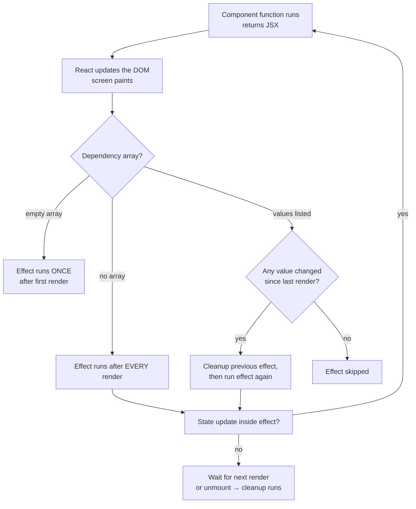

# ⚛️ React — Complete Interview Notes

This file covers everything a final-year student or fresher needs to answer React questions in a full-stack (MERN) interview — components, hooks, state, effects, routing, and performance basics, all with the exact traps interviewers love to set. If you can explain this file out loud in your own words, you are interview-ready for React.

> [!NOTE]
> **How to use these notes:** Every topic follows the same pattern — what it is → small code example → what the interviewer actually asks. Don't memorise code, understand the *why* behind it.

---

## 📌 1. What is React, and Why Use It?

**React is a JavaScript library for building user interfaces** — mainly single-page applications (SPAs) where the page doesn't reload when data changes.

Three ideas make React what it is:

1. **Components** — the UI is broken into small, reusable pieces (a Button, a Card, a Navbar). Each component is a JavaScript function that returns markup.
2. **Declarative UI** — you describe *what* the UI should look like for the current state, and React figures out *how* to update the DOM. You never write `document.getElementById(...)` manually.
3. **Virtual DOM** — React keeps a lightweight copy of the DOM in memory. When state changes, it builds a new virtual tree, compares it with the old one (this comparison is called **diffing**), and updates only the nodes that actually changed. This process is called **reconciliation**.

> [!IMPORTANT]
> The Virtual DOM is **not** faster than the real DOM by itself. Its power is that it lets *you* write simple declarative code while React does the minimum number of real DOM updates under the hood.

**Watch one update run, step by step.** Say you click the button in the Counter example (Section 4) and `count` goes from 0 to 1:

1. **Event:** your click calls `setCount(1)`. React makes a note: "this component's state changed — it needs to re-render."
2. **Render:** React calls your component function again, top to bottom. This time `count` is `1`, so the function returns fresh JSX describing `<p>Count: 1</p>`.
3. **Diff (reconciliation):** React compares the new virtual tree against the previous one, node by node. The `<div>` and `<button>` are unchanged; only the text inside `<p>` differs.
4. **Commit:** React applies the *minimum* change to the real DOM — it updates just that one text node. The button, the div, everything else: untouched.
5. **Effects:** only *now*, after the screen shows the new state, do any `useEffect` callbacks for this render run.

Say it in an interview like this: *"State change → React re-runs the component → diffs old vs new virtual DOM → commits only the real changes → then runs effects."* Re-rendering does **not** mean rebuilding the page — it means re-running your function and letting the diff decide what (if anything) the real DOM needs.

Try the live version:

```visual render-counter
```

**What the interviewer asks:** "Why React over vanilla JS?"
**Say this:** In vanilla JS, I have to manually track which DOM nodes to update when data changes — that gets messy fast. React lets me just describe the UI for each state, and it updates only what changed.

---

## 📌 2. JSX Rules

JSX looks like HTML inside JavaScript, but it's actually **syntax sugar** — it compiles to `React.createElement()` calls. Because it's JavaScript, not HTML, a few rules differ:

| HTML | JSX | Why |
|---|---|---|
| `class` | `className` | `class` is a reserved word in JS |
| `for` (on labels) | `htmlFor` | Same reason |
| `onclick` | `onClick` | JSX uses camelCase props |
| `` | `` | All tags must close |
| `style="color:red"` | `style={{ color: "red" }}` | Style is a JS object |

```jsx
function Welcome() {
  const name = "Ayushi";
  const marks = 92;

  return (
    <div className="card">
      <h1>Hello, {name}!</h1>   {/* {} embeds any JS expression */}
      <p>{marks > 40 ? "Pass" : "Fail"}</p>
    </div>
  );
}
```

The three rules that matter most:

1. **Return a single parent** — a component must return ONE root element. Wrap siblings in a `<div>` or, better, a **Fragment** `<>...</>` which adds no extra node to the real DOM.
2. **Expressions go in `{ }`** — variables, function calls, ternaries, `&&` — anything that *evaluates to a value*. Statements like `if` or `for` loops can't go inside, which is why we use ternary and `.map()`.
3. **All tags must close** — even `<br>` becomes `<br />`.

> [!WARNING]
> A very common beginner mistake: writing `class` instead of `className`. The UI may still *look* styled in some cases, but React will warn in the console and it's an instant red flag in an interview if you write it on a whiteboard.

---

## 📌 3. Components & Props

A **component** is just a function that returns JSX. **Props** (properties) are the data a parent passes down to a child — like function arguments.

```jsx
function StudentCard(props) {
  return <p>{props.name} scored {props.marks}</p>;
}

function App() {
  return <StudentCard name="Ikra" marks={88} />;
}
```

Or with **destructuring** (the way you'll see it in real code):

```jsx
function StudentCard({ name, marks }) {
  return <p>{name} scored {marks}</p>;
}
```

> [!IMPORTANT]
> **Props are read-only.** A child must NEVER modify its props (`props.marks = 100` is a bug). Data flows one way — parent → child. If the child needs to change something, the parent passes a *function* down, and the child calls it.

### The `children` prop

Whatever you write *between* a component's opening and closing tags arrives as the special `children` prop:

```jsx
function Card({ children }) {
  return <div className="card">{children}</div>;
}

<Card>
  <h2>UrjaSetu</h2>   {/* this whole block is `children` */}
  <p>Bill savings app</p>
</Card>
```

**Lifting state up, in miniature** — when two children need the *same* data, the state moves up to their parent:

```jsx
function App() {
  const [count, setCount] = useState(0); // state lives HERE, in the parent

  return (
    <div>
      <Display value={count} />                    {/* child 1 just shows it */}
      <AddButton onAdd={() => setCount(count + 1)} /> {/* child 2 asks the parent to change it */}
    </div>
  );
}

function Display({ value }) {
  return <p>Count: {value}</p>;
}

function AddButton({ onAdd }) {
  return <button onClick={onAdd}>Add</button>;
}
```

Neither child owns `count`. `Display` receives it as a prop; `AddButton` receives a *function* as a prop and calls it — the parent updates its own state, and both children re-render with the new picture. Whenever two components must stay in sync, this is the pattern: find their closest common parent, and lift the state there.

**What the interviewer asks:** "Can a child change the parent's data?"
**Say this:** Not directly. The parent passes a callback function as a prop, the child calls it, and the parent updates its own state. That's called *lifting state up*.

---

## 📌 4. State with `useState`

**State is data that a component remembers and can change over time.** When state changes, React re-renders the component so the UI matches the new data. That's the whole engine of React.

| Props | State |
|---|---|
| Passed from parent | Owned by the component itself |
| Read-only inside the child | Changed via the setter function |
| Like function arguments | Like component memory |
| Change = parent re-renders with new props | Change = component re-renders itself |

```jsx
import { useState } from "react";

function Counter() {
  const [count, setCount] = useState(0); // 0 = initial value

  return (
    <div>
      <p>Count: {count}</p>
      <button onClick={() => setCount(count + 1)}>Add</button>
    </div>
  );
}
```

`useState` returns an **array of two things**: the current value, and a function to update it. We destructure them into `[count, setCount]`.

### Functional updates — the safe way

When the new state depends on the *previous* state, use the function form:

```jsx
setCount(prev => prev + 1);
```

> [!WARNING]
> **Classic trap:** `setCount(count + 1); setCount(count + 1);` in the same handler adds only **1**, not 2 — both calls read the same stale `count` from the current render. `setCount(prev => prev + 1)` twice adds 2, because each update receives the latest queued value.

**Watch batching happen, with counts.** One click handler, two styles:

```jsx
function handleClick() {
  setCount(count + 1); // reads count = 0 → queues "set state to 1"
  setCount(count + 1); // reads count = 0 (still this render!) → queues "set state to 1"
  setCount(count + 1); // reads count = 0 → queues "set state to 1"
}
// After the click: count is 1 — and the component re-rendered ONCE.
```

React **batches** the updates: it collects all three, processes them together after the handler finishes, then re-renders a single time. All three calls read the same `count` snapshot from *this* render (0), so all three ask for `1` — and `1` is what you get.

```jsx
function handleClick() {
  setCount(prev => prev + 1); // receives latest queued value: 0 → 1
  setCount(prev => prev + 1); // receives 1 → 2
  setCount(prev => prev + 1); // receives 2 → 3
}
// After the click: count is 3 — still just ONE re-render.
```

Functional updates queue up like a pipeline: each one receives whatever the previous one produced. That's the whole trick — value updates read a stale snapshot, function updates read the queue.

> [!NOTE]
> **Under the hood:** since React 18, batching is automatic *everywhere* — inside promises, `setTimeout` callbacks, and native event handlers too, not just React's own event handlers. However many setters you call in one event, you get one re-render at the end.

### Updating objects and arrays — immutably

Never mutate state directly. Create a *new* object/array so React can detect the change (React compares references — same object in memory = "nothing changed" = no re-render).

```jsx
// ❌ Wrong — mutates the same object, React may not re-render
user.name = "Ayushi";
setUser(user);

// ✅ Right — spread into a new object
setUser({ ...user, name: "Ayushi" });

// ✅ Arrays: add, remove, update
setItems([...items, newItem]);              // add
setItems(items.filter(i => i.id !== id));    // remove
setItems(items.map(i => i.id === id ? { ...i, done: true } : i)); // update one
```

**What the interviewer asks:** "Why not just do `count++` and set it?"
**Say this:** Because mutating state directly doesn't reliably trigger a re-render — React decides to re-render when the setter is called with a new value/reference. Mutation breaks that contract and causes stale UI bugs.

Simulate the queue yourself (plain JavaScript, same idea as React's):

```playground Simulate React state batching
// A tiny simulation of React's update queue
let state = 0;
const queue = [];
function setState(update) { queue.push(update); } // queued, not applied instantly

function flushQueue() {
  for (const update of queue) {
    if (typeof update === "function") {
      // TODO: apply the updater to current state — state = update(state)
    } else {
      state = update; // a plain value replaces the state
    }
  }
  queue.length = 0;
  return state;
}

setState(state + 1);
setState(state + 1);
console.log("value updates give:", flushQueue()); // 1 — both read the same old state
state = 0; // reset
setState(prev => prev + 1);
setState(prev => prev + 1);
console.log("function updates give:", flushQueue()); // goal: 2, once the TODO works
```

---

## 📌 5. Lists & Keys

When you render an array, React needs a **key** on each item — a unique, stable ID so React can track which item is which across re-renders (which one changed, moved, or got deleted).

```jsx
const bills = [
  { id: 101, month: "March", amount: 671 },
  { id: 102, month: "April", amount: 905 },
];

<ul>
  {bills.map(bill => (
    <li key={bill.id}>{bill.month} — ₹{bill.amount}</li>
  ))}
</ul>
```

> [!IMPORTANT]
> The key must be unique **among siblings** and **stable** — the same item must keep the same key on every render. Database IDs are perfect. `Math.random()` or array index generated fresh each render are terrible.

### Why using the array index as key is risky

If the list never changes order, index keys *work*. But if items can be **deleted, inserted, or reordered**, React matches items by position instead of identity — so input text, checkbox state, or component state can jump to the wrong row, and reordering becomes slow because React re-renders everything instead of moving nodes.

**See it happen — the reorder demo.** Imagine each row has its own internal state (a ticked checkbox, text typed into a row input). With *index* keys:

```
Render 1:                     You tick the checkbox on "Pay rent" (row 0).
  [0] Pay rent   ☑   ← the tick lives at POSITION 0
  [1] Buy milk   ☐
  [2] Call mom   ☐

You delete "Pay rent". React matches by position:
  [0] Buy milk   ☑   ← the tick has jumped onto Buy milk!
  [1] Call mom   ☐
```

React reused position 0's DOM and component state for what is now a *different item* — the state stuck to the **position**, not the item. With real ID keys (`key={item.id}`), React tracks identity instead: deleting "Pay rent" removes *its* row and *its* state, and "Buy milk" keeps its own unticked box.

> [!WARNING]
> **Common mistake:** `key={Math.random()}` or generating any fresh key on each render. Every key changes → React concludes every item is brand new → it destroys and rebuilds the entire list on each render, wiping row state and wasting work. A key must be *stable*: same item, same key, every render.

**What the interviewer asks:** "Is index as key always wrong?"
**Say this:** No — it's fine for a static list that never reorders or filters. If the list is dynamic, use a real ID; index keys attach state to the *position*, not the *item*, which creates bugs on delete/reorder.

---

## 📌 6. Conditional Rendering & Forms

### Conditional rendering

There's no `if` inside JSX, so we use JavaScript expressions:

```jsx
{isLoggedIn && <p>Welcome back!</p>}              {/* renders only if true */}
{loading ? <p>Loading…</p> : <p>{data}</p>}        {/* either/or */}
{error && <p className="error">{error}</p>}
```

> [!TIP]
> The `{condition && <Element />}` pattern is the most common one in real code — use it for "show this only when…". Use ternary when there's an *else* branch.

### Controlled components (forms)

In React forms, the input's value lives in **state**, and state updates on every keystroke. React is the single source of truth — that's a *controlled component*.

```jsx
function LoginForm() {
  const [email, setEmail] = useState("");

  function handleSubmit(e) {
    e.preventDefault(); // stop page reload
    console.log("Submitting:", email);
  }

  return (
    <form onSubmit={handleSubmit}>
      <input
        value={email}                          // state drives the input
        onChange={e => setEmail(e.target.value)} // typing updates state
        placeholder="Email"
      />
      <button type="submit">Login</button>
    </form>
  );
}
```

**What happens on every single keystroke** — say you type `a` into that email box:

1. You press the key. The browser wants to display `a` in the input.
2. `onChange` fires, carrying `e.target.value === "a"`.
3. `setEmail("a")` runs → state changes → the component re-renders.
4. The re-rendered JSX says `value={email}`, and `email` is now `"a"` — so the input shows `a`.

The input never owns its text: React state owns it, and the input just reflects it. That's why a controlled input *cannot* display a character your state rejects — if `onChange` chooses not to update state (say you're filtering out digits), the re-render forces the input back to the old state value, and the forbidden character simply never appears. Total control, at the price of one re-render per keystroke — completely fine at form scale.

> [!WARNING]
> **Common mistake:** giving an input a `value` prop but forgetting `onChange`. React treats it as read-only, logs a console warning, and the user types while *nothing happens*. If you truly want a fixed starting value the user edits freely, use an uncontrolled input with `defaultValue` instead.

Why controlled? Because then you can validate as the user types, disable the submit button until valid, format input, or submit the state value directly — no need to query the DOM.

**What the interviewer asks:** "Controlled vs uncontrolled?"
**Say this:** Controlled = value stored in React state, updated via `onChange`. Uncontrolled = the DOM holds the value and you read it with a ref — less React-idiomatic, used occasionally for file inputs or quick forms.

---

## 🧠 7. `useEffect` — The Full Model

This is the most asked-about hook in interviews. Learn this model properly and most React questions become easy.

### The mental model

> [!IMPORTANT]
> `useEffect` runs **after** the component renders (after the JSX is painted on screen). It exists to synchronise your component with things *outside* React: APIs, timers, subscriptions, the document title, localStorage. It is **not** for things React can compute during render.

```jsx
useEffect(() => {
  // this runs after render
}, [dependencies]);
```

### The dependency array — three forms

| Form | When the effect runs |
|---|---|
| **No array**: `useEffect(fn)` | After **every** render |
| **Empty array**: `useEffect(fn, [])` | Once, after the **first** render only |
| **With values**: `useEffect(fn, [userId])` | First render + whenever any listed value **changes** |

**How React decides whether to re-run your effect** — watch three renders:

```jsx
const [userId, setUserId] = useState(1);
const [name, setName] = useState("");

useEffect(() => {
  console.log("effect ran for user", userId);
}, [userId]);
```

1. **First render:** `userId = 1`, `name = ""`. After the screen paints, React runs the effect (the first render *always* runs it) → logs `effect ran for user 1`. React quietly saves the deps it saw: `[1]`.
2. **You type in the name field:** `setName("A")` triggers a re-render. React compares the new deps `[1]` against the saved `[1]`, element by element (using `Object.is`). Identical → **effect skipped**. Nothing logs.
3. **You switch user:** `setUserId(2)` triggers a re-render. New deps `[2]` vs saved `[1]` — different → the cleanup (if any) runs first, then the effect runs → logs `effect ran for user 2`. Saved deps become `[2]`.

So the dependency array isn't magic — it's simply a list React compares, item by item, against the previous render's list. This is also why putting a fresh object or array literal in the deps (`[{ id: 1 }]`) breaks the system: a newly created object is never `Object.is`-equal to last render's, so the effect re-runs on *every* render.

### Cleanup

If your effect starts something, it should stop it. Return a function from the effect — React runs it before the next effect run and when the component unmounts.

```jsx
useEffect(() => {
  const id = setInterval(() => console.log("tick"), 1000);
  return () => clearInterval(id); // cleanup — no leaked timer
}, []);
```

**Watch cleanup save you from a doubled timer:**

1. The component mounts → the effect runs → interval #1 starts ticking once per second.
2. You navigate away → the component unmounts → React runs the cleanup → `clearInterval` kills interval #1. Silence. ✅
3. **Without** that returned cleanup function: the interval survives the component, logging forever from a page that no longer exists — and every remount adds *another* interval. Two mounts later you get three "tick"s per second plus a memory leak.

The same story applies to event listeners (`removeEventListener`), subscriptions, and fetches (the `AbortController` in Section 12): cleanup simply means *"undo whatever the effect started."*



### The infinite loop trap — understand this cold

```jsx
// 🐛 BUG: infinite loop
function Profile() {
  const [user, setUser] = useState(null);

  useEffect(() => {
    fetchUser().then(data => setUser(data));
  }); // ❌ no dependency array

  return <p>{user?.name}</p>;
}
```

**Why it loops:** effect runs after render → `setUser` changes state → state change re-renders → effect runs again (no array = every render) → `setUser` again → …forever. The tab freezes or the API gets hammered.

**Fix:** add the dependency array. `[]` if it should fetch once on mount, or `[userId]` if it should refetch when the ID changes.

```jsx
useEffect(() => {
  fetchUser(userId).then(data => setUser(data));
}, [userId]); // ✅ runs on mount + when userId changes
```

**The stale closure trap** — the sneakiest effect bug, and pure JavaScript closures underneath:

```jsx
function Ticker() {
  const [count, setCount] = useState(0);

  useEffect(() => {
    const id = setInterval(() => {
      console.log("count is", count); // logs 0 forever!
      setCount(count + 1);
    }, 1000);
    return () => clearInterval(id);
  }, []); // ← empty deps
```

`count` goes 0 → 1 on the first tick… and the log says `0` forever after. Why? The effect ran **once** (empty deps), so the interval callback *closed over* the `count` from the very first render — `0` — and never sees a newer one. Every render creates fresh variables; an effect with `[]` keeps using the first render's snapshot.

**Fix:** use the functional update so the callback never needs the current `count` at all:

```jsx
useEffect(() => {
  const id = setInterval(() => {
    setCount(prev => prev + 1); // always builds on the latest value
  }, 1000);
  return () => clearInterval(id);
}, []); // ✅ now the empty deps are genuinely safe
```

If you truly need to *read* the latest `count` inside, add it to the dependency array instead (the interval restarts on each change) — but the functional update is the cleaner answer, and naming "stale closure" out loud scores points.

> [!WARNING]
> Two more effect traps interviewers test:
> 1. **Missing dependency** — using `userId` inside the effect but not listing it → stale data when the ID changes. Always list every reactive value you use.
> 2. **Objects/functions as dependencies** — `{ userId }` recreated every render counts as "changed" every time, so the effect still runs on every render. Depend on primitives (the ID), not whole objects.

> [!TIP]
> If an interviewer asks "can I make the effect callback `async` directly?" — the answer is **no**, because an async function returns a Promise, but React expects either nothing or a cleanup function. Define an async function *inside* the effect and call it.

Simulate the dependency check yourself:

```playground Simulate effect dependencies
// Simulating how React decides whether an effect re-runs
let prevDeps = null; // the deps React saved from the previous render

function renderAndMaybeRunEffect(userId, note) {
  const deps = [userId];
  const changed =
    prevDeps === null ||
    deps.some((dep, i) => dep !== prevDeps[i]);
  console.log(note, "| effect runs?", changed);
  // TODO: when changed, also log "  fetching user " + userId —
  // and make sure prevDeps is saved for the next render either way
  prevDeps = deps;
}

renderAndMaybeRunEffect(1, "mount");
renderAndMaybeRunEffect(1, "typed a letter (re-render)");
renderAndMaybeRunEffect(1, "typed some more (re-render)");
renderAndMaybeRunEffect(2, "switched user");
```

---

## 📌 8. `useRef`

`useRef` gives you a box with a `.current` property that **persists across renders but does NOT trigger a re-render when changed**.

Two main uses:

**1. Accessing a DOM element directly** (focus an input, scroll, measure size):

```jsx
function SearchBox() {
  const inputRef = useRef(null);

  return (
    <div>
      <input ref={inputRef} placeholder="Search…" />
      <button onClick={() => inputRef.current.focus()}>Focus</button>
    </div>
  );
}
```

**2. Storing a mutable value that shouldn't cause re-renders** — timer IDs, previous values, counters that don't affect the UI:

```jsx
const timerRef = useRef(null);
timerRef.current = setTimeout(() => {}, 1000); // no re-render happens
```

| `useRef` | `useState` |
|---|---|
| Changing it does NOT re-render | Changing it re-renders |
| Value available instantly after change | New value available on next render |
| Good for DOM refs, timer IDs, previous values | Good for anything shown in the UI |

**Worked example — remembering the previous value** (a classic interview follow-up, built from exactly the two properties above):

```jsx
function PriceTag({ price }) {
  const prevPriceRef = useRef(null);

  useEffect(() => {
    prevPriceRef.current = price; // save AFTER render, so during render it still holds the old value
  }, [price]);

  const prev = prevPriceRef.current;
  return <p>₹{price} {prev !== null && `(was ₹${prev})`}</p>;
}
```

Watch it run: first render, `prevPriceRef.current` is `null`, so only `₹100` shows; the effect then stores `100`. Price changes to `120` → during this render the ref *still* holds `100`, so the UI shows `₹120 (was ₹100)`; the effect then stores `120` for next time. The trick works precisely because writing to a ref does not re-render — the new value waits quietly until the next render reads it.

**What the interviewer asks:** "Why not store the timer ID in state?"
**Say this:** Because changing state re-renders the component, and the timer ID isn't UI data — re-rendering for it would be wasteful. Refs are for values you need to *remember* but not *display*.

---

## 📌 9. `useContext` — Killing Prop Drilling

**Prop drilling** is when data has to pass through components that don't even use it, just to reach a deep child:

`App → Layout → Sidebar → UserBadge` — Layout and Sidebar carry `user` only to pass it down.

Context solves this: provide the value once at the top, consume it anywhere below.

```jsx
import { createContext, useContext } from "react";

// 1. Create
const ThemeContext = createContext("light");

function App() {
  // 2. Provide
  return (
    <ThemeContext.Provider value="dark">
      <Toolbar />
    </ThemeContext.Provider>
  );
}

function Toolbar() {
  // 3. Consume — no props needed
  const theme = useContext(ThemeContext);
  return <p>Current theme: {theme}</p>;
}
```

Real-world uses: logged-in user, theme, language (English/Hindi toggle), cart contents.

> [!WARNING]
> Context is for **global, low-frequency data** (theme, auth, language). Don't put fast-changing data like every keystroke in context — every consumer re-renders when the context value changes. For complex app-wide state, tools like Redux or Zustand exist, but context + `useState`/`useReducer` covers most fresher-level apps.

---

## 📌 10. `useMemo` vs `useCallback`

Both are performance hooks — they **cache** things between renders so React can skip work. Both are also **overused by beginners**.

| | `useMemo` | `useCallback` |
|---|---|---|
| Caches | A computed **value** | A **function** |
| Use when | An expensive calculation shouldn't rerun every render | Passing a function to a memoised child, so the child doesn't re-render |
| Example | Filtering/sorting a big list | `onClick` handler passed to `React.memo` child |

```jsx
const visibleBills = useMemo(
  () => bills.filter(b => b.amount > 500), // expensive filter
  [bills] // only recompute when bills changes
);

const handleDelete = useCallback(
  (id) => setBills(prev => prev.filter(b => b.id !== id)),
  [] // stable function identity across renders
);
```

> [!IMPORTANT]
> **When NOT to use them:** Most computations are cheap — wrapping them costs more than it saves. Reach for `useMemo`/`useCallback` only when (1) a calculation is genuinely expensive, or (2) a memoised child is re-rendering because it keeps receiving a "new" function prop. Premature optimisation makes code harder to read for zero gain. React re-rendering a small component is fast and normal.

### The decision rule — ask two questions

When you are unsure, run this two-question check before reaching for either hook:

1. **Is the work itself expensive?** Filtering 10,000 rows, sorting a huge list, heavy math on every keystroke. If yes, that's `useMemo` for the result.
2. **Am I passing this to a child wrapped in `React.memo`?** If yes, and the child keeps re-rendering, the prop's identity is changing every render — that's `useCallback` for a function (or `useMemo` for an object/array).

If the answer to both is *no*, write the plain version. Here is the whole rule in one speakable line: *"Memoise a value when computing it is the expensive part; memoise a function when its identity is the problem — otherwise, let React just re-run it."*

### Tiny example — spot the difference in six lines

```jsx
// ❌ Child re-renders on every keystroke in the parent:
//    handleClick is a brand-new function on every render.
<HeavyList onSelect={id => setSelected(id)} />

// ✅ Same logic, stable identity — HeavyList can now skip re-renders
//    when its other props haven't changed:
const handleSelect = useCallback(id => setSelected(id), []);
<HeavyList onSelect={handleSelect} />
```

Nothing about *what the function does* changed — only whether React sees the *same* function object across renders. That identity check (`Object.is` on props) is the entire reason `useCallback` exists, and it only pays off when the receiving child is memoised. Without `React.memo` on the child, a stable function changes nothing.

**What the interviewer asks:** "Difference between them, in one line?"
**Say this:** "`useMemo` caches a value, `useCallback` caches a function — in fact `useCallback(fn, deps)` is just `useMemo(() => fn, deps)`."

---

## 📌 11. Custom Hooks

A **custom hook** is just a function (starting with `use`) that combines built-in hooks to package reusable *logic* (not UI). If two components both fetch data, handle a toggle, or track window size — that's a custom hook waiting to happen.

```jsx
// hooks/useFetch.js — fetch logic written ONCE, reused everywhere
function useFetch(url) {
  const [data, setData] = useState(null);
  const [loading, setLoading] = useState(true);
  const [error, setError] = useState(null);

  useEffect(() => {
    let cancelled = false;
    fetch(url)
      .then(res => res.json())
      .then(json => { if (!cancelled) { setData(json); setLoading(false); } })
      .catch(err => { if (!cancelled) { setError(err.message); setLoading(false); } });
    return () => { cancelled = true; }; // ignore response if unmounted/changed
  }, [url]);

  return { data, loading, error };
}

// Any component can now just do:
const { data, loading, error } = useFetch("/api/bills");
```

Rules: custom hooks must start with `use`, and they can call other hooks (built-in or custom). They share *logic*, not *state* — two components using `useFetch` each get their own separate state.

### When should you extract one? Three honest signals

Don't create a custom hook just because you can. Extract when you see one of these:

1. **The same logic appears in two or more components** — fetching, toggling, tracking online status. The second copy is your signal; the first copy is just code.
2. **A component's logic is drowning its JSX** — when the top half of a component is 40 lines of state and effects and the markup barely fits on screen, the logic wants its own named home.
3. **The logic has a name** — if you can say it in two words (`useToggle`, `useWindowSize`, `useDebounce`) and another developer would guess what it returns, it deserves to be a hook. If you can't name it, it isn't a hook yet, it's just a long component.

The speakable version: *"I extract a hook when the same stateful logic shows up twice, or when naming it makes the component readable again — not before."*

### Worked micro-hook — `useToggle` in ten lines

The smallest useful hook: a boolean plus the functions to flip it. Settings pages, modals, and dropdowns all need exactly this.

```jsx
function useToggle(initial = false) {
  const [on, setOn] = useState(initial);
  const toggle = useCallback(() => setOn(prev => !prev), []);
  const setTrue = useCallback(() => setOn(true), []);
  const setFalse = useCallback(() => setOn(false), []);
  return { on, toggle, setTrue, setFalse };
}

// In any component — no repeated useState + flip logic:
const menu = useToggle();
<button onClick={menu.toggle}>{menu.on ? "Close menu" : "Open menu"}</button>
```

Notice what got packaged: not the button (that's UI, and it stays in the component), but the *behaviour* — a value and its three honest ways to change. That's the test for every custom hook: **logic travels, markup stays.**

---

## 🔍 12. Data Fetching in React

The standard fresher-level pattern: fetch inside `useEffect`, track three states — **loading, error, data**. Every interview project demo should have all three.

```jsx
function BillList() {
  const [bills, setBills] = useState([]);
  const [loading, setLoading] = useState(true);
  const [error, setError] = useState(null);

  useEffect(() => {
    const controller = new AbortController(); // lets us cancel the request

    fetch("https://api.example.com/bills", { signal: controller.signal })
      .then(res => {
        if (!res.ok) throw new Error("Failed to load bills");
        return res.json();
      })
      .then(data => { setBills(data); setLoading(false); })
      .catch(err => {
        if (err.name === "AbortError") return; // we cancelled it — not an error
        setError(err.message);
        setLoading(false);
      });

    return () => controller.abort(); // cleanup: cancel if user leaves early
  }, []);

  if (loading) return <p>Loading bills…</p>;
  if (error) return <p>Error: {error}</p>;
  return <ul>{bills.map(b => <li key={b.id}>₹{b.amount}</li>)}</ul>;
}
```

> [!TIP]
> **`AbortController` in one line:** it cancels an in-flight fetch when the component unmounts or the effect re-runs, preventing "state update on unmounted component" bugs and wasted requests. Interviewers ask "how do you cancel a fetch?" — this is the answer.

In big apps people use libraries like **React Query (TanStack Query)** or **SWR**, which handle caching, refetching, and loading states for you — worth naming in an interview even if your project uses plain `fetch`.

---

## 🔍 13. React Router Basics

React apps are single-page — React Router swaps components based on the URL **without reloading the page**.

Think of it in plain words first. A normal website is like a book: clicking a link tears out the current page and fetches a fresh printed one from the server. A React app is more like a stage with one backdrop that never leaves: React Router is the stage manager who, when the address in the URL bar changes, quietly swaps which actor (component) stands in the light. The audience sees a "new page"; the browser never actually reloaded anything.

Three words carry the whole topic:

- **Route** — one entry in the address book: *"when the URL looks like THIS, show THAT component."* It pairs a path pattern with a component, nothing more.
- **`Link`** — the polite way to change the address. A normal `<a href="...">` asks the server for a whole new page (full reload, your JS state resets). A `<Link to="...">` just updates the URL and lets the stage manager swap the component — instant, and your state survives.
- **Params** — the blanks in an address. Writing `/bill/:id` means *"anything can sit where `:id` is, and I want to read it."* The URL `/bill/42` fills the blank with `42`, and `useParams()` hands you `{ id: "42" }` to use.

```jsx
import { BrowserRouter, Routes, Route, Link, useParams } from "react-router-dom";

function App() {
  return (
    <BrowserRouter>
      <nav>
        <Link to="/">Home</Link> | <Link to="/dashboard">Dashboard</Link>
      </nav>
      <Routes>
        <Route path="/" element={<Home />} />
        <Route path="/dashboard" element={<Dashboard />} />
        <Route path="/bill/:id" element={<BillDetail />} />
      </Routes>
    </BrowserRouter>
  );
}

function BillDetail() {
  const { id } = useParams(); // reads :id from the URL
  return <p>Showing bill {id}</p>;
}
```

Read that code like sentences: `BrowserRouter` watches the URL bar; `Routes` looks through its `Route` children and renders the first whose `path` matches; `BillDetail` doesn't receive the ID as a prop — it *asks the router* for it with `useParams()`. Navigating to `/bill/42` doesn't create a new page; it makes the same `BillDetail` component render with `id = "42"`, so one component covers every possible bill.

Three things to remember: `<Link>` navigates without a page reload (unlike `<a>`), `<Routes>` picks the first matching `<Route>`, and `useParams()` reads dynamic segments like `:id`. (There's also `useNavigate()` for redirecting after a form submit or login — reach for it when the *code*, not a click, decides where to go next: `navigate("/dashboard")` after a successful login.)

---

## 📌 14. Performance Basics

Start with what a re-render actually is, because most performance confusion comes from picturing it wrong. **A re-render means React calls your component function again** and compares the new virtual tree with the old one. It does *not* mean the browser rebuilt the page. If the diff finds no real difference, nothing in the actual DOM changes — the "render" cost you just paid was one function call and one comparison, which for a small component is nearly free.

A component **re-renders** when: its **state changes**, its **parent re-renders** (children re-render by default), or a **context it consumes changes**.

Key ideas a fresher should know:

- **Re-renders are normal and usually cheap.** React re-rendering a component doesn't mean the real DOM changed — the diff decides that. Don't optimise blindly.
- **`React.memo`** — wraps a component so it skips re-rendering if its props are unchanged: `const Card = React.memo(function Card(props) { ... })`. Useful for heavy list items; useless if props are new objects/functions every render (that's where `useCallback`/`useMemo` come in).
- **Stable keys** — changing keys (like `key={Math.random()}`) force React to destroy and rebuild DOM nodes instead of updating them. Expensive and state-destroying.
- **Keep state low** — state that lives in a small child re-renders only that child. Lifting state to the top of the app makes every keystroke re-render everything below it.

### Three real fixes (and when each one is actually the fix)

1. **Memoise the heavy child.** A list rendering 200 rows on every keystroke in a search box above it? Wrap the row: `const BillRow = React.memo(({ bill }) => <li>{bill.month} — ₹{bill.amount}</li>);` — rows whose `bill` prop didn't change now skip rendering entirely.
2. **Stabilise the function you pass down.** `React.memo` alone fails if you hand the child a fresh handler each render. Pair them: `const handleDelete = useCallback(id => remove(id), []);` — same function object every render, so the identity check inside `memo` can actually pass.
3. **Move state down to where it's used.** If only the search input needs `query`, don't keep it in `App`. `function SearchBox() { const [query, setQuery] = useState(""); ... }` — now typing re-renders one small input component instead of the whole page tree beneath a top-level state.

Notice the order: fix 3 needs no new APIs at all and solves the most common beginner slowness. Reach for `memo` and `useCallback` after placement, not before.

> [!WARNING]
> **The common trap:** writing `<HeavyList config={{ pageSize: 20 }} />` or `onClick={() => doThing()}` inline. That object (or arrow function) is a *brand-new* prop on every render, so `React.memo` compares it, sees a "different" prop, and re-renders anyway — your optimisation silently does nothing. The rule to say out loud: *"Memo only works if the props are genuinely stable; an inline object or function breaks it every single render."*

> [!NOTE]
> **Under the hood:** a "re-render" is just React calling your function again and comparing virtual trees — it does **not** touch the real DOM unless the diff finds a change. That's why re-rendering is cheap, and why experienced React developers say "let it re-render; optimise only when you can *measure* the slowness." The genuinely expensive mistake isn't re-rendering — it's creating new object/array/function props on every render, which silently defeats `React.memo` and dependency checks downstream.

> [!NOTE]
> Interview one-liner for `React.memo`: "It memoises the component — if props haven't changed, React reuses the last rendered output instead of re-rendering."

---

## 🐛 Bug Hunt — 3 Classic Beginner Bugs

These three appear in almost every fresher interview, often as "what's wrong with this code?" questions.

### Bug 1: The Infinite Loop

```jsx
useEffect(() => {
  fetch("/api/user").then(r => r.json()).then(setUser);
}); // ❌ no dependency array
```

**Why:** Effect runs after every render → `setUser` re-renders → effect runs again → fetch → `setUser` → ∞.
**Fix:** Add `[]` (run once on mount) or `[userId]` (run when the ID changes).

### Bug 2: Missing Key in a List

```jsx
{items.map(item => <li>{item}</li>)} // ❌ no key
```

**Why:** React can't tell items apart across renders. Deleting the first item makes React re-render every remaining row (and any state inside them attaches to the wrong row) instead of just removing one node.
**Fix:** Add a stable unique key: `<li key={item.id}>`.

### Bug 3: Stale State Update

```jsx
function handleAddThrice() {
  setCount(count + 1);
  setCount(count + 1);
  setCount(count + 1);
} // ❌ adds only 1 — all three read the same old `count`
```

**Why:** State updates are queued, and each call here uses the `count` value from the *current* render. React batches them into a single re-render.
**Fix:** Use the functional form so each update builds on the previous queued value:

```jsx
setCount(prev => prev + 1);
setCount(prev => prev + 1);
setCount(prev => prev + 1); // ✅ adds 3
```

> [!TIP]
> Rule of thumb that fixes 90% of state bugs: **if the new state depends on the old state, always use the functional update form** — `setX(prev => ...)`.

---

## 🎤 Mock Interview Questions — React

**Q1. What is React and why use it over vanilla JavaScript?**
React is a library for building UIs using components. Instead of manually updating the DOM every time data changes, I describe what the UI should look like for the current state, and React updates only the parts that changed. It makes large apps much easier to manage and reuse.

**Q2. What is JSX? Is it HTML?**
JSX is a syntax extension that lets me write markup-like code inside JavaScript. It's not HTML — it compiles to `React.createElement` calls. That's why we write `className` instead of `class`, `htmlFor` instead of `for`, and close every tag.

**Q3. What is the Virtual DOM?**
It's a lightweight in-memory copy of the real DOM. When state changes, React builds a new virtual tree, diffs it against the old one, and applies only the minimum real DOM updates. The diffing process is called reconciliation.

**Q4. Props vs state — what's the difference?**
Props are data passed from a parent to a child; they're read-only inside the child. State is data the component owns and can change with a setter function, which triggers a re-render. Props are like function arguments; state is the component's memory.

**Q5. Why shouldn't we modify state directly, like `user.name = "x"`?**
Because React detects changes by comparing references. If I mutate the same object, React may not re-render, and the UI goes stale. I should always create a new object or array — like `setUser({ ...user, name: "x" })` — so React sees a changed reference.

**Q6. Explain `useEffect` and the dependency array.**
`useEffect` runs code after render for side effects like API calls and timers. With no dependency array it runs after every render; with an empty array, once on mount; with values listed, on mount and whenever those values change. I can return a cleanup function that runs before the next effect and on unmount.

**Q7. What causes the famous useEffect infinite loop, and how do you fix it?**
If an effect with no dependency array sets state, the state change re-renders, which runs the effect again — forever. Adding the correct dependency array fixes it: `[]` for once-on-mount, or the specific values the effect depends on.

**Q8. Why do lists need keys? Can I use the index?**
Keys give each item a stable identity so React can update, move, or delete the right DOM node efficiently. Index keys work for static lists, but if items are deleted or reordered, state and inputs can attach to the wrong row, so I prefer real IDs from the data.

**Q9. Controlled vs uncontrolled components?**
In a controlled component, the input's value is stored in React state and updated via `onChange`, so React is the single source of truth — I can validate or format as the user types. Uncontrolled inputs keep their value in the DOM and are read via a ref, which is less common.

**Q10. `useRef` vs `useState` — when do you use a ref?**
If changing the value should re-render the UI, it's state. If I just need to remember something without re-rendering — like a DOM element to focus, or a timer ID — I use a ref. Its value persists across renders and updates instantly without triggering a render.

**Q11. What problem does Context solve?**
Context solves prop drilling — passing data through many layers of components that don't use it — by providing a value at the top of a tree and consuming it anywhere below with `useContext`. I use it for theme, logged-in user, or language. One caution: every consumer re-renders when the value changes, so it's best for global, infrequently changing data.

**Q12. `useMemo` vs `useCallback`?**
`useMemo` caches a computed value so an expensive calculation only reruns when its dependencies change. `useCallback` caches a function itself, mainly so a memoised child component doesn't re-render just because it received a "new" function. I'd only use either when there's an actual performance need — most renders are cheap.

**Q13. How do you fetch data in React, and how do you cancel a request?**
I fetch inside `useEffect` with loading, error, and data states, showing a loading indicator first, then the data or an error message. To cancel, I create an `AbortController`, pass its signal to fetch, and call `abort()` in the effect cleanup — that prevents setting state after the component unmounts.

**Q14. What makes a component re-render, and how can you prevent unnecessary ones?**
State changes, a parent re-rendering, or a consumed context changing. Most re-renders are fine because React's diff keeps DOM updates minimal. When a heavy child re-renders with identical props, I wrap it in `React.memo` and keep its props stable with `useCallback`/`useMemo` where needed.

**Q15. What is a custom hook? Give an example.**
A custom hook is a function starting with `use` that packages reusable logic built on other hooks. For example, a `useFetch` hook that takes a URL and returns `{ data, loading, error }` — every component that needs API data reuses it instead of repeating the fetch-and-state code. It shares logic, not state — each component using it gets its own state.

---

## ✅ 60-Second Revision Checklist

- [ ] React = components + declarative UI + Virtual DOM diffing (reconciliation)
- [ ] JSX: `className`, `htmlFor`, single parent/Fragment, `{}` for expressions, all tags closed
- [ ] Props flow parent → child and are read-only; child talks back via callbacks; `children` is a prop
- [ ] `useState` returns `[value, setter]`; setter triggers re-render
- [ ] New state from old state? Always `setX(prev => ...)`
- [ ] Never mutate state — spread objects, and add/filter/map arrays into new ones
- [ ] Lists need stable, unique keys; index only for static lists
- [ ] Conditional rendering: `&&` for show/hide, ternary for either/or
- [ ] Forms: controlled inputs — value in state, `onChange` updates, `e.preventDefault()` on submit
- [ ] `useEffect` runs after render; no array = every render, `[]` = mount only, `[deps]` = when deps change
- [ ] Return a cleanup function for timers, subscriptions, and fetches
- [ ] Effect + setState + no deps = infinite loop
- [ ] `useRef` = DOM access and mutable values that don't re-render
- [ ] `useContext` kills prop drilling; best for theme/auth/language
- [ ] `useMemo` caches a value, `useCallback` caches a function — use only when needed
- [ ] Fetch pattern: loading + error + data states, `AbortController` in cleanup to cancel
- [ ] React Router: `<Link>` (no reload), `<Routes>`/`<Route>`, `useParams()` for `:id`
- [ ] Re-renders come from state, parent, or context; `React.memo` + stable props/keys prevent waste
- [ ] Bug trio: missing deps loop, missing key, stale `setCount(count + 1)`
